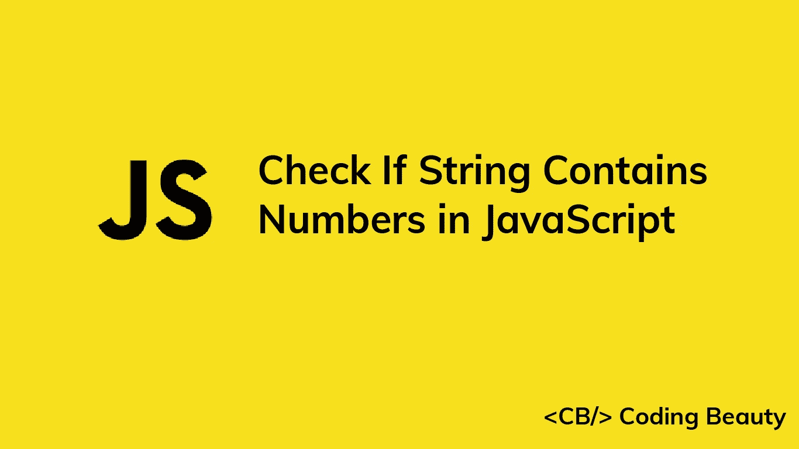

# 如何在 JavaScript 中检查一个字符串是否包含数字

> 原文：<https://blog.devgenius.io/javascript-check-if-string-contains-numbers-21351004c9a3?source=collection_archive---------4----------------------->



要在 JavaScript 中检查一个字符串是否包含数字，请在这个 regex: `/\d/`上调用`test()`方法。如果字符串包含数字，`test()`将返回`true`。否则，它将返回`false`。

例如:

```
function containsNumbers(str) {
  return /\d/.test(str);
}console.log(containsNumbers('hello123')); // true
console.log(containsNumbers('javascript')); // false
console.log(containsNumbers('3 apples')); // true
```

RegExp test() 方法搜索正则表达式和字符串之间的匹配。

`/`和`/`字符用于开始和结束正则表达式。

`\d`元字符匹配字符串中的任意数字(`0` - `9`)。

您也可以使用`[0-9]`来匹配数字。该模式匹配`0`和`9`之间的任何数字字符。

```
function containsNumbers(str) {
  return /[0-9]/.test(str);
}console.log(containsNumbers('hello123')); // true
console.log(containsNumbers('javascript')); // false
console.log(containsNumbers('3 apples')); // true
```

您可能会发现`[0-9]`比使用`\d`更具可读性，尤其是如果您不太熟悉正则表达式中的特殊字符。

# 检查字符串是否只包含数字

为了检查字符串是否只包含**和**数字，我们必须使用不同的正则表达式— `^\d+$`:

```
function containsOnlyNumbers(str) {
  return /^\d+$/.test(str);
}console.log(containsOnlyNumbers('hello123')); // false
console.log(containsOnlyNumbers('3453')); // true
console.log(containsOnlyNumbers('3 apples')); // false
```

`^`字符标记字符串输入的开始，`$`字符标记字符串输入的结束。

在`\d`之后添加`+`字符使得正则表达式匹配一个或多个`\d`模式。

因此正则表达式匹配以连续数字序列开始和结束的字符串。

正如我们之前所做的，我们可以在这里用`[0-9]`替换`\d`:

```
function containsOnlyNumbers(str) {
  return /^[0-9]+$/.test(str);
}console.log(containsOnlyNumbers('hello123')); // false
console.log(containsOnlyNumbers('3453')); // true
console.log(containsOnlyNumbers('3 apples')); // false
```

# 字符串匹配()方法

我们可以用`String` `match()`方法代替`RegExp` `test()`来检查一个字符串是否包含数字

```
function containsNumbers(str) {
  return Boolean(str.match(/\d/));
}console.log(containsNumbers('hello123')); // true
console.log(containsNumbers('javascript')); // false
console.log(containsNumbers('3 apples')); // true
```

[String match()](https://developer.mozilla.org/en-US/docs/Web/JavaScript/Reference/Global_Objects/String/match) 方法返回一个字符串中正则表达式所有匹配项的数组。如果没有匹配，它返回`null`。

```
function containsNumbers(str) {
  return str.match(/\d/);
}console.log(containsNumbers('hello123'));
// [ '1', index: 5, input: 'hello123', groups: undefined ]console.log(containsNumbers('javascript')); // nullconsole.log(containsNumbers('3 apples'));
// [ '3', index: 0, input: '3 apples', groups: undefined ]
```

我们将`match()`的结果传递给`Boolean()`构造函数，将其转换成一个`Boolean`值。`Boolean()`将真值转换为`true`，将假值转换为`false`。

在 JavaScript 中，有六个 falsy 值:`undefined`、`null`、`NaN`、`0`、`''`(空字符串)和`false`。其他所有的价值都是真实的。

```
console.log(Boolean(undefined)); // false
console.log(Boolean(['number60'])); // true
console.log(Boolean(null)); // false
console.log(Boolean(5)); // true
```

*最初发表于*[*codingbeautydev.com*](https://cbdev.link/03754a)

# JavaScript 做的每一件疯狂的事情

一本关于 JavaScript 微妙的警告和鲜为人知的部分的迷人指南。


[报名](https://cbdev.link/d3c4eb)立即免费领取一份。