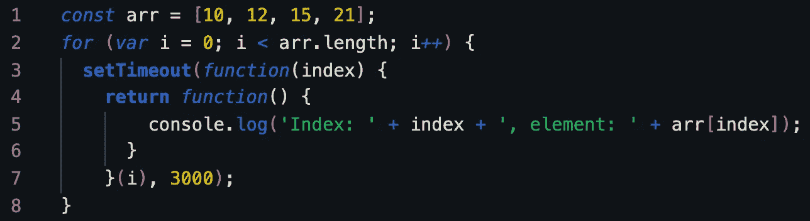
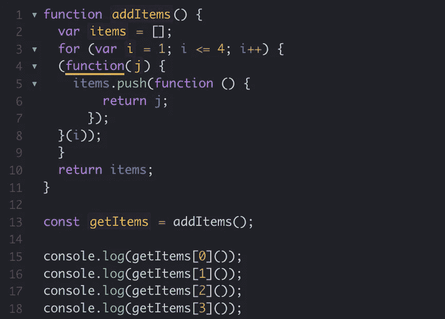

# 深入研究 JavaScript 闭包。

> 原文：<https://blog.devgenius.io/javascript-closures-lets-dive-in-73e235952a83?source=collection_archive---------8----------------------->


闭包是 javascript 世界中最重要的概念之一，同时也是一个令人困惑的关键字。

1.  在函数创建时，每次创建函数时都会创建闭包。
2.  它允许从内部函数访问外部函数。

让我们试着深入这个概念，理解闭包到底是什么，它在哪里起作用。

[MDN](https://developer.mozilla.org/en-US/docs/Web/JavaScript/Closures) 的定义说“一个 ***闭包*** 是一个**函数**和一个**词法环境**的组合，其中**函数**被**声明为**”

> 闭包是指一个函数能够记住并访问它的词法范围，即使它是在它的词法范围之外被调用的。

在这里，我们需要理解“词法范围”。

***词法作用域说明如何在嵌套函数中解析变量名。***

让我们勾勒出一个基本的闭包。


基本闭包

`outerFunc()`创建一个名为`outer`的局部变量和一个名为`innerFunc()`的函数。`innerFunc()`函数是一个内部函数，定义在`outerFunc()`内部，只能在`outerFunc()`函数体内使用。注意`innerFunc()`函数没有自己的局部变量。

但是，由于内部函数可以访问外部函数的变量，`innerFunc()`可以访问父函数`outerFunc()`中声明的变量`outer`。

这是一个 ***词法* *作用域*** 的例子，描述了函数嵌套时解析器如何解析变量名。单词 ***词法*** 指的是**词法作用域**使用 l **位置，即在源代码中声明变量的位置，来确定该变量在哪里可用**。


在一些编程语言中，函数中的局部变量只在函数执行期间存在。一旦`outerFunc()`完成执行，您可能会认为外部变量将不再可访问。

然而，因为代码仍然像预期的那样工作，所以在 JavaScript 中显然不是这样。

原因是 JavaScript 创建了一个“闭包”。在上面的例子中，myFunc 是对执行 myFunc 时创建的 innerFunc 实例的引用。

innerFunc 的实例维护一个对其词法环境的引用，其中存在变量名“outer”。由于这个原因，当调用 myFunc 时，变量“outer”仍然可用。

让我们举一个稍微复杂一点的例子。


你能猜出这段代码是怎么回事吗？

当您尝试调用 add5()方法时，它引用了匿名函数，该函数接受参数“y”，但 makeAdder()接受参数“x”。那么，这个词法范围是如何产生的。

让我们明白这一点。

如果你看到 add5()和 add10()方法创建了一个闭包。

如果您尝试控制台 add5 方法，它将显示如下。

```
function(y) {
  window.runnerWindow.proxyConsole.log(y)
  return x + y;
}
```

匿名函数在闭包创建的外部作用域中仍然保存“x”的值。


我希望到目前为止，您可能已经开始理解“闭包”这个概念有多复杂，但同时它也很有趣。

让我们来谈谈开发人员在理解闭包时最常犯的错误。

我们将回答一个关于“闭包”概念的最常见的面试问题，即典型的 for 循环示例。


乍一看，如果你是第一次学习“闭包”，你会得到的答案大多是这样的。


但是，实际上你会得到什么样的。


现在，我们要思考的是为什么？

下面说几个可能的解决方案。

1.  使用“ **let** 关键字。


使用 let 关键字

使用 let 关键字，每个闭包都会绑定块范围的变量，这意味着不需要额外的闭包

2.利用**的生命**。


利用生命

如果你看到，我们正在使用一个 IIFE 函数，它接受一个参数“index ”,在每次迭代中保存“I”的当前值。

仔细分析 IIFE 块，setTimeout()函数即使在执行了使用“闭包”创建的“index”值之后，仍然保存该值。

这就是使用“结束”的魔力。

3.返回一个**【函数】**就像一个**【闭包】**



返回一个函数

如果您理解上面的示例，这里的解决方案是不言自明的，setTimeout()函数在每次迭代中都保存当前值。因为我们也用 IIFE 返回一个函数，它打印出想要的输出。

我们再举一个封闭的例子。


我猜，现在你能够做出什么样的输出？


如果你的回答是以上，那么让我们明白是怎么回事？

如果你的答案是 1234。我猜，你是在正确的轨道上。

所以，让我们试着理解代码块中发生了什么。

永远记住这一点。

> ***闭包——它是在创建函数时创建的，而不是在调用函数时创建的。***

让我们看看当我们在第 13 行调用 getItems[0]()时，让我们开始执行代码块。

在第 2 行初始化一个空数组。

然后第 3 行的 for 循环，变量“I”被提升。换句话说,“I”变量是在 for 循环之外声明的，然后该变量在每次迭代中发生变异。

对于每次迭代，我们都将一个匿名函数推送到数组中。您可以将一个值、一个对象或一个函数推送到数组中。如果我们将 I 推送到数组中，我们会将迭代时 I 的值推送到数组中。

当我们将一个匿名函数推送到数组时，匿名函数将在调用时返回“I”的值。在调用时，循环应该已经运行了。

到循环完成时，“I”将等于 5，这是因为 for 循环中的增量表达式的工作方式。

唯一剩下的问题是 getItems 数组中的每个匿名函数如何在每次迭代中访问 I 的值？

明确的答案是在每次迭代时绑定“I”的值，并且在创建时而不是调用时绑定？？？

想想当我们执行匿名函数时会发生什么。

1.  我们从全局范围调用一个匿名函数。
2.  第 1 行的 addItems 是一个外部函数，它返回一组内部函数，因为返回的 Items 数组包含一组匿名函数，这些函数实际上是 addItems 函数中的一组内部函数
3.  items 数组中的每个内部函数都在访问 addItems 函数范围内的 I 变量
4.  在调用每个内部函数时，addItems 函数不再存在，但是每个内部函数都保持对 addItems 范围内的 I 变量的访问

因此，上述所有的关闭条件都已满足。

现在，剩下的部分就是在每次迭代中唯一地绑定“I”变量。

我们可以使用“let”关键字和生活来解决。

***使用“让”关键字。***


***利用***



通过在 IIFE 中包装每个 items.push，我们可以确保 j 变量的作用域是这个函数的私有范围，因此，j 变量在每次迭代中都有唯一的绑定。

希望上面的例子对你理解“闭包”有很大帮助。

决定闭包的两个重要特征。

> **调用外部包装函数，创建封闭范围。**
> 
> **包装函数的返回值必须包括对至少一个内部函数的引用，该内部函数在包装器的私有内部范围上具有闭包。**

让我们看看“闭包”的一些实际应用。

1.  封装——模拟私有方法
2.  常见的 web 示例，如“向页面添加按钮以调整文本大小”。
3.  模块模式和显示模块模式
4.  闭包可以用来提高函数的内存效率和性能——例如，确保大型数组/对象只初始化一次。
5.  闭包是函数式编程的基本概念。HOF，没有闭包就不可能有 currying。
6.  Init 函数——闭包可以用来确保一个函数只被调用一次。

我希望这篇文章能够澄清大多数关于“结束”的误解。如果你真的喜欢这篇文章，请跟我来。

快乐编码。不断学习。继续探索。