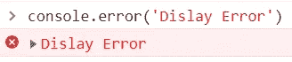
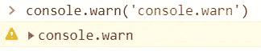
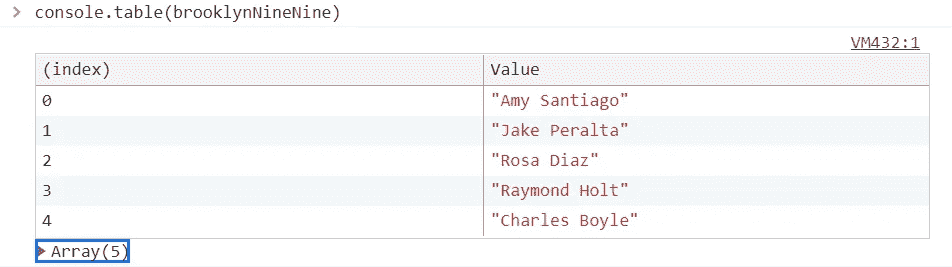
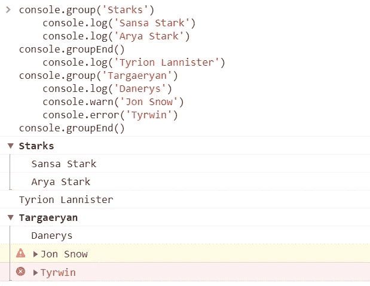
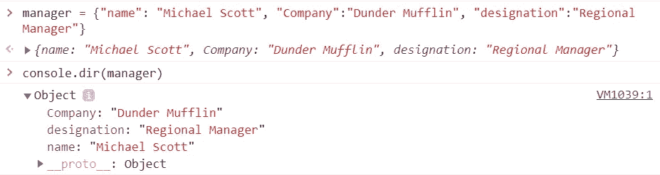
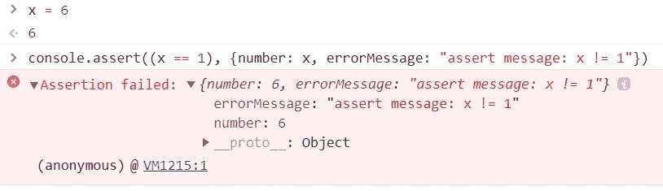
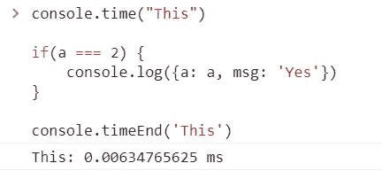

# 除 console.log()之外的 JavaScript 控制台命令

> 原文：<https://blog.devgenius.io/javascript-console-commands-other-than-console-log-f1973371ee14?source=collection_archive---------7----------------------->

如果你是一个 JavaScript 开发者，你知道你最基本的东西是 console.log()。铝

因此，这里有几个控制台命令，我们可以使用，使我们的调试过程容易得多。

1.  ***console . error()***—将`message`发送到控制台窗口。消息文本为红色*并以错误符号开头。*

2.***console . warn()***—将`message`发送到控制台窗口，以警告符号开头。

3.***console . table()—***以表格形式显示 JSON / Array，更易于阅读。

4. ***console.group()和 console.groupEnd()***—console . group()和 console . groupend()用于对消息进行分组。

**注意** : *可以用****console . group collapsed()****代替****【console . group()****使其默认以折叠视图出现。*

5.***console . dir()***—在对象可视化器中显示 JSON。使在控制台窗口中检查属性变得更加容易。

6.***console . assert(expression，message)***—如果`expression`评估为 false，则向控制台窗口发送消息。

7.***【console . time(' name ')和 console . time end(' name ')***—用于跟踪它们之间代码执行的时间。它计算`time`和`timeEnd`之间经过的时间，并使用`name`字符串作为前缀将结果(以毫秒为单位)发送到控制台。

8.***console . clear()***—该命令用于清除控制台消息。只要运行这个命令，你的控制台就会焕然一新。

这就是总结..

谢谢你