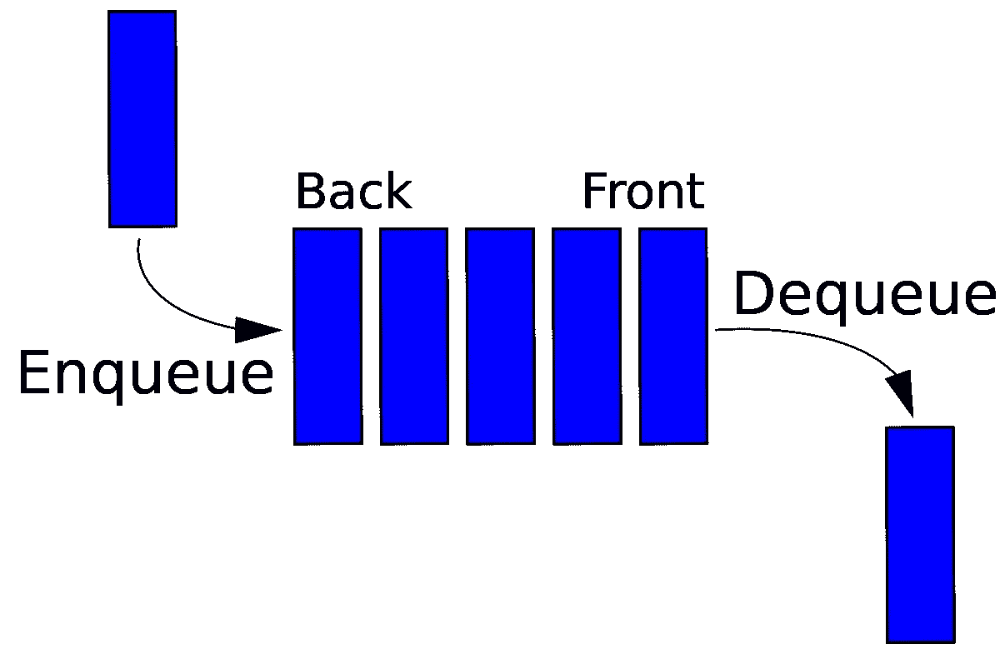

# JavaScript 数据结构—队列

> 原文：<https://blog.devgenius.io/javascript-data-structures-queue-190e8788d1c2?source=collection_archive---------13----------------------->

在我的上一篇文章中，我谈到了[栈](https://medium.com/@utarit/javascript-data-structures-stack-e3a3977b92aa)。现在，我想谈谈排队的问题。当我们看定义的时候，

> 一个**队列**是一个线性的**结构**，它遵循操作执行的特定顺序。

如你所见，队列也是一个线性结构(就像我们所说的数组)。不同的是**先进先出**。这意味着**进入队列的第一个元素先出去** *(记住栈是后进先出的)*。

让我们看看我们有哪些功能:

*   **Enqueue(el):** 将一个元素推到队列的后面。
*   **Dequeue():** 从队列的前面弹出元素。(这是第一个被推动的元素)
*   **front():** 返回第一个未出列的推送元素。
*   **rear():** (有人说 back 而不是 rear)返回最后一个推送的元素。
*   如果队列已满，则返回

其他函数是常用函数，我不想再重写它们。

队列在生产者-消费者问题、CPU、网络和异步问题中被大量使用。我建议深入队列，更有效地解决算法。此外，它还能很好地处理面试问题(尽管:D 并不比链表好)。下一个建筑见。保持健康…