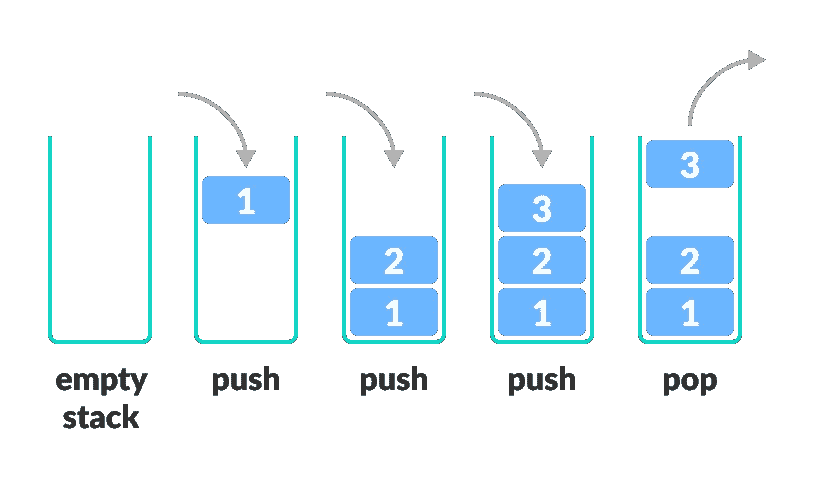

# JavaScript 数据结构—堆栈

> 原文：<https://blog.devgenius.io/javascript-data-structures-stack-e3a3977b92aa?source=collection_archive---------22----------------------->

我想进入一个著名的学科，数据结构。当我们看定义的时候，

> 数据结构是一种在计算机中组织数据的特殊方式，这样数据就能被有效地使用。

在开发算法或解决问题时，数据结构对我们帮助很大。今天我想展示一些 JavaScript 中的数据结构。

# 堆

堆

堆栈是保存数据的线性数据结构。栈的关键是**后进先出。**这意味着最后一个数据进入堆栈，然后从堆栈中出来。

让我们看看 JavaScript 中的堆栈是什么样子的:

*   **push(data):** 这个函数将新数据推到堆栈的顶部。
*   **pop():** 这个函数从栈顶弹出数据并返回。
*   **top():** 该函数返回排名靠前的数据。
*   **isEmpty():** 检查堆栈是否为空
*   **size():** 返回堆栈的大小

这就是用 JavaScript 实现堆栈的方法。我将继续与其他人的其他文章。保持健康...