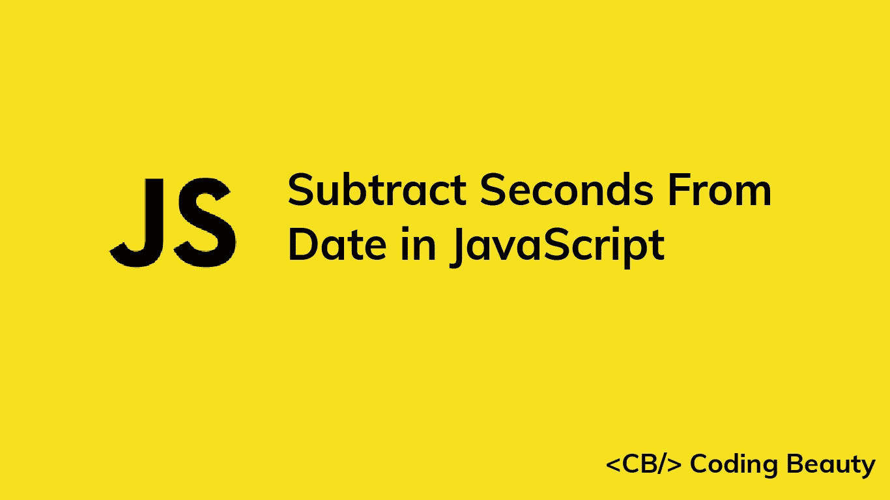

# 如何用 JavaScript 从日期中减去秒

> 原文：<https://blog.devgenius.io/javascript-date-subtract-seconds-83b3285b7959?source=collection_archive---------19----------------------->



让我们学习如何在 JavaScript 中轻松地从一个`Date`对象中减去任意秒数。

# 1.Date setSeconds()和 getSeconds()方法

从一个`Date`中减去秒:

1.  调用`Date`上的`getSeconds()`方法来获得秒数。
2.  减去秒。
3.  将减法的结果传递给`setSeconds()`方法。

例如:

```
function subtractSeconds(date, seconds) {
  date.setSeconds(date.getSeconds() - seconds); return date;
}// July 10, 2022 at 5:35:40 pm
const date = new Date('2022-07-10T17:35:40.000Z');const newDate = subtractSeconds(date, 10);// July 10, 2022 at 5:35:30 pm
console.log(newDate); // 2022-07-10T17:35:30.000Z
```

我们的`subtractSeconds()`函数接受一个`Date`对象和要减去的秒数作为参数。它返回减去秒数后的同一个`Date`对象。

Date [getSeconds()](https://developer.mozilla.org/en-US/docs/Web/JavaScript/Reference/Global_Objects/Date/getSeconds) 方法返回一个介于`0`和`59`之间的数字，表示特定`Date`的秒。

Date [setSeconds()](https://developer.mozilla.org/en-US/docs/Web/JavaScript/Reference/Global_Objects/Date/setSeconds) 方法将`Date`的秒数设置为指定的数字。

如果我们减去的秒数减少了`Date`对象的分钟、小时、日、月或年，`setHours()`会自动更新`Date`信息以反映这一点。

```
function subtractSeconds(date, seconds) {
  date.setSeconds(date.getSeconds() - seconds); return date;
}// July 10, 2022 at 5:20:00 pm
const date = new Date('2022-07-10T17:20:00.000Z');const newDate = subtractSeconds(date, 130);// July 10, 2022 at 5:17:50 pm
console.log(newDate); // 2022-07-10T17:17:50.000Z
```

在本例中，将`Date`的秒减少`130`将分钟减少`3`并将秒设置为`50`。

## 避免副作用

`setSeconds()`方法改变了它所调用的`Date`对象。这给我们的`subtractSeconds()`函数带来了一个副作用。为了避免修改传递的，并创建一个纯函数，制作一个`Date`的副本并在这个副本上调用`setSeconds()`，而不是原始的。

```
function subtractSeconds(date, seconds) {
  // make copy with Date() constructor
  const dateCopy = new Date(date); dateCopy.setSeconds(date.getSeconds() - seconds); return dateCopy;
}// July 10, 2022 at 5:35:40 pm
const date = new Date('2022-07-10T17:35:40.000Z');const newDate = subtractSeconds(date, 10);// July 10, 2022 at 5:35:30 pm
console.log(newDate); // 2022-07-10T17:35:30.000Z// original not modified
console.log(date); // 2022-07-10T17:35:40.000Z
```

**提示:**不修改外部状态的函数(即纯函数)往往更容易预测，也更容易推理，因为它们对于特定的输入总是给出相同的输出。这使得限制代码中副作用的数量成为一个很好的实践。

# 2.date-fns 亚秒()函数

或者，我们可以使用 [date-fns](https://www.npmjs.com/package/date-fns) NPM 包中的`subSeconds()`函数，从`Date`中快速减去秒。它的工作原理类似于我们的纯`subtractSeconds()`函数。

```
import { subSeconds } from 'date-fns';// July 10, 2022 at 5:35:40 pm
const date = new Date('2022-07-10T17:35:40.000Z');const newDate = subSeconds(date, 10);// July 10, 2022 at 5:35:30 pm
console.log(newDate); // 2022-07-10T17:35:30.000Z// original not modified
console.log(date); // 2022-07-10T17:35:40.000Z
```

*原载于*[](https://cbdev.link/19df44)

# *JavaScript 做的每一件疯狂的事情*

*一本关于 JavaScript 微妙的警告和鲜为人知的部分的迷人指南。*

**

*[报名](https://cbdev.link/d3c4eb)立即免费领取一份。*