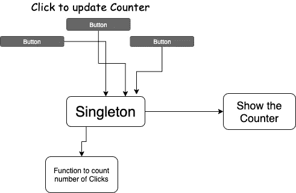

# JavaScript 设计模式

> 原文：<https://blog.devgenius.io/javascript-design-patterns-a18ec06c0418?source=collection_archive---------17----------------------->

马克西米利安·魏斯贝克尔在 [Unsplash](https://unsplash.com?utm_source=medium&utm_medium=referral) 上的照片

模式描述了环境中一次又一次发生的挑战，因此描述了挑战答案的核心，以这种方式，你可以简单地使用这个解决方案一次又一次，而不用做同样的事情两次。

在应用程序开发中，重要的是关注构建的策略，以一种非常健康、非常强大且易于维护的方式关联应用程序，模式提供了一种为常见挑战的解决方案命名的方式。这些解决方案可以是抽象的，也可以是非常精确和技术性的，并允许开发人员有效地相互交流。

本系列的目标是通过向您介绍代码流行模式的思想，并展示一些在流行的 JavaScript 中被大量使用的模式，来激发您对代码开发知识的正式讨论的兴趣。

# 单一模式

# 什么

单体模式不是最广泛使用的模式之一，但是我们从这里开始，因为它相对容易理解

单例模式源于单例的数学构造，即:

*在数学中，一个* ***单体*** *，也称为一个* ***单位集*** *，是恰好有一个元素的集合。例如，集合{null}是一个单例。*

单例模式将特定对象的实例数量限制为一个。这个单独的实例称为单例。

这仅仅意味着我们将一个类的实现限制在一个对象上。实现单例模式的类的对象第一次应该被合并时，它实际上将被合并。任何后续尝试都将返回第一个实例。

# 为什么

虽然单例模式并非没有挑战，但是单例也可以被归类为不止一个全局状态。然而，它仍然有它的用途。最值得注意的是配置对象。每次我们调用这个对象，我们实际上是在返回一个对这个对象的引用。因此，一个独生子女！

# 哪里

Angular 的服务是如何使用单例模式的主要例子。在 [Angular 的文档中，我们有一个专门的页面来解释](https://angular.io/guide/singleton-services)如何确保一个服务总是作为单例提供。

服务是单例的意义很大，我们使用服务作为存储状态、配置和允许组件之间通信的地方，我们确保没有多个实例混淆这些概念。

我们将跟踪一个对象中按钮被按下的次数，这个对象提供了计数和提供当前点击次数的功能。

如果该对象不是单例对象(每个按钮都有自己的实例)，那么点击计数就不正确。