# JavaScript DOM

> 原文：<https://blog.devgenius.io/javascript-dom-4398e97c165e?source=collection_archive---------4----------------------->

JavaScript DOM 的简单解释！！我已经在本文中包含了几个 dom 方法、dom CSS、事件、节点列表、HTML 集合等等。这些都是高级 JavaScript 主题。


DOM 是文档对象模块的简称。它是一个接口，允许程序动态访问和更新文档内容。DOM 是万维网联盟(W3C)标准。W3C 定义了三种形式的 DOM:核心、XML 和 HTML。核心 DOM 用于所有文档类型。XML DOM 指的是 XML 文档，而 HTML DOM 与 HTML 文档相关。

在本文中，我们将了解到 **HTML DOM** 。我已经讨论了所有的基本前提，重点是这个主题的新手。

HTML DOM 是 HTML 的一个编程接口，它允许访问和操作 HTML 文档。JavaScript DOM 可以改变 Html 元素和属性的内容，也可以改变 CSS 的样式。我们可以创建一个新的 Html 元素，也可以用 JavaScript DOM 删除一些现有的元素和属性。

> HTML DOM 还允许我们使用节点列表，稍后我们将更详细地讨论这一点。

## DOM 方法

Dom 方法是您可以对每个 HTML 元素执行的操作。DOM 方法允许我们访问和修改任何 HTML 元素。

**getElementById** :用指定的 Id 名访问 HTML 组件的方式。

```
<!DOCTYPE html>
<html>
<head>
<meta charset="UTF-8">
<meta http-equiv="X-UA-Compatible" content="IE=edge">
<meta name="viewport" content="width=device-width, initial-scale=1.0">
<link rel="stylesheet" href="styles.css">
<title>Document</title>
</head>
<body>
<h2>Let's Learn Javascript DOM</h2>
<p id="example"></p>
<script>
document.getElementById("example").innerHTML = "DOM is an W3C Standard";
</script>
</body>
</html>
```

这里提供的代码只是演示了 Dom 函数。
我们有一个名为“ **example** ”的 id，我们在脚本标签中使用了 **getElementById** 方法来检索它。
**InnerHTML** 是一个属性，可以用来修改任何给定元素的属性或内容。

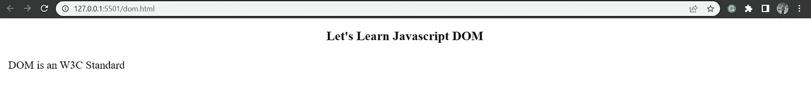

getElementById 输出

## DOM 元素

DOM 优先处理 HTML 内容。要更改元素的值或内容，我们需要首先访问它们。

我们已经讨论过使用 getElementById("id_name ")访问 Id 元素。

现在让我们尝试访问 HTML 文档中使用的其他元素。

**getElementByClassName:** 这是访问具有指定类名的元素的方法。

```
<!DOCTYPE html>
<html>
<head>
<meta charset="UTF-8">
<meta http-equiv="X-UA-Compatible" content="IE=edge">
<meta name="viewport" content="width=device-width, initial-scale=1.0">
<link rel="stylesheet" href="styles.css">
<title>Document</title>
</head>
<body>
<h2>Let's Learn Javascript DOM</h2>
<p class="cname">
 dom with class name !!
</p>
<p class="cname">
Let's learn dom with class name !!
</p>
<p id="example"></p>
<script>
var x = document.getElementsByClassName("cname");
document.getElementById("example").innerHTML = "This is " + x[0].innerHTML;
</script>
</body>
</html>
```

在这里，我们有一个 id 和一个类。我们可以使用 getElementsByClassName("….. "来访问该类).

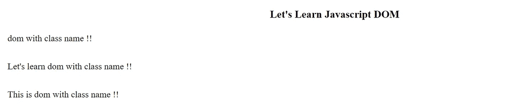

js dom 类名

> id 和类访问方法之间有所区别。因为 id 名称总是唯一的，所以我们只能访问一个具有该 id 名称的元素。然而，我们可能有许多同名的类，并且访问许多同名的项目。

**getElementsByTagName:** 这是用标签名访问元素的方法。标签包括< a >、< h1 >、< p >等。

```
<!DOCTYPE html>
<html>
<head>
<meta charset="UTF-8">
<meta http-equiv="X-UA-Compatible" content="IE=edge">
<meta name="viewport" content="width=device-width, initial-scale=1.0">
<link rel="stylesheet" href="styles.css">
<title>Document</title>
</head>
<body>
<h2>Let's Learn Javascript DOM</h2>
<p>
DOM with tag Name  !!
</p>
<p id="example"></p>
<script>
var x = document.getElementsByTagName("p");
document.getElementById("example").innerHTML = "This is " + x[0].innerHTML ;
</script>
</body>
</html>
```

这里我们使用了 getElementsByTagName()方法并访问了 p 标记元素。

输出如下所示:

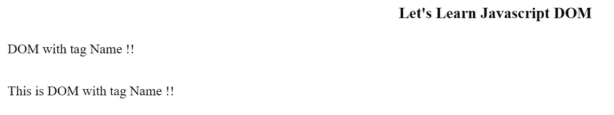

标签名称输出

**query selector()&query selector all()**:这是访问指定 CSS 选择器的两种技术。
*querySelector* 返回所提供的 CSS 选择的第一个元素，而 *querySelectorall* 返回指定的 CSS 选择器的所有元素。

```
<!DOCTYPE html>
<html lang="en">
<head>
<meta charset="UTF-8">
<meta http-equiv="X-UA-Compatible" content="IE=edge">
<meta name="viewport" content="width=device-width, initial-scale=1.0">
<title>Document</title>
</head>
<body>
<h1> JS Query Selector</h1>
<h2 class="hclass">QUery selector</h2>
<p class="pclass"> query selector returns first element </p>
<p id="myid"> It is p id</p>
<p id="myid"> This is second id </p>
<script>
//Element selector
var a=document.querySelector("p");
console.log(a);
</script>
</body>
</html>
```

在这里你可以观察代码。我们有 h2 和 p 类以及一个带有 id 元素的 p 标签。

我们通过 querySelector 选择了元素。

```
var a=document.querySelector("p");
console.log(a);
```

document . query selector(" p ")；遍历 HTML 文档，搜索指定的选择器 ie : p，并返回第一个值。

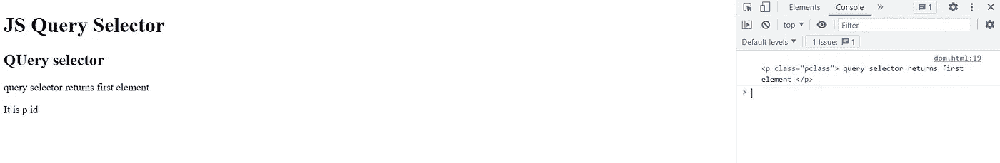

查询选择器输出

您可以在控制台中看到输出。

```
var b = document.querySelector("#myid");
console.log(b); // this will return us :
**<p id="myid"> It is p id</p>** in our console as ouput**.**
```

从前面的代码中我们可以看到，我们有两个#myid 选择器，但是它只返回第一个元素及其上下文。

但是对于 querySelectorAll，情况有所不同。它将所有元素返回给指定的选择器。

```
//queryselectorall code
var b = document.querySelectorAll("#myid");
console.log(b);The output is shown below :
```

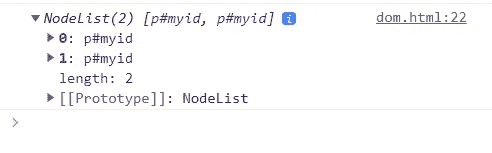

queryselectorall 所有输出

所以这些是我们在 HTML DOM 中必须学习的基本方法。

通过这些方法，HTML DOM 允许 JavaScript 更改 HTML 元素的内容。

*   **改变 HTML 内容再举一个例子:**

```
<!DOCTYPE html>
<html lang="en">
<head>
<meta charset="UTF-8">
<meta http-equiv="X-UA-Compatible" content="IE=edge">
<meta name="viewport" content="width=device-width, initial-scale=1.0">
<title>Document</title>
</head>
<body>
<h2>JS can change html content .  </h2>
<p id="id1">This is our first text !!</p>
<script>
document.getElementById("id1").innerHTML="Our new Text";
</script>
</body>
</html>
```

查看这段代码，我们看到一个 p 标签，id 为“id1 ”,内容为“这是我们的第一个文本！!"我们使用 DOM 方法获取 id 为“id1”的元素，然后 Javascript 将其内容修改为“我们的新文本”。

这个新文本将作为输出显示在我们的页面上。

同样，我们可以用标记名、类名或 id 名来更改任何 HTML 内容。

如前所述，HTML DOM 还允许 JavaScript 改变 CSS 的样式。

在更改 CSS 样式时，我们首先需要访问元素，然后向它们添加所需的样式属性。

*   **改变 HTML 元素的样式:**

> 我们有一个简单的语法:
> 
> **document.getElementById(" .. "). style.property =新样式**

```
<!DOCTYPE html>
<html lang="en">
<head>
<meta charset="UTF-8">
<meta http-equiv="X-UA-Compatible" content="IE=edge">
<meta name="viewport" content="width=device-width, initial-scale=1.0">
<title>Document</title>
</head>
<body>
<h1>Changing the styling features</h1>
<p id="id0">This is zero id</p>
<p id="id1">This is one id</p>
<script>
document.getElementById("id1").style.color = "blue";
document.getElementById("id0").style.color = "red";
</script>
</body>
</html>
```

其输出如下所示。

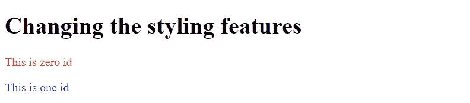

改变风格

## **DOM 事件**

DOM 允许 JavaScript 响应 HTML 事件。
开始，有哪些赛事？？
事件是用户做的任何动作，比如点击按钮、停留在元素上、按键、提交表单等等。
事件属性可用于分配事件。

```
<!DOCTYPE html>
<html lang="en">
<head>
<meta charset="UTF-8">
   <meta http-equiv="X-UA-Compatible" content="IE=edge">
<meta name="viewport" content="width=device-width, initial-scale=1.0">
<title>Document</title>
</head>
<body>
<button onclick="time()"> Click for time :</button>
<p id="id"></p>
<script>
function time(){
document.getElementById("id").innerHTML=Date();
}
</script>
</body>
</html>
```

所以，这里我们有一个名为“点击时间”的按钮

当我们单击按钮时，我们利用了事件属性“onclick”，它为我们提供了将函数 time()作为事件附加的指令。

当按钮被按下时，函数被启动，我们在函数中写的任何东西都被执行。我们在这个例子中显示了日期。

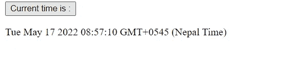

点击按钮后显示的日期

像 onclick()事件一样，还有许多其他的事件属性。

```
<!DOCTYPE html>
<html lang="en">
<head>
<meta charset="UTF-8">
<meta http-equiv="X-UA-Compatible" content="IE=edge">
<meta name="viewport" content="width=device-width, initial-scale=1.0">
<title>Document</title>
</head>
<body>
<style>
.head{
margin-left: 30px;
padding: 20px;
font-size: 20px;
background-color: aquamarine;
</style>
<button class="head" onmouseover="hov(this)" onmouseout="hovout(this)">THIS IS BUTTON</button>
<p id="id"></p>
<script>
function hov(text){
text.innerHTML = "Mouse over done"
}
function hovout(obj){
obj.innerHTML = "Mouse out done"
}
</script>
</body>
</html> 
```

当我们将鼠标移到按钮上时，onmouseover()改变内容，当我们将鼠标从按钮上移开时，onmouseout()改变内容。

在 Javascript 中，事件是这样工作的。

还有一个 DOM 事件监听器:

**addEventListener()，**将事件连接到特定元素。

让我们看看事件监听器方法的语法。

> *元素*。addEventListener( *事件，函数，使用捕获*)；

事件可以是像点击或鼠标悬停这样的事件。

**函数**是事件发生时我们设置的参数。

**useCapture** 是可选写的。它是一个布尔值，指定是使用冒泡还是捕获。

> 布尔值只能为真或假。在这种情况下，默认值为 false，表示事件冒泡，而另一个值为 true，表示事件正在捕获。这将在稍后阶段揭示。

让我们看一个使用 addEventListener()附加事件的例子；

```
<!DOCTYPE html>
<html lang="en">
<head>
<meta charset="UTF-8">
<meta http-equiv="X-UA-Compatible" content="IE=edge">
<meta name="viewport" content="width=device-width, initial-scale=1.0">
<title>Document</title>
</head>
<body>
<style>
.head{
margin-left: 30px;
padding: 20px;
font-size: 20px;
background-color: aquamarine;
}
</style>
<button class="head" id="button">Click me</button>
<script>
document.getElementById("button").addEventListener("mouseover",function() {
document.write("This is event listener");
alert("Add event listener");
console.log("This is console section");
})
</script>
</body>
</html>
```

对于 addEventListener，我们有两个参数。
一个指定事件的类型，如鼠标悬停，如前所述。
我们接下来写的函数会在事件发生时按预期动作。
以下是输出:第一个图像显示了单击按钮后执行的警告操作。

第二幅图像展示了我们在控制台和页面上获得的输出。

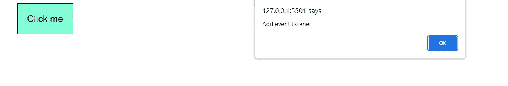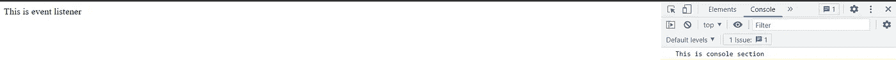

事件监听器输出

## 事件捕获和事件冒泡

本质上，这些是事件传播的形式，指定哪个元素事件应该首先发生。事件冒泡是我们默认的事件传播机制，它首先处理内部元素事件，然后移动到外部元素。相反的情况适用于事件捕获。它首先处理外部元素的事件，然后移动到内部元素。

```
<!DOCTYPE html>
<html lang="en">
<head>
<meta charset="UTF-8">
<meta http-equiv="X-UA-Compatible" content="IE=edge"><meta name="viewport" content="width=device-width, initial-scale=1.0">
<title>Document</title>
</head>
<body>
<style>
.head{
margin-left: 30px;
padding: 20px;
font-size: 20px;
background-color: aquamarine;
}
</style>
<div id="first">
<h3>bubble</h3>
<button class="head" id="button">Click me</button>
</div>
<div id="second"><h3>capture</h3><button class="head" id="button2 ">Click me </button>
</div>
<script>
document.getElementById("first").addEventListener("click",
function() {
alert("outer element event got executed at the end!");
}, false);document.getElementById("button").addEventListener("click",
function() {
alert("inner element event got executed first!");
}, false);document.getElementById("second").addEventListener("click", function() {
alert("outer element event got executed first!");
}, true);document.getElementById("button2").addEventListener("click", function() {
alert("inner element event got executed at the end!");
}, true);
</script>
</body>
</html>
```

在本例中，我们有两个 div，其中包含 h1 和 button 标记。

第一个 div 用于冒泡，而第二个用于捕获。我们将 js 代码放在脚本标记中，并使用了 dom 方法和带有函数的 addEventListener 方法。

该函数有一个 click 事件，并使用一个布尔值来指定哪个事件应该在何时发生。查看具有假值的代码；它用于 bubbing，当您单击按钮时，内部元素的事件首先发生，然后是外部元素的事件。相反的情况适用于引用捕获的具有真值的代码。

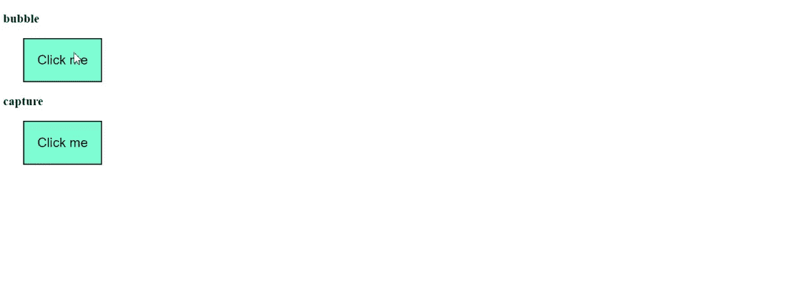

事件冒泡和捕获结果

我们可以使用 removeEventListener()移除事件处理程序。

## HTML DOM 节点

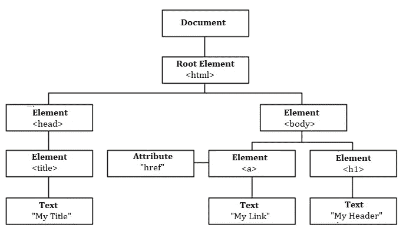

HTML DOM 允许我们在树的节点间导航。如上面图片 ie: ***节点树*** 所示，HTML 页面中的一切都是节点。
根节点是顶层节点，根节点没有父节点。这里，< html >是根节点，有两个子节点:<头>和<体>。HTML 的第一个孩子是头，HTML 的最后一个孩子是体。

有一个子节点:<title>，它又有一个子节点:textnode。</title>

有两个子节点:和

# 。两者都有自己的文本节点子节点。

有了 HTML dom，我们可以使用 JavaScript 访问树中的所有节点。我们可以添加新节点或修改和删除现有节点。

**创建新节点(新 HTML 元素)**

因此，我们在 html 中添加了一个新的节点，但在此之前，我们需要先创建一个元素节点，然后使用 appendChild()添加到现有的元素中。

```
<!DOCTYPE html>
<html lang="en">
<head>
<meta charset="UTF-8">
<meta http-equiv="X-UA-Compatible" content="IE=edge">
<meta name="viewport" content="width=device-width, initial-scale=1.0"><title>Document</title>
</head>
<body>
<h1>Add new html element node </h1>
<section id="id1">
<h3 id="h1">This is heading id </h3>
<p id="p1">This is paragraph id </p>
</section>
<script>
const first = document.createElement("p");
const text = document.createTextNode("So we added this ");
first.appendChild(text);
const exist = document.getElementById("id1");
exist.appendChild(first);
</script>
</body>
</html>
```

我们在这个部分有一个标题和一个带文本的 p 标签。我们现在想要向该部分添加一个新元素节点。为此，我们首先用 ***createElement()*** 函数构造了元素“ **p** ，并先将其设置为一个名为“**的变量。**”

```
const first = document.createElement("p");
```

接下来，我们想给这个元素添加一些文本。

```
const text = document.createTextNode("So we added this ");
```

我们使用 createTextNode()创建一个文本节点，然后向其中添加一些文本，并使用 const 将其存储在一个变量中。

现在我们需要给文本节点添加元素 p。

```
first.appendChild(text);
```

最后，我们将元素 p 添加到已经存在的元素

中。为此，我们将首先获取现有元素的 id，然后将新元素附加到它上面。

```
const exist = document.getElementById("id1");
exist.appendChild(first);
```

让我们观察它的输出:

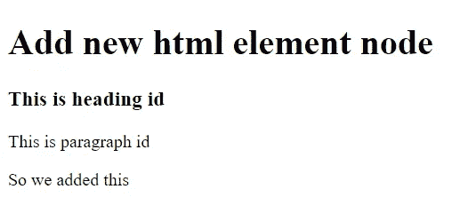

添加新节点输出

您可以看到我们添加的新元素节点显示为最后一个子节点。如果你不想在最后，那么我们可以使用 **insertBefore()** 方法来代替 appendChild()。在向现有元素添加新元素时，我们可以使用 insertBefore()。

遵循给定的代码:

```
<!DOCTYPE html>
<html lang="en">
<head>
<meta charset="UTF-8">
<meta http-equiv="X-UA-Compatible" content="IE=edge">
<meta name="viewport" content="width=device-width, initial-scale=1.0">
<title>Document</title>
</head>
<body>
<h1>Add new html element node </h1>
<section id="id1">
<h3 id="h1">This is heading id </h3>
<p id="p1">This is paragraph id </p>
</section>
<script>
const first = document.createElement("p");
const text = document.createTextNode("So we added this ");
first.appendChild(text);
const exist = document.getElementById("id1");
const newelement = document.getElementById("h1");
exist.insertBefore(first,newelement);
</script>
</body>
</html>
```

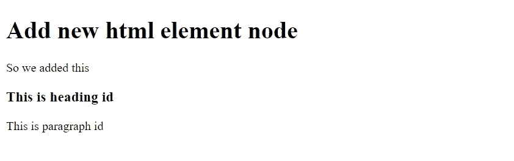

**移除现有元素**

如果需要，我们也可以删除现有部分。只需识别要删除的元素，给它分配一个变量名，然后调用 ***remove()*** 方法。

```
<!DOCTYPE html>
<html lang="en">
<head>
<meta charset="UTF-8">
<meta http-equiv="X-UA-Compatible" content="IE=edge">
<meta name="viewport" content="width=device-width, initial-scale=1.0">
<title>Document</title>
</head>
<body>
<h1>REMOVE  html element node </h1>
<section id="id1">
<h3 id="h1">This is heading id </h3>
<p id="p1">This is paragraph id </p>
</section>
<script>
const element = document.getElementById("h1");
element.remove();
</script>
</body>
</html>
```

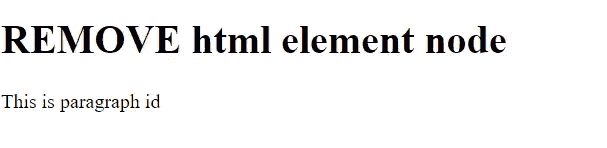

移除元素输出

这里我们删除了 h3 元素节点。

**替换 HTML 元素节点**

为了替换 html 元素，我们使用 replaceChild()。

```
<!DOCTYPE html>
<html lang="en">
<head>
<meta charset="UTF-8">
<meta http-equiv="X-UA-Compatible" content="IE=edge">
<meta name="viewport" content="width=device-width, initial-scale=1.0"><title>Document</title>
</head>
<body>
<h1>REPLACE html element node </h1>
<section id="id1">
<h3 id="h1">This is heading id </h3>
<p id="p1">This is paragraph id </p>
</section>
<script>
const root = document.getElementById("id1");
const child = document.getElementById("p1");
const element = document.createElement("p");
const text = document.createTextNode("this is thee text replaced");
element.appendChild(text);
root.replaceChild(element,child);
</script>
</body>
</html>
```

我们选择要替换的节点元素，并将其赋给变量“element”，同时创建 textnode 并将其追加到“element”中。
最后，使用 replaceChild，选择您希望替换的目标节点的父节点。

## **HTML DOM 节点列表**

Nodelist 是 html 文档中节点的集合。我们可以使用 querySelectorAll()返回 nodelist 对象。

**从节点列表中访问元素**

```
<!DOCTYPE html>
<html lang="en">
<head>
<meta charset="UTF-8">
<meta http-equiv="X-UA-Compatible" content="IE=edge">
<meta name="viewport" content="width=device-width, initial-scale=1.0">
<title>Document</title>
</head>
<body>
<h1 style="text-align: center;">NodeList</h1>
<p>Collection of NODES</p>
<p>Hello World</p>
<script>
var myNodeList = document.querySelectorAll("p");
var x = myNodeList[0];
console.log(x);
console.log(myNodeList.length);
</script>
</body>
</html>
```

可以通过索引号访问 Nodelist 元素。索引通常从 0 开始。

因此，为了访问第一个元素，我们编写了 **myNodeList[0]** 。如果我们需要访问第二个元素，我们可以写 **myNodeList[1]** 。

我们也可以用 **myNodeList.length** 方法知道 NodeList 的长度。

我们上面展示的代码的输出是:

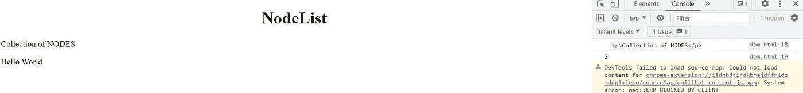

节点列表输出

## **HTML 集合对象**

它非常类似于 NodeList。Html 集合对象是 html 元素的列表。它也可以通过索引号来访问，就像我们在 NodeList 中所做的一样，我们还有 length 属性，它定义了元素的编号。

```
<!DOCTYPE html>
<html lang="en">
<head>
<meta charset="UTF-8">
<meta http-equiv="X-UA-Compatible" content="IE=edge">
<meta name="viewport" content="width=device-width, initial-scale=1.0">
<title>Document</title>
</head>
<body>
<h1 style="text-align: center;">HTML COLLECTION List</h1>
<p>Collection of html elements</p>
<p>Hello World</p>
<script>
var htmllist = document.querySelectorAll("p");
var x = htmllist[1];
console.log(x);
console.log(htmllist.length);
</script>
</body>
</html>
```

您可以看到下面的输出:

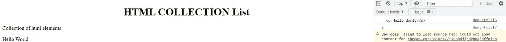

HTML 集合输出

所以，这些是一些需要掌握的高级 JavaScript 主题。