# JavaScript ES6 模块

> 原文：<https://blog.devgenius.io/javascript-es6-modules-32b28b2329c1?source=collection_archive---------21----------------------->

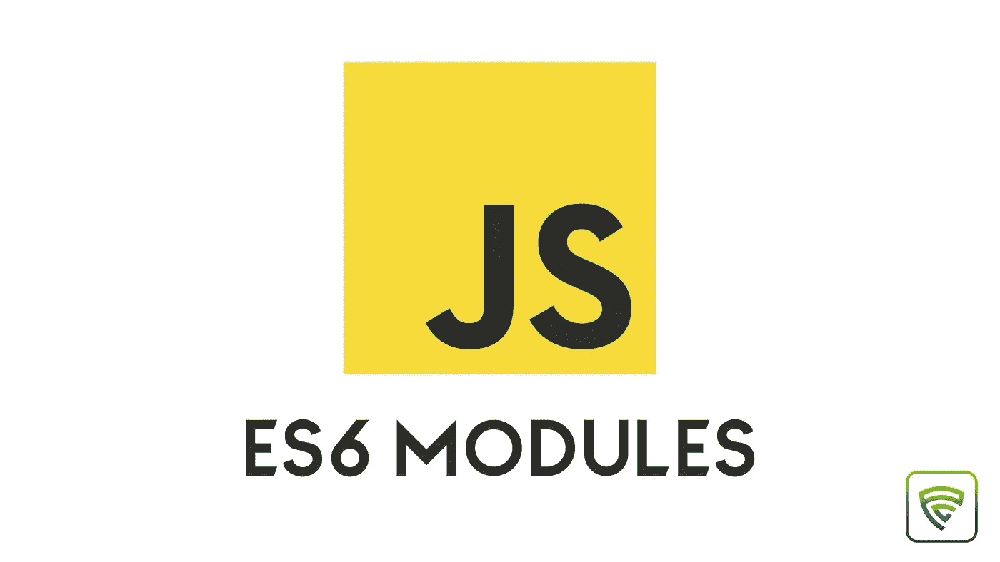

## 以简单的方式理解 JS 模块

JS 模块用于将类、函数、对象和原语从一个模块导出到另一个模块。所以，我们可以在多个文件中使用同一个模块，而不需要一遍又一遍地重写代码来使我们的代码变干(不要重复自己)。JavaScript 库或 ReactJS、AngularJS 等框架支持使用这些模块。理解模块如何工作对于学习任何现有的框架都是必不可少的。

# 包括 index.html 的脚本标签

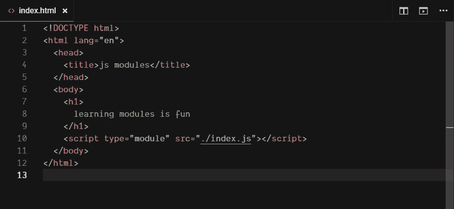

如果你想使用模块特性，在 HTML 文件中包含 JavaScript 文件是有点不同的，并且必须提到 type="module"。

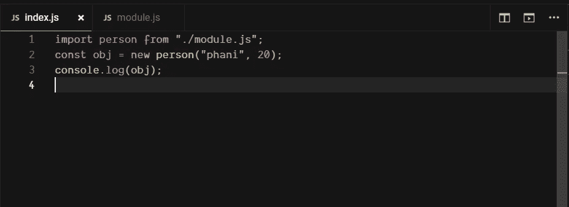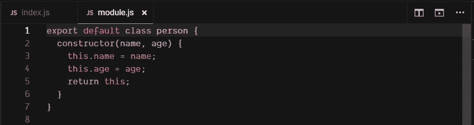

在上面的例子中，在 module.js 文件中，我们将 person 类导出为默认导出，并在 index.js 文件中导入 person。导入 person 类后，我们将创建一个新对象，并通过控制台记录它。因此，输出看起来像这样。

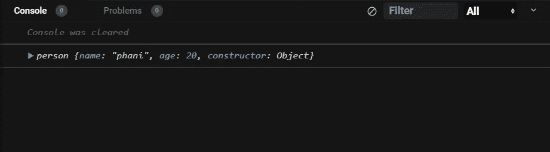

# 指定出口

命名导出是指我们不将其作为默认导出进行导出。一个模块可以有多个命名的导出，然后用花括号导入您想要的特定导出。

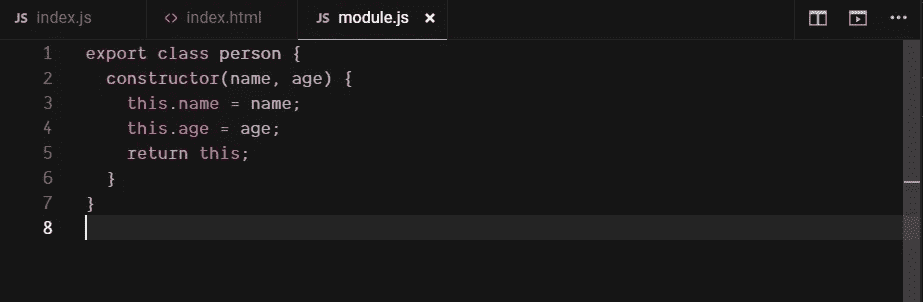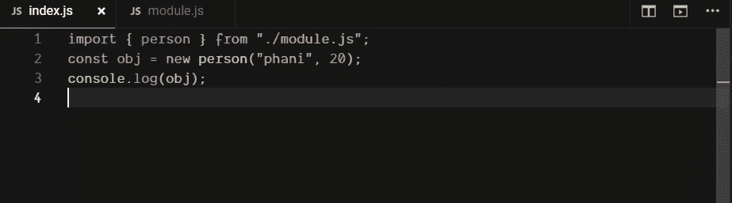

> 如果您要像命名的那样导出，导出花括号是必要的。如果是默认导出，请不要使用括号

# 作为操作员

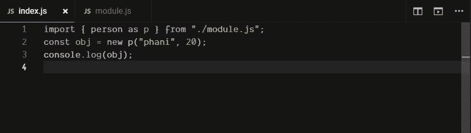

作为操作符，我们输入“某物作为另一物”并用另一物代替某物。AS 运算符只能用于指定的导出。

> **一个模块可以同时拥有默认和命名的导出**

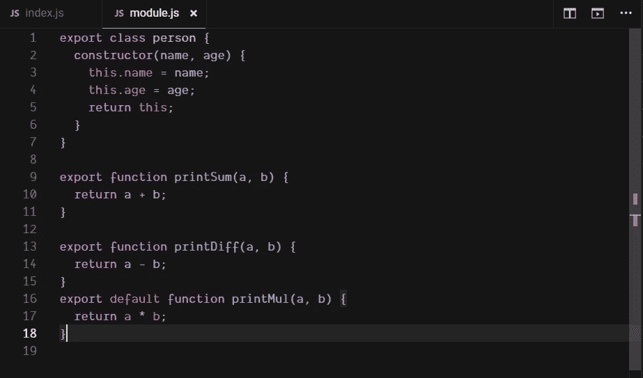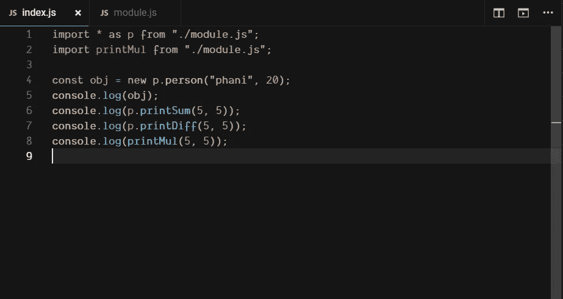

在上面的示例中，module.js 文件同时具有命名导出和默认导出，在 index.js 文件中，我们将所有命名导出作为 p 导入(星号表示我们正在导入的所有命名导出)。使用点操作符，我们可以使用导入的所有命名导出。

> **记住一个模块不能有多个默认导出，但是它可以有多个命名导出**

你可能会问，如果要重命名一个命名的导出，我们使用 AS 操作符，但是我们如何重命名一个默认的导出呢？。

别担心，我掩护你。

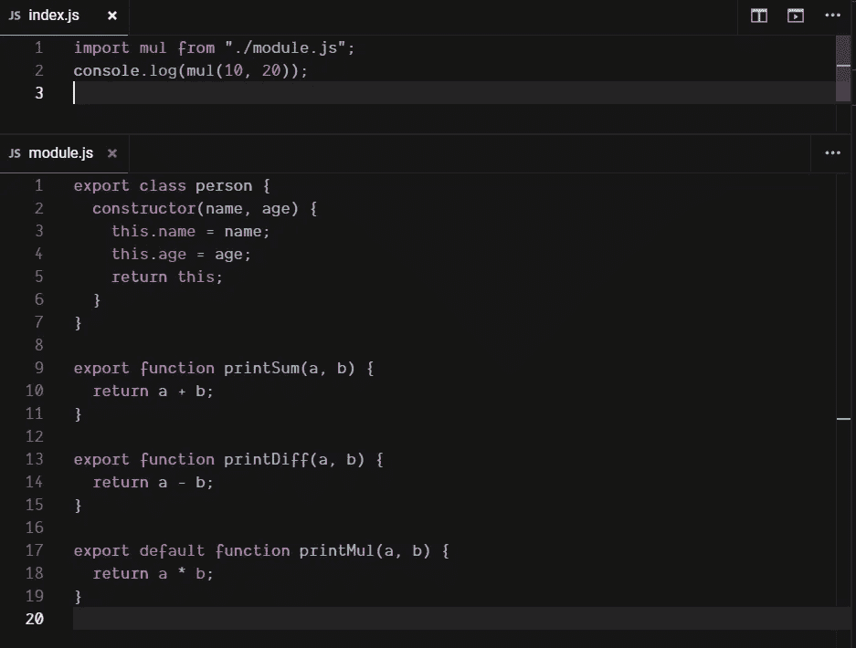

当我们导入一个模块的时候，只要把名字改成你想要的就行了，不需要像操作符之类的东西。

```
import printMul, { printSum } from “./module.js”;
```

当您想要导入命名导出和默认导出时，可以使用上面的代码行。

这是我们用来理解这个主题的代码，我们用这个代码沙箱来更好地理解这个主题。

**查看我的其他文章:**

[](https://medium.com/@phanendraguptha/how-to-create-a-dark-light-theme-switch-using-html-css-and-javascript-d8e466dcd979) [## 如何使用 HTML、CSS 和 JavaScript 创建暗/亮主题切换

### 在开始主题之前，我想告诉你为什么黑暗主题在你的网站上是必不可少的。黑暗模式已经变成…

medium.com](https://medium.com/@phanendraguptha/how-to-create-a-dark-light-theme-switch-using-html-css-and-javascript-d8e466dcd979) [](https://medium.com/@phanendraguptha/learn-js-with-babeljs-d20091739058) [## 用 babeljs 学习 js

### 巴贝利斯

medium.com](https://medium.com/@phanendraguptha/learn-js-with-babeljs-d20091739058) [](https://medium.com/@phanendraguptha/git-cheatsheet-b124439bd3f3) [## Git 备忘单

### 简而言之，git 是一个版本控制系统，允许开发人员提交、创建分支&允许他们…

medium.co](https://medium.com/@phanendraguptha/git-cheatsheet-b124439bd3f3)