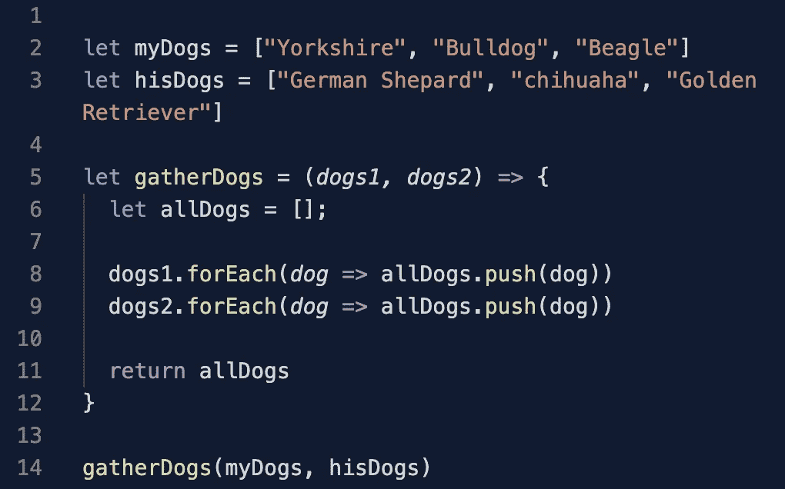
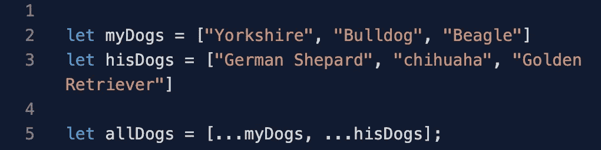
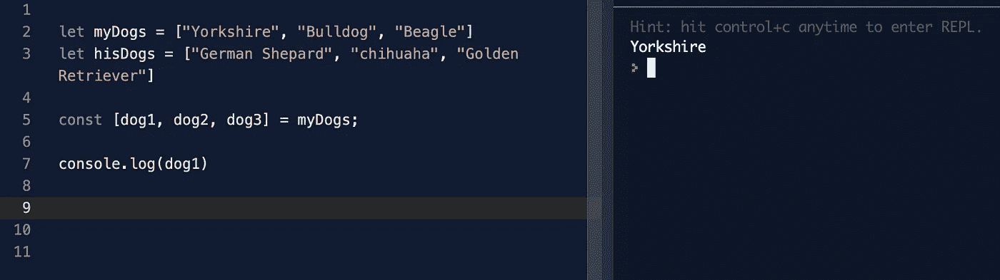

# JavaScript: ES6 扩展操作符和析构

> 原文：<https://blog.devgenius.io/javascript-es6-spread-operator-and-destructuring-5a556e06d8a9?source=collection_archive---------39----------------------->

# 介绍

多年来，程序员一直在寻找简化代码的方法，创造新的特性、技术、框架，在这种情况下，彻底改变一门语言。ECMAScript 是 JavaScript 的**子集，这意味着 JS 是基于 ECMAScript 构建的，其他语言如 TypeScript 和 ActionScript 也是基于 ECMAScript 构建的。尽管已经有了一个 ES8 版本， **ES6 标志着这种语言的一个巨大增加**。**

ES6 的**有两个非常有用和流行的特性**，扩展操作符和数组重构，在这篇博客中，我会用一些用例及例子来解释这两个特性。

# 扩展运算符

spread 操作符非常简单易懂，它基本上允许我们做的是**获取数组内部的元素并使用它们，而不必单独指定每个元素**。很多时候，我们会发现自己想要将一个数组中的元素添加到另一个数组中，但又不想将一个数组添加到另一个数组中，在 spread 运算符之前，我们可以创建一个函数来添加两个数组，如下所示:

有许多方法可以实现这种数组融合，但是让我们看看 spread 操作符如何在一行代码中完成所有这些操作

哇对了！让我们仔细看看，我们在每个数组前用了三个点，这是告诉 JavaScript 抓取数组中的所有元素，并将它们放入或“散布”到一个新数组中。

# 解构

析构是**用数组内部的元素创建新变量**的行为。例如，假设我们需要在一个单独的变量中保存每个狗的品种，而不是手动访问 dog 数组中的每个元素，让我们重新构造这个数组。

酷吧！为了创建新的变量，我们需要把变量名放在括号内，然后设置它等于数组。

# 结论

利用这两个特性，我们可以做更多的事情，甚至可以做更多的 ES6 特性。如果您有兴趣了解更多关于 JavaScript 历史和 ECMAScript 版本的信息，请查看我找到的这篇很棒的博文 [***。感谢阅读！***](https://medium.com/@madasamy/javascript-brief-history-and-ecmascript-es6-es7-es8-features-673973394df4)