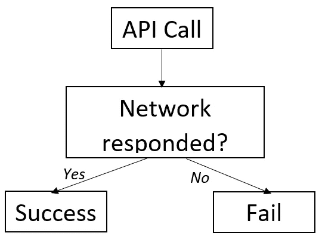

# Javascript —获取 API 和 HTML 错误状态

> 原文：<https://blog.devgenius.io/javascript-fetch-api-and-html-error-statuses-694e7df55c4?source=collection_archive---------3----------------------->

> 不要被这种有点令人惊讶的互动所迷惑。


马科斯·迈尔在 [Unsplash](https://unsplash.com?utm_source=medium&utm_medium=referral) 上的照片

前几天我写了一个 GET 请求到一个端点，在测试中，我收到了很多 400 错误。400 错误与**客户端错误**有关，基本上是由提出请求的人引起的错误。一些常见的 400 错误有: **- 400 坏请求
- 401 未授权
- 404 未发现
-** [**418 我是茶壶**](https://en.wikipedia.org/wiki/HTTP_418) (好吧也许没有这么多这一条，但这是一个真正的错误代码)

现在，这是绝对好的，我已经预料到会遇到这些错误。但是我没有想到的是，当 API 响应返回时，我的 API 钩子(在我的例子中是 React-query)正在触发 **onSuccess 方法**。基本上，我的调用失败了，出现 400 错误，但是我的 API 管理钩子认为它成功了。非常奇怪。

起初，我怀疑 React-query 中有违规行为，不知何故，400 个错误被编码为成功，尽管这在我看来很疯狂。
但是经过一番挖掘，发现其实是 **fetch API** 的‘毛病’。事实证明，**这根本不是故障**，这是预期行为。那么 fetch 如何处理 HTTP 错误状态呢？

## 什么是成功？

对于你们中的一些读者来说，这篇文章可能看起来非常明显——我认为这可以归结为我们自己对成功的定义。对我来说，API 环境中的成功意味着类似于:

1.我们发出了我们的请求。服务器回应
3。我们被授权提出那个请求。我们的要求被执行
5。一切正常，我们得到了 200 ok 状态的🥳

**但这不是 fetch 定义成功的方式**。Fetch 只对第 2 点感兴趣。fetch 所关心的是网络是否能够执行请求。本质上，我们可以认为 fetch 是这样工作的；



获取 API 成功响应的简化

如果你像我一样认为，成功基本上等同于 200 的地位，那么这是一个有点难以接受的概念。我们可以返回一个 500 的错误，但在技术上仍然是成功的？Fetch 说是的。

## 那么我们如何用 fetch 处理错误状态呢？

让我们来看看一些代码。

```
export const getExample = async ({ token }) => {
    const response = await fetch("API_URL", {
        method: "GET",
        headers: {
            "Authorization": `Bearer ${token}`
        }
    });
    return response;
};
```

这个`getExample`函数返回一个承诺，这是一个简单的 GET fetch API 请求的响应。如果我们使用 API 管理库(比如 React-query/Apollo ect)来消费这个承诺，那么他们会告诉我们这是一个成功的调用，因为响应承诺没有失败。请记住— Fetch 仅在网络错误时不履行承诺，而在错误状态时不履行承诺。如果我们想改变这种行为，我们要做的就是**手动拒绝/拒绝承诺**。

谢天谢地，这很简单。虽然 fetch 没有违背我们的承诺，但是如果返回的错误状态不是 200–299，它会将一个名为`ok`的响应标志设置为 false。更多关于`response.Ok`旗帜的信息，请点击此处—[https://developer . Mozilla . org/en-US/docs/Web/API/Response/ok](https://developer.mozilla.org/en-US/docs/Web/API/Response/ok)

记住这一点，我们可以写一个检查，看看布尔标志是否被设置为假，如果是这样，我们可以手动取消承诺。这应该可以了；

```
...if (!response.ok) await ***Promise***.reject(new ***Error***(response.status.toString())); //Write your own error msg here
return response;
```

## **重述**

**API 成功！== 200 OK**
Fetch 只要得到服务器的响应就不关心错误状态。如果代码不是我们想要的样子，我们需要手动检查并使响应承诺失败。
或者……我们可以只使用 Axios，它会自动为我们完成这项工作。

***来源***

[](https://developer.mozilla.org/en-US/docs/Web/API/Fetch_API) [## 获取 API

### 获取 API 提供了获取资源的接口(包括通过网络)。对…似乎很熟悉

developer.mozilla.org](https://developer.mozilla.org/en-US/docs/Web/API/Fetch_API) [](https://developer.mozilla.org/en-US/docs/Web/API/Response) [## 响应-Web API | MDN

### Fetch API 的接口表示对请求的响应。您可以使用…创建新的响应对象

developer.mozilla.org](https://developer.mozilla.org/en-US/docs/Web/API/Response) 

如果你喜欢这篇文章或者觉得它有用，请随意。或者，你可以在这里的 Medium [*上支持我*](https://jamesmbrightman.medium.com/membership) *或者给我买一杯* [*咖啡*](https://ko-fi.com/jamesbrightman) *！非常感谢所有的支持。*