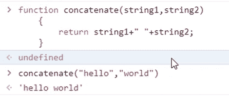
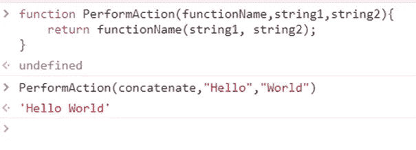
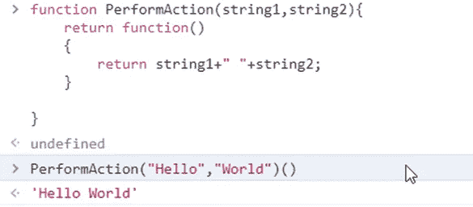
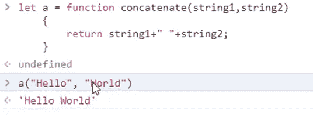
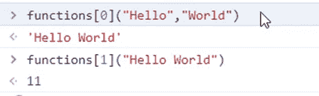

# JavaScript —一级函数

> 原文：<https://blog.devgenius.io/javascript-first-class-function-f7418b1eb7dd?source=collection_archive---------21----------------------->


穆罕默德·拉赫马尼在 [Unsplash](https://unsplash.com?utm_source=medium&utm_medium=referral) 上的照片

对于技术，最简单的概念有时可能是最复杂的。对我来说，JavaScript 函数就是这种情况。我避免编写返回函数或者将函数作为参数传递的函数。

因此，我决定把它写下来。写任何话题的好处是它能给研究带来真诚，并且你能记住更长的时间。

# 什么是一流的功能？

*“当一种编程语言中的函数被像对待其他变量一样对待时，该语言被称为具有* ***一级函数*** *”—* [*维基百科*](https://en.wikipedia.org/wiki/First-class_function)

一级函数的属性如下

1.  将函数作为参数传递给其他函数
2.  将它们作为其他函数的值返回
3.  将它们赋给变量
4.  将它们存储为数据结构

# 将函数作为参数传递给其他函数

我将定义一个函数来连接两个字符串，中间有一个空格。

```
function concatenate(string1,string2)
{
return string1+” “+string2;
}
```



我将定义另一个函数，对两个字符串执行字符串操作。参数 functionName 定义了该操作。

```
function PerformAction(functionName,string1,string2){
 return functionName(string1, string2);
}
```

让我们调用函数 PerformAction 并让它执行连接。

```
PerformAction(concatenate,” Hello”,” World”)
```



# 将它们作为其他函数的值返回

为了演示这个场景，我们将在同一个函数中合并 concatenate 和 PerformAction 这两个方法。

```
function PerformAction(string1,string2){
return function()
{
return string1+” “+string2;
}
}
```

PerformAction 方法返回连接两个字符串的方法。请注意，该函数没有名称。没关系，因为方法 PerformAction 返回函数的内容。我们也可以通过将 concatenate 函数赋给一个变量来编写不同的代码。

```
function PerformAction(string1,string2){
let a = function concatenate()
{
return string1+” “+string2;
}
return a
}
```

我们可以调用下面的 PerformAction()

```
PerformAction(“Hello”,”World”)()
```



# 将它们赋给变量

在这个例子中，我们将把“concatenate”方法赋给一个变量。

```
let a = function concatenate(string1,string2)
{
return string1+” “+string2;
}
```

我们可以调用变量“a”来连接字符串。

一(“你好”、“世界”)



# 将它们存储为数据结构

为了演示这个例子，我将定义两个方法并将它们分配给变量‘a’和‘b’:

## 功能 1 —连接字符串

```
let a = function concatenate(string1,string2)
{
return string1+” “+string2;
}
```

## 函数 2 —计算字符串的长度

```
let b = function GetLength(string1)
{
return string1.length;
}
```

将这些函数存储在一个数组中

```
var functions = [a,b];
```

执行以下这些方法:



页（page 的缩写）s-Medium 是一个阅读、写作和向其他作者学习的绝佳平台。如果你想加入我的旅程，今天就加入 [medium](https://tarunbhatt9784.medium.com/membership) 。