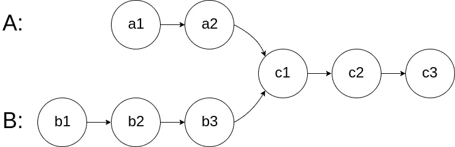
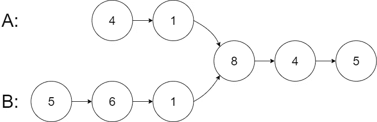
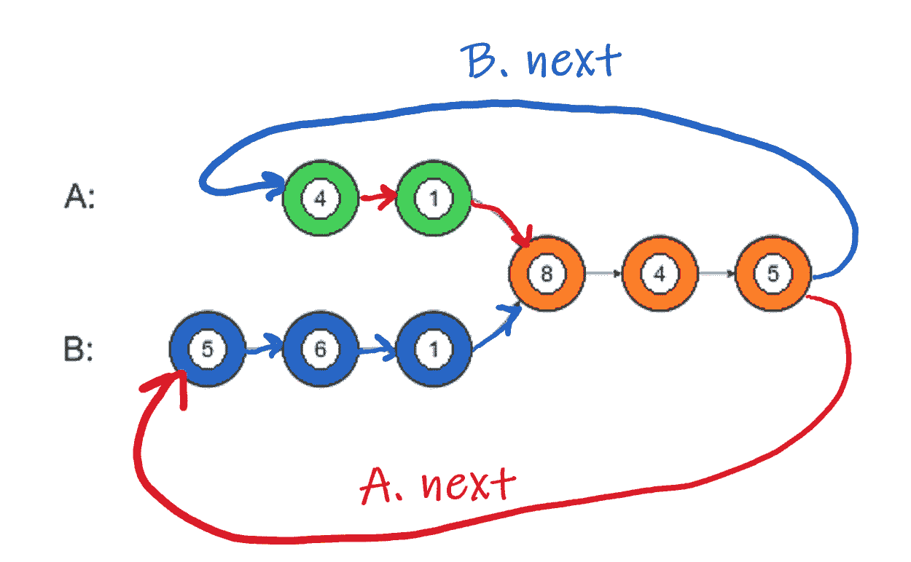
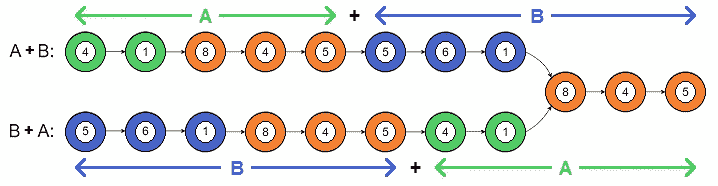

# JavaScript:两个链表有趣的交集

> 原文：<https://blog.devgenius.io/javascript-fun-intersection-of-2-linked-lists-ae6949594aa9?source=collection_archive---------2----------------------->



寻找两个单链表的交集

这是一个有趣的问题——寻找两个单链表的交点。对于上面的例子，节点 C1 是交叉节点。

# 天真的解决方案

一种简单的方法是遍历链表 A 的每个节点，交叉检查链表 A 中是否存在相同的指针。

假设链表 A 长度为 ***M*** ，链表 B 长度为 ***N.***

时间复杂度为 O(M * N)。

我们可以做得更好。让我们改进解决方案。

# 双指针解决方案

让我们用下面的作为问题:



两个指针的解决方案是如此巧妙和简单！

我们需要以相反的顺序连接两个链表， **A + B** 和 **B + A** 。这将帮助我们对齐两个列表的末尾。

让我们将尾部重定向到另一个链表的头部旁边。a 的尾巴接着去了 B 的头。b 的尾巴接着到了 A 的头上。如下图。



现在两个列表的长度基本相同！



现在我们只需检查两个列表是否在某个点合并或相交于同一个节点。如果它们不相交，当列表结束时，我们将在 null 退出。

**JavaScript 解决方案:**

```
var getIntersectionNode = function(headA, headB) {
    let a = headA;
    let b = headB;

    while (a != b) {
        a = !a ? headB : a.next;
        b = !b ? headA : b.next;
    }

    return a;
};
```

总之，如果节点存在，我们继续沿着列表 A 和列表 B 向下移动。如果我们到达一个节点不存在的点。如果我们在列表 A 的末尾，我们就把当前的指针发送到 B 的开头，反之亦然。最终，我们的 A 和 B 指针将在我们行进的同时穿过交叉点节点，然后我们将退出循环并返回该节点。

时间复杂度也是 O(M+N)！

这是一个有趣的，巧妙的问题和解决方法，想分享一下！