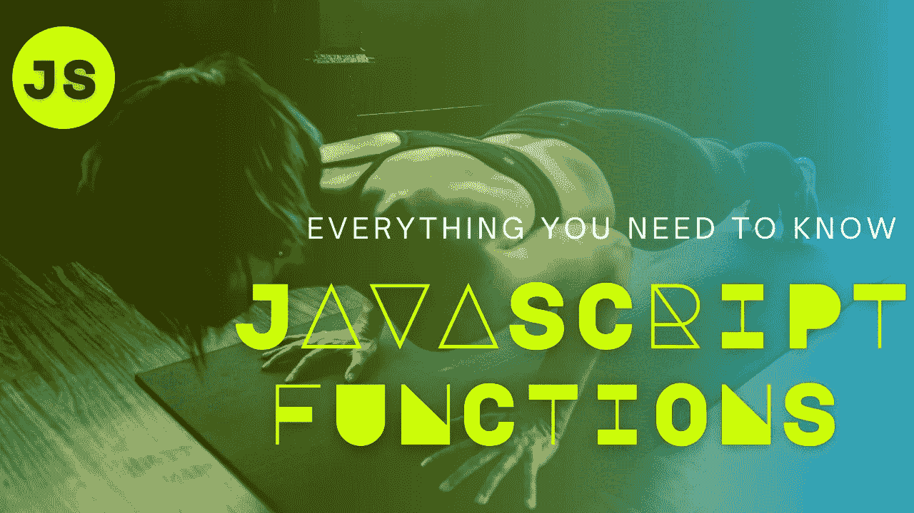
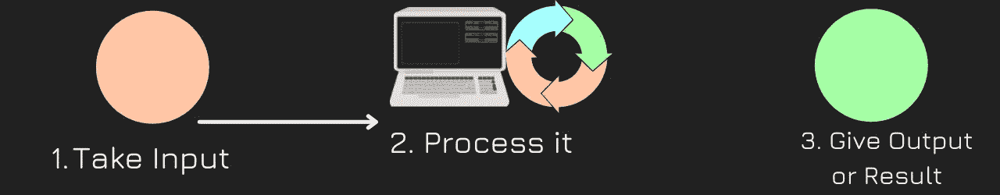
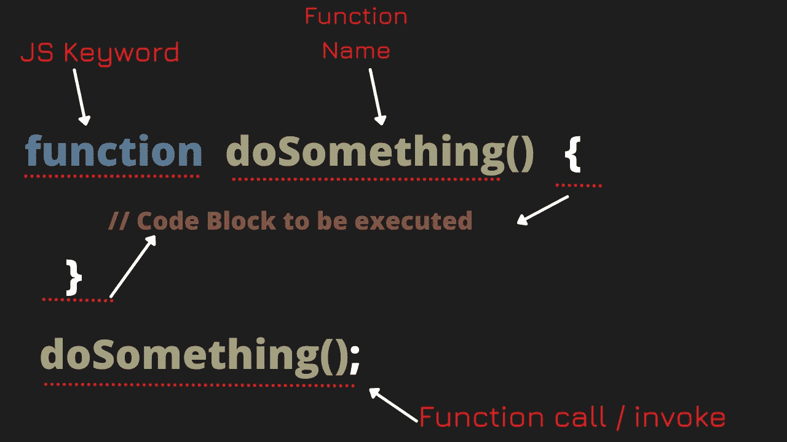

# JavaScript 函数解释—第 1 部分

> 原文：<https://blog.devgenius.io/javascript-functions-explained-a-gentle-intro-part-1-cb6e27595de3?source=collection_archive---------10----------------------->

对函数的简单介绍。简单易懂的示例代码，图片，视频+动画(我手工制作)。

在 JavaScript 变量中，我们学习了在哪里以及如何粘贴数据。但是操作数据的**动作呢？我们需要**功能**。**



JavaScript 函数—图片来源:作者

JavaScript 函数，移动用户视频

> 目录:

1.  什么是函数？(**功能的一般概念**
2.  JavaScript 函数
3.  JavaScript 函数—调用/调用函数

# 什么是函数？(**功能的一般概念**

同一件事有许多不同的解释。但我会采取我自己的方法。因为我个人就是这么学习自己的。
而不是说具体功能。先说一个函数的**大概思路**。

你可以把一个函数想象成一台机器:

1.  **可以输入**
2.  **过程**它
3.  并且**给出输出/结果**



函数是如何工作的。图片来源:作者

# JavaScript 函数

JavaScript 函数是为执行特定任务而设计的代码块。它们也可以重复使用和修改。

当有东西调用它时，JavaScript 函数被执行/激活。

让我们创建一个名为 **doSomething** 的基本函数，将我/你的名字打印到控制台上。

要创建一个函数，编写关键字`function`

然后给它起一个名字，比如`doSomething`或者你给它起的任何名字(描述性的)。函数名可以包含字母、数字、下划线和美元符号(与变量的规则相同)。

在函数名的末尾使用`()`一对括号`doSomething()`

末尾的一组花括号`{}` 像 so `doSomething () {}`一样定义了块，函数在被调用时会执行。

在那里，我将把我的名字打印到控制台上，使它成为一个简单的函数。

示例:

```
function doSomething() {
console.log("Lia Sue");
}
```

如果你检查控制台，什么也没发生。那是因为我们必须**调用**或者**调用**这个函数。

# JavaScript 函数—调用/调用函数

我们调用函数的方式是，我们必须使用或输入它的名字。在我们声明/创建函数之后。在名字的末尾放一对括号，就像这样`doSomething ();`

```
// Declaring a function 
function **doSomething()** {
console.log("Lia Sue");
}// Invoke / call function**doSomethiing()**;
```

希望这张照片能帮助你想象。



JavaScript 函数解释。图片来源:作者

这就是本文和视频的基本内容。我试着尽可能简化。

这是 JS 函数的“第 1 部分”。

如果你觉得我的东西有用，可以关注支持我。