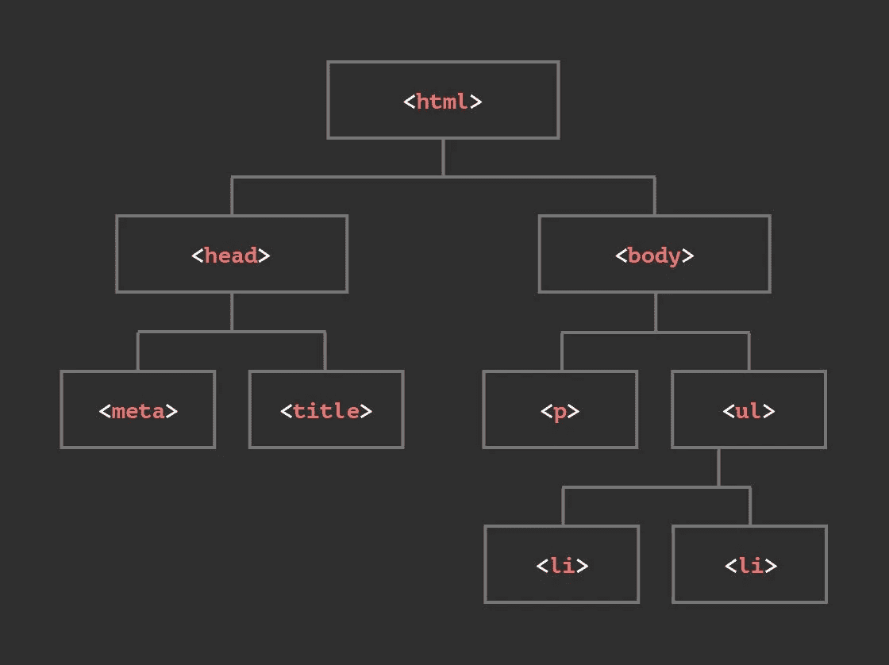
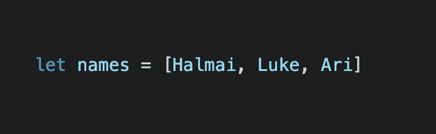
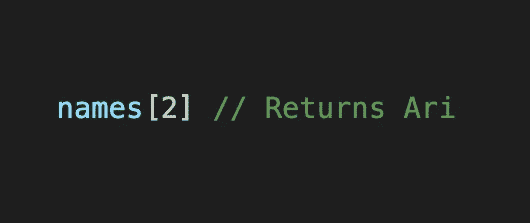
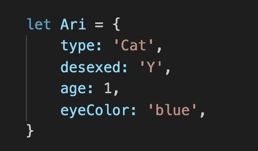
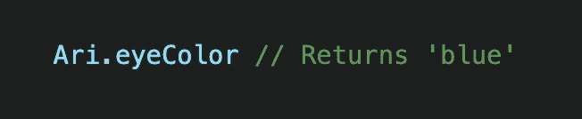

# 前端:基础

> 原文：<https://blog.devgenius.io/javascript-fundamentals-15d29901fe4f?source=collection_archive---------11----------------------->

# HTML、CSS 和 JavaScript 之间的区别:

HTML、CSS 和 JavaScript 并不相同，但是它们可以作为一个团队一起工作！如果你把网页看作一个人的身体，理解这三种语言之间的区别可能会更容易。

HTML 代表超文本标记语言。HTML 是一种结构化语言，构建网页的基本结构，类似于你的骨架。这是通过标签、元素和属性来实现的。像标题、段落、图像、文本和超链接都可以由 HTML 提供！

如果 HTML 是骨架，CSS 就是皮肤。

CSS 代表级联样式表。CSS 提供了网页的样式和布局。使用 CSS，你可以设置元素的颜色和背景，以及字体、边距、间距和填充——基本上使你的网页看起来更吸引人。如果没有 CSS，网站看起来会很无聊。或者裸体。

JavaScript 是一种编程语言，为网页提供计算、逻辑条件和所有功能，例如弹出警告或登录提示。不要太复杂，它就像你的大脑，让你的身体动起来。

JavaScript 允许你让你的网页思考和行动——这就是编程的全部。

# DOM:

文档对象模型(DOM)是一个编程接口，它规定了 web 浏览器如何解释 HTML 文档。

当浏览器读取一个 HTML 文档时，它会构建一个称为 DOM 的树状模型来表示它，并使用它来决定显示什么。

请查看下面的模型:

文档对象模型

这个树模型反映了 HTML 元素如何包含其他子元素。JavaScript 提供了一些功能，可以让您快速地从树的某些部分提取数据，这取决于您赋予 HTML 元素的属性。DOM 中的每个 HTML 元素称为一个节点。CSS 和 Javascript 用于通过 DOM 访问节点来改变或操作浏览器上显示的内容。

# 控制流程和循环:

曾经被困在单调乏味的日程安排中吗？感觉自己在一遍又一遍地重复同样的任务？你活在一个循环中！令人欣慰的是，人类的日常生活可以在适当的时候改变。

就像我们的例程一样，有时我们希望程序根据提供给它的信息做出不同的行为。控制流将从代码的顶部运行到底部，除非遇到改变程序流的语句，如循环。这使您能够告诉您的程序如何决定何时运行哪些代码段。

JavaScript 中的循环提供了一种简单的方法来重复做一些事情。想把一件事重复 10 遍？无论您想重复 10 次还是 10，000 次，所需的代码量都是一样的。你只需要指定号码。一旦满足指定的条件，循环将结束。

虽然大多数人发现无限次重复同样的任务会摧毁灵魂，但计算机在这方面做得很好！

# 功能及其用途:

函数基本上是一组执行任务或计算值的语句。

函数很有用，因为它们可以让您设置特定的指令，您可以随时调用这些指令来执行操作，而不必重复同一行代码。

重复代码不仅烦人，还意味着你的文件会更大，占用更多空间。如果想要修改某些东西，您必须在几个地方更改相同的代码，这增加了引入 bug 的可能性。

# 从数组和对象访问数据:

一个数组可以保存许多值，您可以通过引用索引号来访问这些值，类似于编号列表。请记住，数组的索引号总是从[0]开始。

数组中的名称列表如下所示:

如果您想从列表中提取第三个名字，您可以这样做:

对象是用来表示某种东西的。对象包含分配给它的键值。假设您想要存储更多关于 Ari 的信息:

要访问 Ari 的眼睛颜色，您需要:

