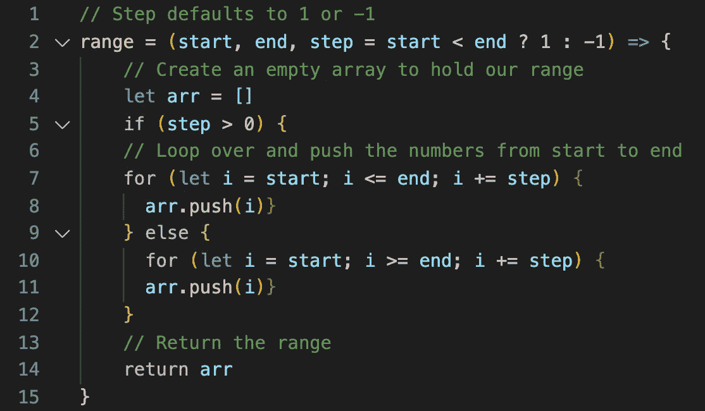

# JavaScript:生成一系列数字

> 原文：<https://blog.devgenius.io/javascript-generating-a-range-of-numbers-76d7f926f223?source=collection_archive---------1----------------------->

## 用三个论点；开始、结束和步进


来自 [Pixabay](https://pixabay.com/?utm_source=link-attribution&utm_medium=referral&utm_campaign=image&utm_content=1867053) 的[像素](https://pixabay.com/users/Pexels-2286921/?utm_source=link-attribution&utm_medium=referral&utm_campaign=image&utm_content=1867053)图像

F 还是今天的算法，我们会写一个叫`range`的函数，接受三个整数作为参数；`start`、`end`和`step`。这个函数将返回从第一个参数到第二个参数的所有数字的列表，方法是将它们输出到一个带有一定数量的`step`的数组中。这个问题的类似版本可以在[口才 Javascript](https://eloquentjavascript.net/) 一书中找到(第 3 版，第 4 章；数据结构:对象和数组)。

以下是一些例子:

```
**Example 1:****Input:** (1, 7)
**Output:** [1, 2, 3, 4, 5, 6, 7]**Example 2:****Input:** (1, 7, 2)
**Output:** [1, 3, 5, 7]**Example 3:****Input:** (7, 1, -2)
**Output:** [7, 5, 3, 1]
```

让我们按照列出的步骤编写我们的函数:

1.  设置第三个参数；`step`，作为选项。使用三元运算符检查`start`是否小于`end`。如果是，`step`默认为`1`，否则提供`-1` ( `start < end ? 1 : -1`)的负`step`值。
2.  声明一个空数组的变量来存储一个范围内的所有数字。
3.  使用两个独立的 for 循环；一个用于正`step`值，另一个用于负`step`值。
4.  将循环的初始值设置为`start`,并根据`step`的值通过向上计数或向下计数运行至`end`。向上计数时使用`<=`操作器，向下计数时使用`>=`操作器检查循环是否结束。
5.  通过增加`step`的增量，将从`start`到`end`的所有数字推入数组。
6.  建立范围后返回数组。

看看我的 JavaScript 解决方案:



我们的`range`函数接受可选的第三个参数；`step`。如果没有定义`step`，并且`start`的值小于`end`的值，我们通过将`step`的值增加`1`来从`start`向上计数到`end`。如果没有定义`step`并且`start`值大于`end`值，我们通过将`step`的值增加`-1`来从`start`倒计数到`end`。注意`end`值包含在范围内。

感谢阅读！如果您发现这个算法很有帮助，请查看我关于 JavaScript 算法的其他文章:

[](https://medium.com/swlh/javascript-three-ways-to-reverse-an-array-32f9819e9a97) [## JavaScript:反转数组的三种方法

### 不使用反向方法

medium.com](https://medium.com/swlh/javascript-three-ways-to-reverse-an-array-32f9819e9a97) [](https://medium.com/swlh/javascript-chessboard-program-6740c855e44f) [## JavaScript:棋盘程序

### 来自雄辩 JavaScript 的练习

medium.com](https://medium.com/swlh/javascript-chessboard-program-6740c855e44f) [](https://medium.com/dev-genius/sort-array-by-parity-problem-584bfbf861a1) [## 按奇偶问题排序数组

### 解释了 JavaScript 和 Ruby 中的两种方法

medium.com](https://medium.com/dev-genius/sort-array-by-parity-problem-584bfbf861a1) [](https://medium.com/swlh/remove-adjacent-duplicates-problem-5b9ac4abe87f) [## 删除相邻重复问题

### 使用堆栈在 JavaScript 和 Ruby 中解决

medium.com](https://medium.com/swlh/remove-adjacent-duplicates-problem-5b9ac4abe87f) [](https://medium.com/dev-genius/subtract-product-and-sum-problem-6d4d39a3c91e) [## 减法乘积和求和问题

### 用 JavaScript 解决

medium.com](https://medium.com/dev-genius/subtract-product-and-sum-problem-6d4d39a3c91e) [](https://medium.com/swlh/unique-number-of-occurrences-problem-cf25bd3fab4f) [## 唯一出现次数问题

### 用 JavaScript 和 Ruby 解决

medium.com](https://medium.com/swlh/unique-number-of-occurrences-problem-cf25bd3fab4f)