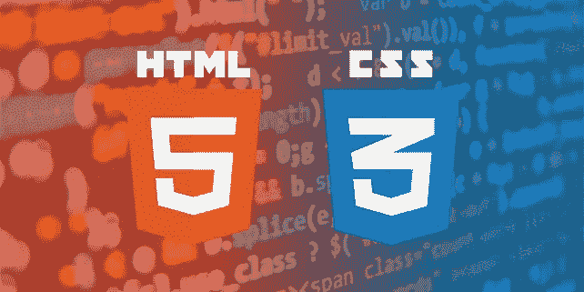

# 初学者 JavaScript 指南

> 原文：<https://blog.devgenius.io/javascript-guide-for-beginners-fc1ca7c29137?source=collection_archive---------8----------------------->

**制作一周内学会的 JavaScript。**

如果你是编程初学者，开始学习一门新语言会很困难。在这里，我给你一个学习 JavaScript 的指南。

## 1-为什么学习 JavaScript

今天，JavaScript 基于其源代码与其他编程语言一起用于各种目的。如果你对区块链和网络开发感兴趣，你最终将不得不学习 JavaScript。或者，你可以换一种方式，而不是普遍使用。

## 2-设置文本编辑器

使用在线文本编辑器可能不如文本编辑器有用，因为它们不会提前向你显示错误。在开始学习之前，选择一个您自己选择的文本编辑器，并使用带有扩展名的文件来使程序工作。为 html 和。js for JavaScript 和其他版本的 JavaScript 如 nodeJS。)

## 3-学习基本的 HTML 和 CSS

JavaScript 是一种动态类型的网络语言；它仍然需要理解最初的 web 开发语言 HTML 和 CSS。为了简单地理解它们，免费的 YouTube 或 Udemy 课程可以帮助你对学习 JavaScript 有一个非常基本的了解。

## 4-学习 JavaScript

你一找到 JavaScript 课程，并且事先完成了基本的 HTML 和 CSS 课程，现在你可以在一周内开始学习基础知识。并且根据你的领域，你可以学习 JavaScript 的面向对象编程，JavaScript 的函数式编程，学习我们这个时代其他基于 JavaScript 的编程语言。

## 5-记笔记并练习

记笔记可以让你记住主题的代码结构，练习可以让它们永远留在你的脑海中。但是，只要你手写结构。你将很容易记住并理解你的代码。而且，与根本不记笔记相比，它会让你练习得更少。

## 6-做填空练习，并复制粘贴代码进行分析

在做填空练习和复制粘贴代码时，学习编程中的函数的最好方法之一是让你从一些构建的程序和所需的分析中理解所需的代码。

*你认为 JavaScript 的指南怎么样？在下面的评论区分享你的想法和经历。*