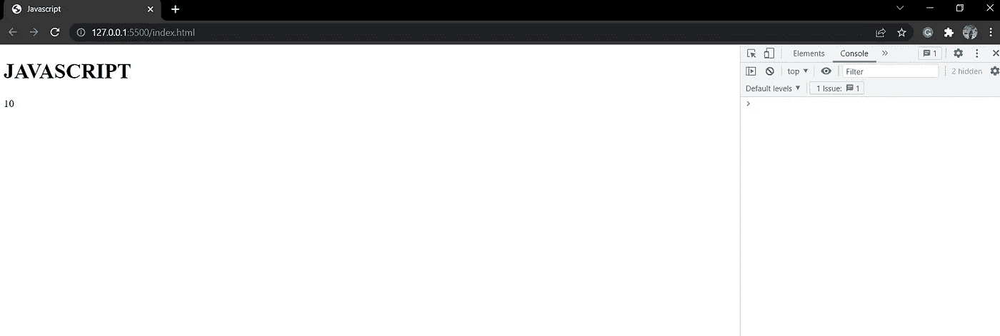

# 一读 Javascript！！

> 原文：<https://blog.devgenius.io/javascript-in-one-read-68dd43bf8e46?source=collection_archive---------6----------------------->

本文包括 JS 的基本概念，如变量、字符串、数组、函数、循环、对象等等。


java 描述语言

JavaScript 是一种面向对象的编程语言，也称为 web 脚本语言，因为它可以在客户端和服务器端使用。它是目前网络上最强大和最有效的编程语言。JavaScript 是一种强大的语言，是继 HTML 和 CSS 之后，每个 web 开发人员必须掌握的第三重要的语言。HTML 是指定网站所有内容的基本构件。CSS 旨在改善网站的外观。

另一方面，JavaScript 提供了网站所需的功能。它改善了网站的动态交互。JavaScript 逻辑包括下拉菜单、客户端验证、显示日期和时间以及弹出窗口。JavaScript 根据代码中使用的逻辑使您的网站看起来功能正常。

我们在编写 JavaScript 开发网站的同时，将适当的代码放在 HTML 页面的脚本标签之间:。或者，您可以创建另一个 js 文件，并在脚本标签中包含文件名，如:。

## Javascript 中的注释

在开发代码时，注释被用来使代码更容易理解，更有指导意义。我们可以编写代码描述或任何逻辑信息。编译过程中，注释会被忽略。有两种评论。

**i)单行注释
ii)多行注释**

*   //可用于显示单行注释。这主要用于注释一行代码或任何信息。
*   /*…..*/可用于显示多行注释。当有许多行需要注释时，使用这种方法。

## JavaScript 中的显示方法

我们有几种在 JavaScript 中显示数据的技术，比如

*   console.log:在浏览器中显示数据
*   内部 HTML:用于访问 HTML 元素
*   document.write:直接在页面上显示数据
*   windows.alert:在警告框中显示数据

## Console.log

首先，我创建了一个 HTML 页面，并使用 script 标记将它链接到 Js 文件。只需键入 console . log(“…”)；使用控制台日志功能显示数据。使用这种方法，我们可以很容易地显示文本或数字。

包含 JavaScript 文件位置的 HTML 代码如下所示(index.js)。

```
<!DOCTYPE html>
<html lang="en">
<head>
<meta charset="UTF-8">
<meta http-equiv="X-UA-Compatible" content="IE=edge">
<meta name="viewport" content="width=device-width, initial-scale=1.0"><title>Javascript</title>
</head>
<body>
<script src="index.js"></script></body>
</html>
```

现在，我们将 console.log 代码写入 Js 文件，如下所示:

```
//console log method -- this is our comment
 console.log("hey display data with console log method ");
```

要查看我们的输出，请检查您的页面并导航到控制台区域，在那里您可以找到您的数据。


控制台日志输出

# 内心。超文本标记语言

当试图使用 JavaScript 改变 HTML 元素时，这是需要考虑的最重要的方面。Javascript 使用了**文档。getelementbyid** 或**document . getelementbyclass**方法来检索 HTML 元素。


内部 HTML

在我的 HTML 文件中，我包含了 h1 和 h2 标签。h2 元素有一个与之关联的 id，我们将使用该 id 在我们的网站上发布信息。

```
/*inner html
document.getElementById("content").innerHTML="inner-html method ";  */
```

这里我们用一个 ***文档编写了“inner-HTML method”字符串。getelementbyid*T3**和*inner text*方法。****


INNERHTML 输出

***getelementbyid*** 用于获取带有 id 内容的 HTML 元素，**内部 HTML** 决定要显示的内容。

## 文档。写

这是在 JavaScript 中显示数据的另一种方法。

```
/* document.write
document.write(2+98-90); */
```



文档。写入输出

这里我们使用文档。写(…)；代码，并在括号内添加了一个算术运算。

## **windows。警报**

在警告框中显示任何消息或数据时使用此方法。


窗户。警报代码


window.alert 输出

> 写窗口其实是可选的。如果我们跳过该窗口，也可以显示数据。就用 alert("….. ");

## JAVASCRIPT 变量

变量用作存储数据或任何值的名称。我们为数据/值声明了某些名称以供进一步使用。

***JavaScript 变量的命名约定*** :

规则 1:变量名区分大小写。

规则 2:变量名不能以数字开头，也不能包含除下划线以外的任何符号。

规则 3:不能使用保留关键字。

## 声明 JavaScript 变量的方法

I)使用 var ii)使用 let iii)使用 const

**使用 var**

Var 可以用来声明 JavaScript 变量。你可以看到下面的代码:

```
//Javascript Varaibles
var a = 5; //variable declaration and initialization.
console.log(a*3); //This will display 15 on console.
```

*   用 var 声明的变量没有块范围，即在闭括号内声明的变量也可以在块外访问。

例如，您可以看到下面的代码，它在控制台中显示 2。

```
a=10;
{
var a=2; 
console.log(a); //This will display 2 in console
}
console.log(a); //this will also display 2 in console
```

***变量用 var*** 重新声明

使用 var 重新声明变量可以在程序的任何地方进行，但也会设置一些问题。

例如:

```
var x = 9;
{
var x = 1; //redeclaration 
}
console.log(x); //This will display 1 in the console.
```

我们在块内重新声明的任何值也将在块外重新声明，但这与我们使用 let 设置变量名的情况不同。

**使用 let**

*   通过 let 声明的变量有块作用域。在右括号内声明的变量不能在块外访问。

```
a=10;
{
let a=11;
console.log(a); //this will display 11 in console 
}
console.log(a); // this will display us 10 in console
```

***变量重新声明同***

我们不能用 let 在同一个块中重新声明变量。但是使用 var 是可能的。*例如*:

```
//using var
var a=2;
var a =10;
console.log(a); //this will display 10 in console // using let 
let a = 2;
let a = 10;
//this will create error in redeclaration since both are in same block.
```

用 ***let*** 重新声明变量允许重新声明的变量的作用域只在块内。简单地说，在块内用 let 重新声明变量不会在块外重新声明变量。

```
let x =1;
{
let x=2; //block scope - the value 2 is for this block only and cannot be accessed by outer block.
}
console.log(x); //we get 1 value in console.
```

**使用常量**

不能重新定义或重新分配用 const 声明的变量。当你知道你不需要更新某个值时，通常使用 Const。

```
const num=1;
num=num+1;
console.log(num); //this will arise you error.
// Uncaught TypeError: Assignment to constant variable.
```

当声明数组、对象或函数时，我们可以使用关键字 const。我们不能重新声明数组或对象，但是我们可以改变 const 中的数组元素和对象属性。

*让我们以一个数组*为例:

```
const array=["nikhil", "pallak", "shivam" ];
console.log(array);//this will display the above array. 
array[2]="jay";
console.log(array); //here when we check our console we get the array index 2 name to be changed by jay.array.push("riya"); //it adds element to the last position of array
console.log(array);
```


常量输出

## JavaScript 中的运算符

在 JavaScript 中，运算符只有两种类型

1.  一元运算符—只有一个操作数。
2.  二元运算符—有两个操作数。

```
//unary operators
let c =5;
c=-c;
console.log(c);//binary operators
d=23*34;
console.log(d);//more operators include arithmetic,assignment,comparison and so on.
let a = 10;
a+=2;
document.write(a);//this will display 12 to your page content.
console.log(typeof(a)); //typeof determines the datatype name.//likewise we can use any operators
```

## **JavaScript 数据类型**

JavaScript 主要关注两种数据类型。

1.  原始数据类型:除了对象，它包含所有类型。它包含一个数字、一个布尔值、一个字符串、一个未定义的符号、一个 null 和一个 bignit。
2.  复合数据类型:这包括对象。对象只是属性值可以是任何类型的属性集合。

> 我们将在后面作为主要话题讨论对象。

```
//string type -- for text
const name1="James";
const name2="Jack";
console.log(`We have ${name1} and ${name2}`); //displays We have James and Jack//number -- integer and float numbers
const n1= 1;
console.log(n1); //display 1 in console //bignit -- used for large numbers and need to append n at the end
const num2=2899928829982n;
const final=num2+2n;
console.log(final); //display 2899928829984n in the console.//undefined -- when value is not deffined
let a;
console.log(a); //undefined displays//null -- empty value
let number=null;
console.log(number);//symbol
let v=Symbol('hey');
console.log(v.description); //display hey
console.log(typeof (v)); //display datatype of the v ie symbol.
```

## JavaScript 字符串

该字符串表示字符序列。让我们来理解 JavaScript 中的字符串及其操作。我们可以在单引号或双引号中写字符串。

```
//stringslet str="Hello Javascript !! ";
console.log(str); //display content of str in console
let len= str.length; //determines length of the string named 'str'
console.log(len); 
console.log(` length of the string is ${len}`);
```

在上面的代码中，我们提到了“长度”操作。$(美元)符号也是一个 JavaScript 标识符，用于标识所提到的对象的内容。

${len}也表示字符串的长度。

***更弦操作*** :

```
//escape chracters
let str = "please contact me for \"further\" analysis"
console.log(str);//indexOf()- returns index of first occurance of specified text
console.log(str.indexOf("me"));//lastIndexOf()- returns index of last occurrence of specified text
console.log(str.lastIndexOf("me"));//search()- search the string and return the position of string
console.log(str.search("me"));//includes()- return true only if string contains specified value
console.log(str.includes("hi"));//startsWith()- returns true if the string starts with specified value
console.log(str.startsWith("please"));//replace- replace the string with another one
console.log(str.replace('please', 'kindly'))//touppercase- converts entire string to upper case
console.log(str.toUpperCase());//trim- removes the first and last whitespaces if any
console.log(str.trim());//concatinate- it adds two strings
const b = "Hello";
const c = "World";
let end = b.concat(" ", c);
console.log(end);// slice- it extracts certain part of string without changing original stringlet a = "hello world";
console.log(a.split());
console.log(a.slice(1,4));
console.log(a.slice(1));
```

我们上面提到的代码在控制台中分别显示了下面的输出。


字符串操作输出

## JavaScript 数组

数组是同一类型数据的集合。可以重新分配、更改和删除数组元素。

我们来创建一个数组，学习一些运算。

```
//create an array named color with three element 
const colors=["pink","red","blue"];
console.log(colors);console.log(colors[1]); //accessing element of the arraycolors[1]="white";//changing the array element
console.log(colors[1]);console.log(colors.length);
console.log(colors[colors.length-1]);//accessing the last element colors.push("yellow"); //adding new element to the arrayconsole.log(colors);//display your array
```

相应代码的输出可以在下图中看到。


阵列代码输出

我们也可以在 JavaScript 中用**new Array()**构造一个数组。

```
const data = new Array('bird','ant','fly');
console.log(data);data.push('rodents'); //add element to last
console.log(data);data.pop(); //delete last element
console.log(data);data.shift(); //delete first element
console.log(data);data.unshift('butterfly'); //add element to first
console.log(data);data.sort(); //sort array alphabetically
console.log(data);data.reverse(); //sort in descending
console.log(data);
```

相应代码的输出可以在下图中看到。


阵列代码输出

## JavaScript 条件语句、循环和切换案例

让我们来看一些条件语句，包括 if、if-else 和 if-else if。

```
let age = 12;
if(age>=18)
{
console.log('Allowed to vote');
}
else
{
console.log('Not allowed ');
}// the output will display as Not allowed according to logic we used.
```

让我们看看开关案例:

```
const price = 10;
switch(price){
case 100:
console.log("Price for the ring is 100");
break;
case 120:
console.log("price for the ring is 120");
break;
case 200:
console.log("Price for the ring is 200");
break;
default:
console.log("Price for the ring is 60");
}
```


开关盒输出

因此，根据这一逻辑，我们将定价定为 10 英镑。switch 语句现在正在场景中迭代。如果有任何事例与您指定的值匹配，将显示相应的语句。
如果没有一种情况得到满足，我们就有一个默认语句。
我们也使用了 break 这种情况下。如果它符合其中一种情况，它会停止改变所有的情况。如果我们不为所有情况提供中断，它将向我们显示所有语句。

*让我们进入循环*:

我们有这样的循环:for 循环，while 循环，do 循环..而循环中，**、*为*、**为**、*为*、**为循环。

```
//for loop -- loop throughout the block number of times
for(i=0;i<10;i++){
str="the number are " + i +;
console.log(str);
}//while loop --loop throughout block of code while a specified condition is true
let i=0;
while(i<10)
{
str= "The number is " + i ;
console.log(str);
i++;
}//do-while loop -- iterates for the number of times
let i=0;
do{
str= "The number is " + i ;
console.log(str);
i++;
}while(i<10)
```

这三个是我们可以在 JavaScript 中使用的基本循环，但是它们也拥有一些额外的循环，比如(For..in)和(For..of)循环。

For In: For In 循环可以迭代对象的属性。

```
const person = {fname:"Danny", lname:"Drill", age:20};
let text = ""
for (let x in person) {
text += person[x] + " ";
}
console.log(text);
```

在上面的代码中，我们设置了一个名为 person 的对象，上面有一些物品。

这里的 for in 循环遍历对象并给出我们想要的输出。


对于环路输出

For of: For of 循环可以迭代数组的属性。

```
const fruits = ['apple','banana','orange']
let text =''
for(let x of fruits){
text+=x+ " ";
}
console.log(text);
```

在上面的代码中，我们设置了一个名为 fruits 的数组，上面有一些商品。For of 循环遍历数组并显示所需的输出。


## JavaScript 函数

函数是代码块，可以从程序中的任何地方调用来执行特定的目的。当调用该函数时，将执行其中包含的代码。
在 JavaScript 中，我们可以通过使用关键字“ **function”轻松声明函数。**
下面的代码提供了对 Js 函数非常基本的掌握。

```
function mydata(){
text="I am a learner";
document.write(text);
}
mydata();
```

因为我们正在使用一个“*文档。写*，这将显示我们网站上指示的文本，你可以清楚地看到这个函数是如何工作的。我们创建了一个名为 mydata 的函数，每当调用这个函数时，就会执行其中的代码并显示输出。


Javascript 函数

## JavaScript 对象

对象与可以有多个值的变量是一样的。

***在 JavaScript 中声明对象***

*   **通过使用对象文字**:我们可以使用下面的语法来声明对象。

***object name = { property:" value 1 "，property2: "value2 "，property:" valuen " }；***

你可以看到下面的代码，我们用 object literal 创建了一个对象。

```
const car = {type:"Ford", model:"500", color:"white"};
//This is our object named car which has multiple values which determine the properties of the object.
// Here we have properties like type,model,color with its respective value.
```

*   ***通过创建对象实例*** :我们可以使用**“new”**关键字创建一个对象，语法如下。

***var Object name = new Object()；***

```
var cars = new Object();
cars.name="Ford";
cars.model="XYZ";
cars.color="white";
console.log(cars.name + " " + cars.model + " " + cars.color);
```

*   ***通过使用对象构造器*** :我们可以构建一个带参数的函数，用**“this”**关键字给参数赋值。

```
function student(rollno , fname , lname){
this.rollno=rollno;
this.fname=fname;
this.lname=lname;
}
std= new student(4,"Aish","Rooki");
console.log(std.rollno + " " +std.fname + " " + std.lname);
```