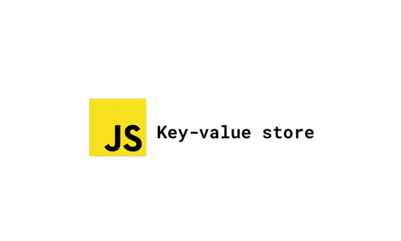
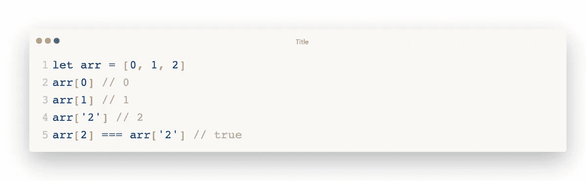
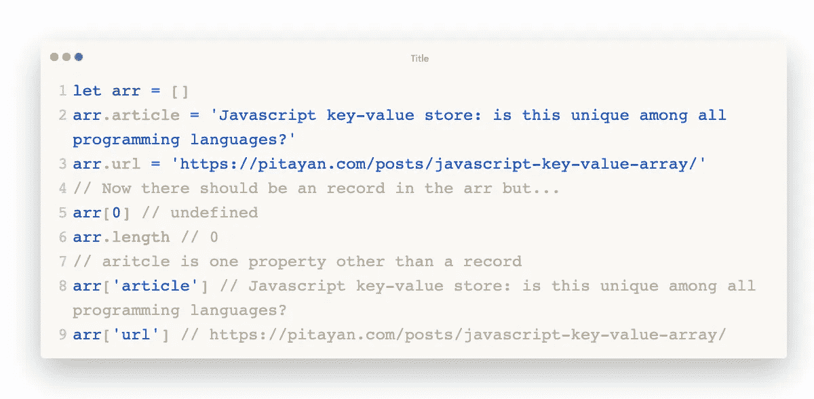
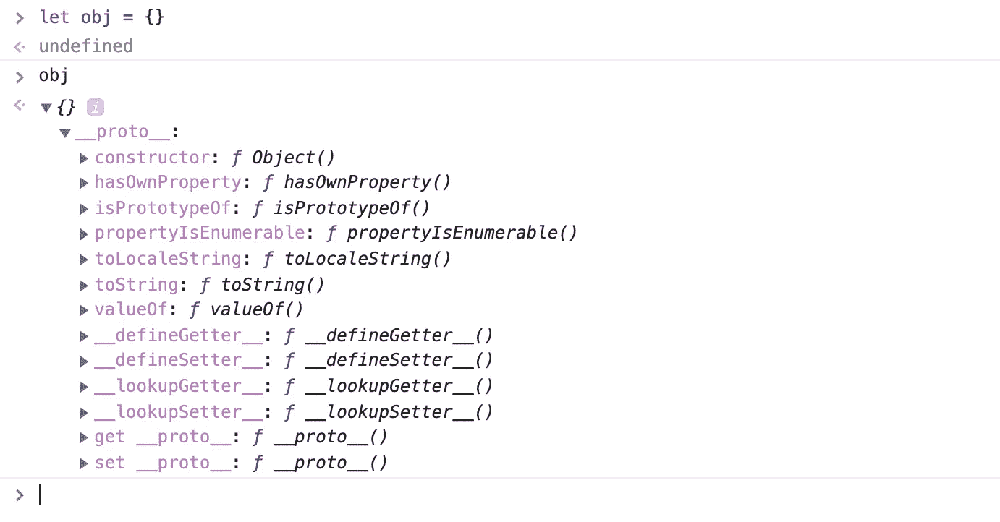
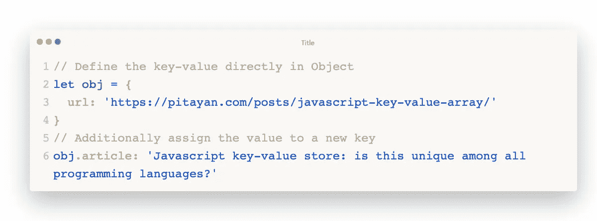
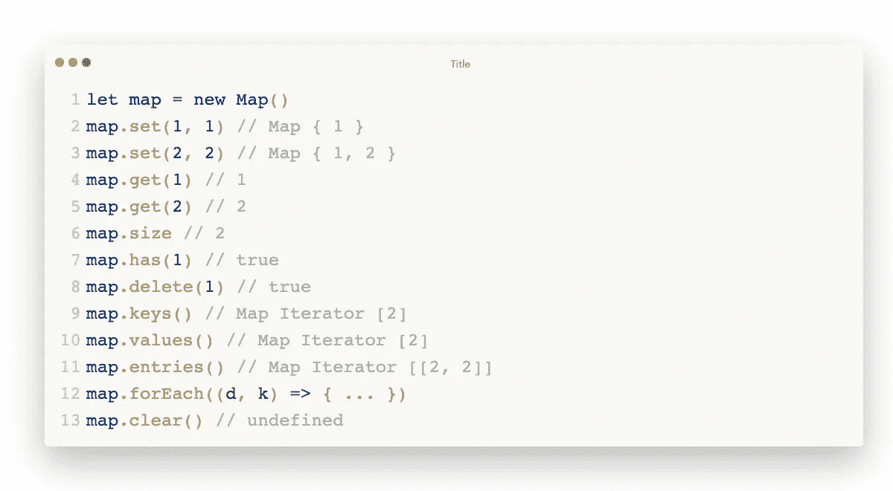
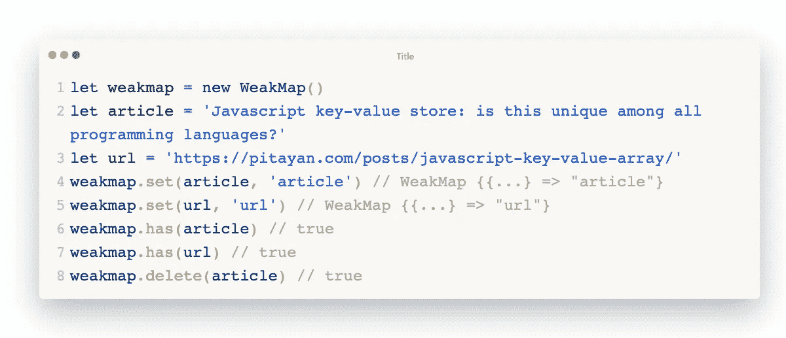
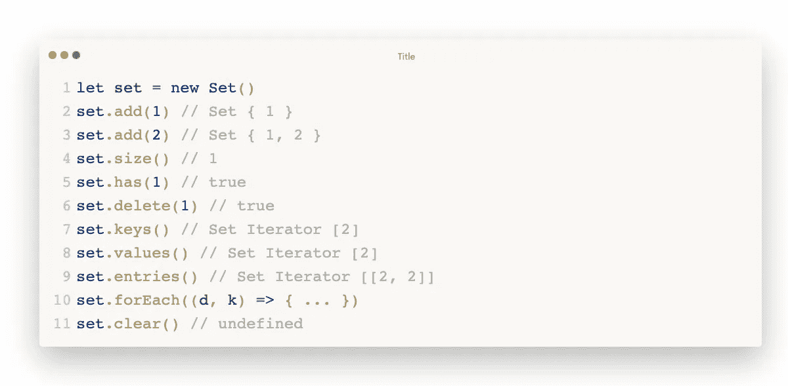
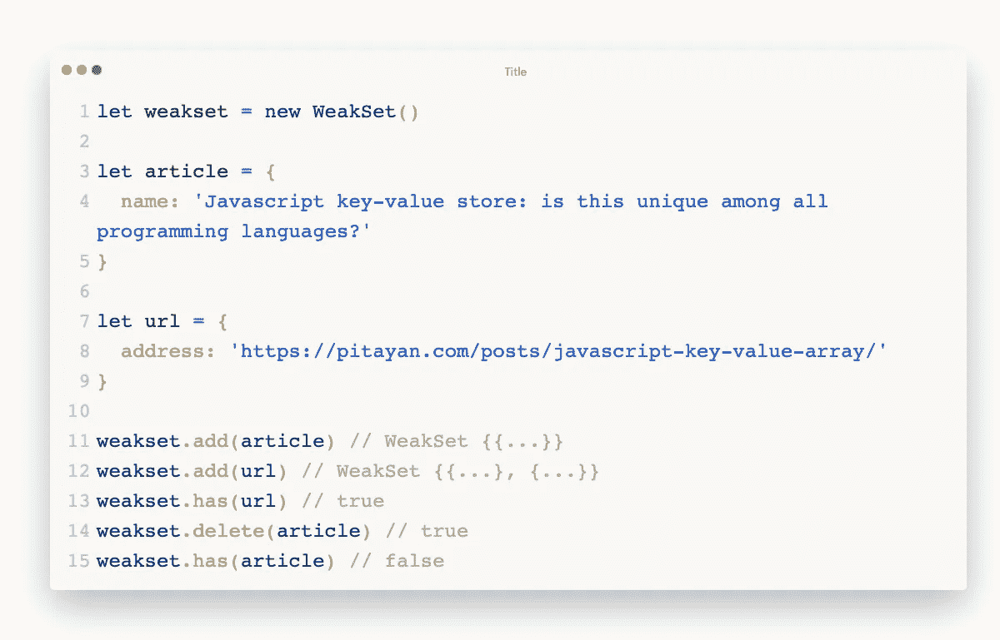
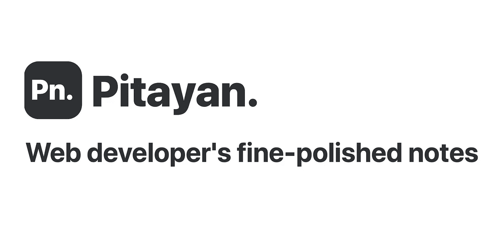

# Javascript 键值存储:了解一些很酷的内置对象

> 原文：<https://blog.devgenius.io/javascript-key-value-store-understand-some-cool-built-in-objects-7b4c1ecc3c2f?source=collection_archive---------40----------------------->

Javascript 键值存储

在本文中，我将向您展示如何用特殊的“数组”处理 Javascript“键-值”数据类型。

# 你能用“数组”作为“键值”存储吗？

严格来说，没有…

一个[数组](https://developer.mozilla.org/en-US/docs/Glossary/array)用于存储有序的数据列表。这意味着它的每个值的键实际上是一个数(字符串数)。

众所周知，[数组](https://developer.mozilla.org/en-US/docs/Glossary/array)在 Javascript 中也是一个[对象](https://developer.mozilla.org/en-US/docs/Web/JavaScript/Reference/Global_Objects/Object)。即使给一个[数组](https://developer.mozilla.org/en-US/docs/Glossary/array)分配一个新的属性也能让它工作。[数组](https://developer.mozilla.org/en-US/docs/Glossary/array)中的方法没有按照您预期的方式工作。

# “对象”就是你想要的全部

Javascript 中没有键值数组。基本上，Javascript 存储“键值”需要的是一个名为 [hashmap](https://www.w3schools.com/java/java_hashmap.asp) 的数据结构。但是 Javascript 本身没有 hashmap。它使用了不同的数据类型[对象](https://developer.mozilla.org/en-US/docs/Web/JavaScript/Reference/Global_Objects/Object)，该对象具有与[散列表](https://www.w3schools.com/java/java_hashmap.asp)几乎相似的能力。

当你在 Chrome 浏览器中打开一个控制台并声明一个`Object`时，你会得到如下结果:一个由一对可爱的花括号定义的变量。

javascript 对象

当然，您可以在其中分配一些属性(键值)。很简单。只需定义键和值，几秒钟后就可以存储数据了。

对象的 javascript 键值

[对象](https://developer.mozilla.org/en-US/docs/Web/JavaScript/Reference/Global_Objects/Object)是一个相当常见和常用的内置对象。为了满足某些功能需求，您可能需要一些其他内置对象，如 Map 和 Set (WeakMap WeakSet)。它们用于数据重组和存储。让我们来看看。

# Javascript 中的其他“键值”存储对象

除了使用[对象](https://developer.mozilla.org/en-US/docs/Web/JavaScript/Reference/Global_Objects/Object)作为键值存储之外，您还可以利用以下 Javascript 标准内置对象。

[***地图***](https://developer.mozilla.org/en-US/docs/Web/JavaScript/Reference/Global_Objects/Map) :

*   键值对集合
*   可重复的

[***weak map***](https://developer.mozilla.org/en-US/docs/Web/JavaScript/Reference/Global_Objects/WeakMap):

*   存储键-值对但“键”是对象的还原映射
*   所有条目都是对象
*   条目是弱引用，可由 GC 检索。没有内存泄漏。
*   不可迭代

[***设置***](https://developer.mozilla.org/en-US/docs/Web/JavaScript/Reference/Global_Objects/Set) :

*   独特，无序
*   键等于值。或者只有值没有密钥
*   可迭代的

*:*

*   *所有条目都是对象*
*   *条目是弱引用，可由 GC 检索。密钥可以是任何类型。*
*   *不可迭代*

# *[地图](https://pitayan.com/#map)*

*以下是操作[地图](https://developer.mozilla.org/en-US/docs/Web/JavaScript/Reference/Global_Objects/Map)条目的方法/属性*

*   ****set*** (key，value):向集合中添加新元素*
*   ****get*** (key，value):从集合中获取一个元素*
*   ****尺寸*** :包含元素的数量*
*   ****删除*** (按键):从集合中删除一个元素*
*   ****有*** (关键):检查元素是否存在*
*   ****按键*** ():获取所有按键*
*   ****值*** ():获取所有值，与键()相同*
*   ****条目*** ():获取所有键值对的所有迭代器*
*   ****forEach*** ():遍历所有元素*
*   ****清除*** ():从集合中移除所有元素*

**

*javascript 地图*

# *WeakMap*

*以下是操作 [WeakMap](https://developer.mozilla.org/en-US/docs/Web/JavaScript/Reference/Global_Objects/WeakMap) 条目的方法/属性*

*   ****设置*** (按键):向集合中添加新元素*
*   ****获取*** (key):获取一个元素*
*   ****有*** (值):检查元素是否存在*
*   ****删除*** (值):从集合中删除一个元素*

**

*javascript weakmap*

# *一组*

*以下是操作[集合](https://developer.mozilla.org/en-US/docs/Web/JavaScript/Reference/Global_Objects/Set)的条目的方法/属性*

*   ****尺寸*** :所包含元素的数量*
*   ****add*** (值):向集合中添加新元素*
*   ****删除*** (值):从集合中删除一个元素*
*   ****有*** (值):检查元素是否存在*
*   ****清除*** ():从集合中移除所有元素*
*   ****按键*** ():获取所有按键*
*   ****值*** ():获取所有值，与键()相同，因为[设置](https://developer.mozilla.org/en-US/docs/Web/JavaScript/Reference/Global_Objects/Set)只有值*
*   ****条目*** ():获取所有键值对的所有迭代器*
*   ****forEach*** ():遍历所有元素*

**

*javascript 集*

# *WeakSet*

*以下是操作 [WeakSet](https://developer.mozilla.org/en-US/docs/Web/JavaScript/Reference/Global_Objects/WeakSet) 条目的方法/属性*

*   ****add*** (值):向集合中添加新元素*
*   ****删除*** (值):从集合中删除一个元素*
*   ****有*** (值):检查元素是否存在*

**

*javascript weakset*

# *参考*

*   *[https://developer . Mozilla . org/en-US/docs/Web/JavaScript/Reference/Global _ Objects](https://developer.mozilla.org/en-US/docs/Web/JavaScript/Reference/Global_Objects)*
*   *[https://developer . Mozilla . org/en-US/docs/Web/JavaScript/Reference/Global _ Objects/Map](https://developer.mozilla.org/en-US/docs/Web/JavaScript/Reference/Global_Objects/Map)*
*   *[https://developer . Mozilla . org/en-US/docs/Web/JavaScript/Reference/Global _ Objects/weak map](https://developer.mozilla.org/en-US/docs/Web/JavaScript/Reference/Global_Objects/WeakMap)*
*   *[https://developer . Mozilla . org/en-US/docs/Web/JavaScript/Reference/Global _ Objects/Set](https://developer.mozilla.org/en-US/docs/Web/JavaScript/Reference/Global_Objects/Set)*
*   *[https://developer . Mozilla . org/en-US/docs/Web/JavaScript/Reference/Global _ Objects/weak set](https://developer.mozilla.org/en-US/docs/Web/JavaScript/Reference/Global_Objects/WeakSet)*
*   *[https://juejin.im/post/5d39d14c518825625337f84e](https://juejin.im/post/5d39d14c518825625337f84e)*
*   *[https://juejin.im/post/5e1d2717e51d4557e97b109b](https://juejin.im/post/5e1d2717e51d4557e97b109b)*

*原载于[上**Pitayan.com**上](https://pitayan.com/posts/javascript-key-value-array/)*

*[https://pitayan.com/posts/javascript-key-value-array/](https://pitayan.com/posts/javascript-key-value-array/)*

* [## Javascript 键值存储:了解一些很酷的内置对象——pita Yan

### 在本文中，我将向您展示如何用特殊的“数组”处理 Javascript“键-值”数据类型。技术上…

pitayan.com](https://pitayan.com/posts/javascript-key-value-array/) 

[https://pitayan.com](https://pitayan.com)*