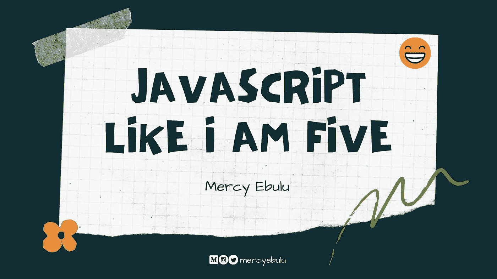

# JavaScript 像我五岁一样！

> 原文：<https://blog.devgenius.io/javascript-like-i-am-five-2654295d73ea?source=collection_archive---------2----------------------->

你好世界🤗

我很高兴能向你们介绍 JavaScript。当我们作为初学者踏上了解 JavaScript 基础知识的旅程时，请带上您的饮料。

JavaScript 是一种专为 web 开发的编程语言，是世界上最流行、使用最广泛的编程语言之一。它是一种快速发展的编程语言，像网飞、沃尔玛和 PayPal 这样的大公司围绕 JavaScript 构建了整个应用程序。JavaScript 被广泛称为网络编程语言。如果你熟悉使用 HTML 和 CSS 来创建网页，JavaScript 是让你的网站栩栩如生的最后一部分。
在我们开始之前，让我们绕个弯来谈谈 JavaScript 的历史。

## JavaScript 的历史

事实是，JavaScript 在名称方面有一个奇怪的过去。JavaScript 最初被称为 **LiveScript** 当它在 1995 年被开发出来的时候，它是作为一种在 Netscape Navigator 浏览器中向网页添加程序的方式而被引入的。它在 1996 年被改回了 **JavaScript** 。随着语言的发展，语言的竞争版本出现了。因此，JavaScript 最终在 1997 年被 ECMA International 采用，从而形成了该语言的官方标准。

今天，这种语言本身被称为 JavaScript。但是最近的版本是通过它们的版本号来引用的。像 **ES5** 或者 **ES6** 。总的来说，JavaScript 已经成为世界上最流行的语言之一，被认为是前端和 web 开发的基础支柱之一。

> 需要注意的是，JavaScript 与名为 Java 的编程语言几乎没有任何关系。一个相似的名字是出于营销考虑，而不是良好的判断。

**JavaScript 中的位置**

在 HTML 中，JavaScript 代码被插入到标签之间。

第二个选择是创建一个外部的。js 文件，并使用 head 部分中的将其连接到 HTML 文档，如下所示。