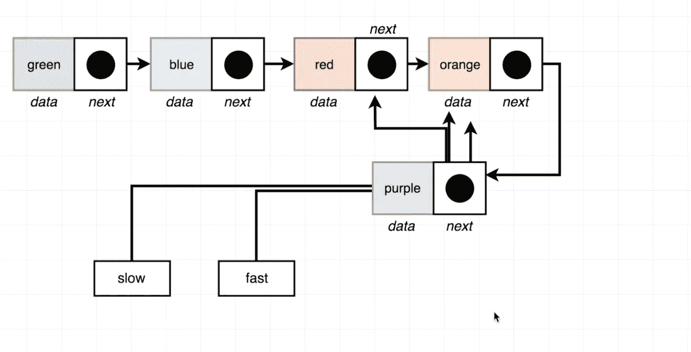

# JavaScript。链接列表。循环列表。

> 原文：<https://blog.devgenius.io/javascript-linked-lists-circular-list-f3edc4d65338?source=collection_archive---------1----------------------->


大家好，谁是阅读这个博客。我很高兴继续使用链表来讨论更多的问题，并找到更多解决这些问题的方法。今天，我们将把一个叫做循环列表的新章节分成几个小部分。那是什么？所以基本上我们有一个链表，这个链表的节点指向我们传递的元素。结果，我们收到一个无限循环，破坏了我们的代码。我们必须确保我们列表避免无限循环。让我们创建一个方法，它将帮助我们检查它是真还是假。

如果你刚刚开始使用链表，我强烈推荐你浏览一些博客:

[](https://medium.com/dev-genius/javascript-linked-lists-what-is-linked-lists-create-a-node-class-api-9aa0fa460075) [## JavaScript。链接列表。什么是“链表”？创建节点类 API

### 新读者们你们好，欢迎回到我身边。只是想提一下，我已经不再写关于…

medium.com](https://medium.com/dev-genius/javascript-linked-lists-what-is-linked-lists-create-a-node-class-api-9aa0fa460075) 

# 检查列表是否是循环的

# 方向

给定一个链表，如果链表是循环的，返回 true，否则返回 false。

# 例子

```
const l = new LinkedList();
const a = new Node('a')
const b = new Node('b')
const c = new Node('c')
l.head = a 
a.next = b
b.next = c
c.next = b
circular(l)
```

让我们从 5 个节点的列表开始。正如你所看到的，我们有一个循环列表，紫色封闭了“红色”元素的列表。这个算法的思想是创建两个变量“慢”和“快”。其中“慢”会有一步，“快”会有两步。当慢速和快速拥有相同的节点时，它将返回 true。否则，它将返回 false。


让我们创造变数，一步一步慢慢前进。


可以看到“慢”女仆走了一步，“快”走了两步。


然后我们再次向前移动并检查是否(" slow" === "fast ")


在最后一次，我们可以看到“慢”和“快”找到了对方，我们将返回 true，因为它是内存中的同一个节点。



在这里，我们可以看到 JS 代码，并完全描述了上述所有算法。

我们创建了变量“slow”和“fast ”,并指向列表的头部。当我们有 next 和 next.next 元素时，我们就在循环。此外，如果“慢速”与“快速”是同一个节点，则检查条件。如果它在 while 循环中没有找到任何东西，那么我们返回 false。


完整代码:

```
class Node {
 constructor(data, next = null) {
 this.data = data;
 this.next = next;
 }
}class LinkedList {
 constructor() {
 this.head = null;
 }insertFirst(data) {
 const node = new Node(data, this.head);
 this.head = node;
 }

 size() {
 let counter = 0;
 let node = this.head;
 while (node) {
 counter++;
 node = node.next;
 }
 return counter;
 }

 getFirst() {
 return this.head.data;
 }

 getLast() {
 if (!this.head) {
 return null;
 }
 let node = this.head;
 while (node) {
 if (!node.next) {
 return node;
 }
 node = node.next;
 }
 }

 clear() {
 this.head = null;
 } 

 removeFirst() { 
 if (!this.head) {
 return;
 }
 this.head = this.head.next;
 }removeLast() {
 if (!this.head) {
 return;
 }

 if (!this.head.next) {
 this.head = null;
 }

 let previous = this.head;
 let node = this.head.next;

 while (node.next) {
 previous = node;
 node = node.next;
 }

 previous.next = null;
 } insertLast(data) {
 const last = this.getLast();
 if (last) {
 last.next = new Node(data);
 } else {
 this.head = new Node(data);
 }
 }

 getAt(index) {
 let counter = 0;
 let node = this.head;
 while (node) {
 if (counter === index) {
 return node;
 }
 counter++;
 node = node.next;
 }
 return null;
 } removeAt(index) {
 if (!this.head) {
 return;
 } if (index === 0) {
 this.head = this.head.next;
 return;
 }

 const previous = this.getAt(index — 1);
 if (!previous || !previous.next) {
 return;
 }
 previous.next = previous.next.next;
 } insertAt(data, index) {
 if (!this.head) {
 this.head = new Node(data);
 return;
 }
 if (index === 0) {
 this.head = new Node(data, this.head);
 return;
 }
 const previous = this.getAt(index — 1) || this.getLast();
 const node = new Node(data, previous.next);
 previous.next = node; 
 }
}function circular(list) {
  let slow = list.head;
  let fast = list.head;
  while (fast.next && fast.next.next) {
    slow = slow.next;
    fast = fast.next.next;
    if (slow === fast) {
      return true;
    }
   }
  return false;
}const l = new LinkedList();
const a = new Node("a");
const b = new Node("b");
const c = new Node("c");
l.head = a;
a.next = b;
b.next = c;
c.next = b;
console.log(circular(l)); //true
```