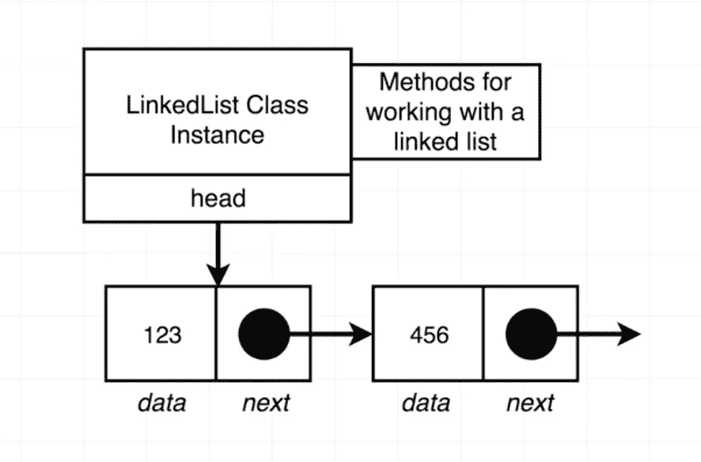
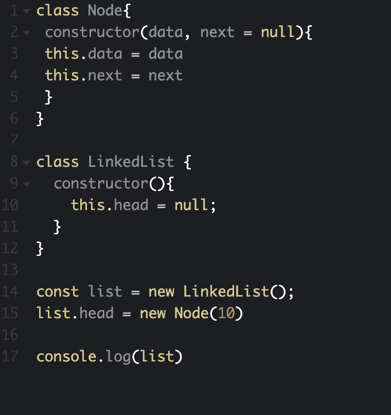
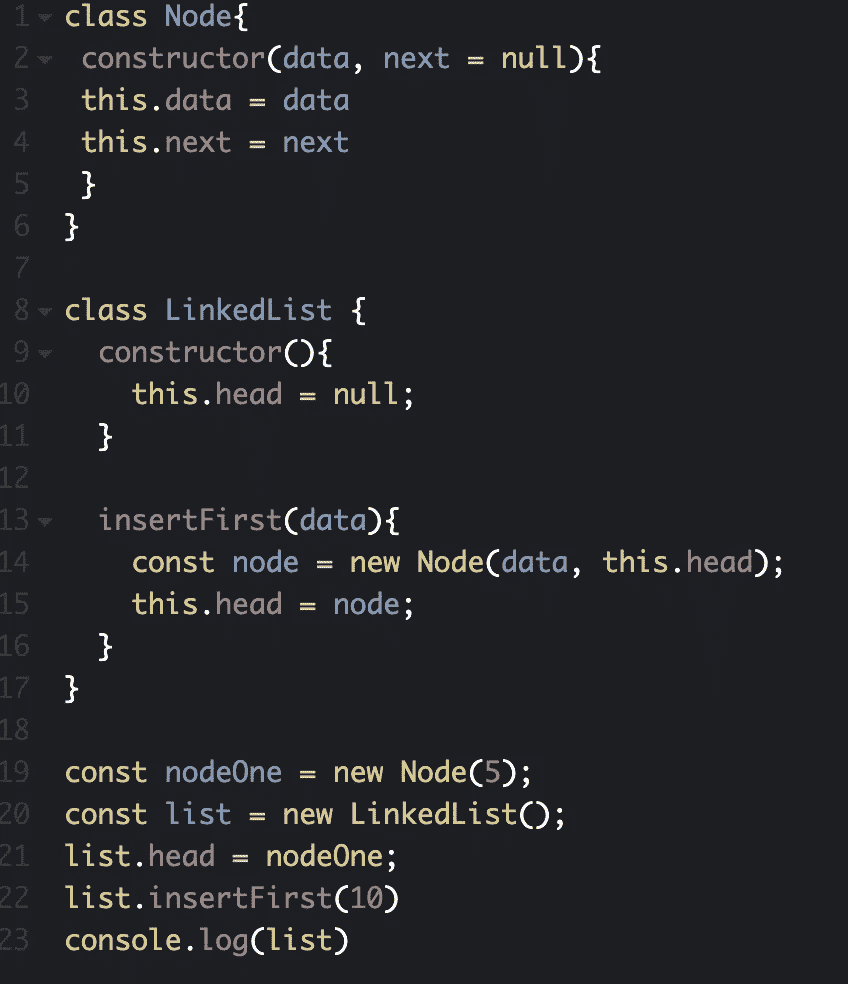

# JavaScript。链接列表。创建一个 LinkedList 类 API。首先插入

> 原文：<https://blog.devgenius.io/javascript-linked-lists-create-a-linkedlist-class-api-insert-first-c309f41b24ca?source=collection_archive---------23----------------------->


## 今天我们继续学习链表，我们的目标是编写一个 LinkedList 类，并用一个节点类连接。如果有人刚刚从这个博客开始，我会推荐阅读我的第一个博客，以了解我们现在在哪里。

## 第一篇关于“JavaScript”的博客。链接列表。什么是“链表”？创建节点类 API "

[](https://medium.com/dev-genius/javascript-linked-lists-what-is-linked-lists-create-a-node-class-api-9aa0fa460075) [## JavaScript。链接列表。什么是“链表”？创建节点类 API

### 新读者们你们好，欢迎回到我身边。只是想提一下，我已经不再写关于…

medium.com](https://medium.com/dev-genius/javascript-linked-lists-what-is-linked-lists-create-a-node-class-api-9aa0fa460075) 

今天我们正在构建 LinkedList 类 API 和 connect。我们开始吧

# LinkedList 类

**函数→构造函数**

**返回→链接列表**

## 方向

创建一个类来表示一个链表。创建时，一个链表应该没有头节点与之相关联。LinkedList 实例将有一个属性“head”，它是对链表的第一个节点的引用。默认情况下，“head”应为“null”。这将只知道第一个节点。

## 例子

```
const list = new LinkedList();
list.head // null
```



让我们用实际代码来创建它:



代码:

```
class Node{
 constructor(data, next = null){
 this.data = data
 this.next = next
 }
}class LinkedList {
 constructor(){
 this.head = null;
 }
}const list = new LinkedList();
list.head = new Node(10)console.log(list)
```

# 首先插入

**函数→带自变量的 InsertFirst(数据)**

## 方向

从参数“data”创建一个新节点，并将结果节点分配给“head”属性。确保处理链表已经有一个节点分配给“head”属性的情况。

## 例子

```
const list = new LinkedList();list.insertFirst(‘Hello’);// List has one node
```

我们必须插入一个新的第一个节点。例如，我们以前有一个节点，但我们想插入一个新的第一个节点。因此，我们添加了一个新节点，成为第一个节点，第二个节点将是一个旧节点。我们不是在旧的基础上重写，只是在一个位置上向前推进。



慢慢来，把所有的代码点连接起来。我知道这并不容易，但这仍然是一个很好的例子。总的来说，我们在类“insertFirst”中创建了一个带参数(数据)的新方法。这种方法创建了一个新节点，并替换了列表中的第一个位置，并将旧节点前移。

代码:

```
class Node{
 constructor(data, next = null){
 this.data = data
 this.next = next
 }
}class LinkedList {
 constructor(){
 this.head = null;
 }

 insertFirst(data){
 const node = new Node(data, this.head);
 this.head = node;
 }
}const nodeOne = new Node(5);
const list = new LinkedList();
list.head = nodeOne;
list.insertFirst(10)
console.log(list) 
```

今天，我们创建了一个 LinkedList 类，还创建了 insertFirst 方法，帮助我们向列表中插入一个新节点。我们将继续学习链表，我很乐意与你分享更多关于它的信息。