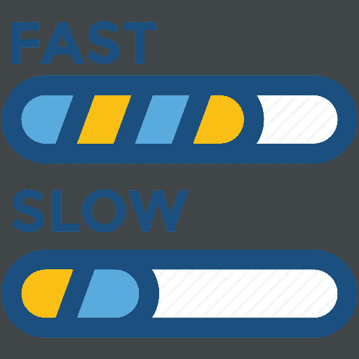
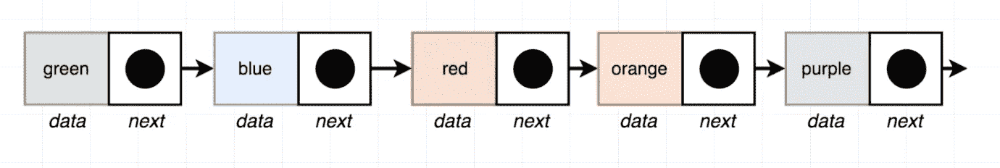
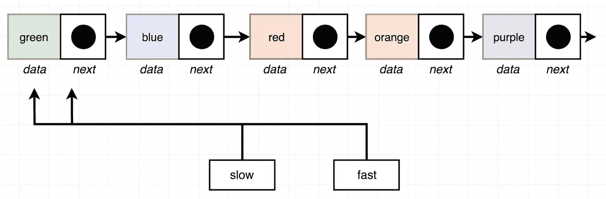
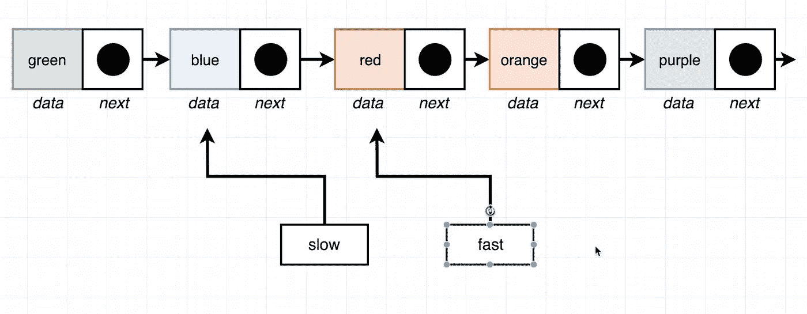
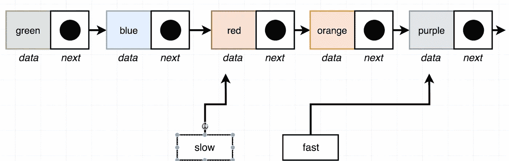
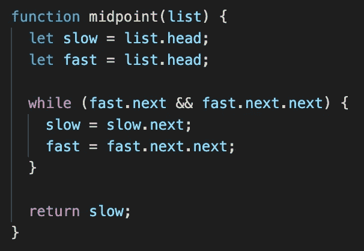
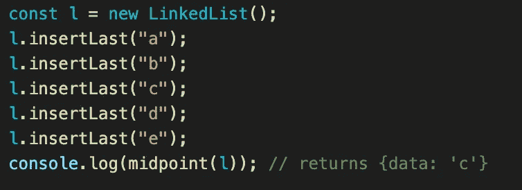
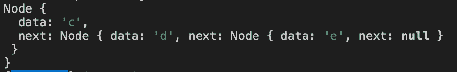

# JavaScript。链接列表。查找中间节点。

> 原文：<https://blog.devgenius.io/javascript-linked-lists-find-middle-node-6b1fa73b20fb?source=collection_archive---------0----------------------->



大家好！今天，我们有很好的机会深入研究链表及其功能。我希望你已经知道链表和它的方法的基础知识。今天，我们将讨论面试中可能会被问到的重要方法，我很乐意与你分享。另外，如果您刚刚开始学习链表，我建议您从这里开始学习:

[](https://medium.com/dev-genius/javascript-linked-lists-what-is-linked-lists-create-a-node-class-api-9aa0fa460075) [## JavaScript。链接列表。什么是“链表”？创建节点类 API

### 新读者们你们好，欢迎回到我身边。只是想提一下，我已经不再写关于…

medium.com](https://medium.com/dev-genius/javascript-linked-lists-what-is-linked-lists-create-a-node-class-api-9aa0fa460075) 

# 查找中间节点

## 方向

返回链表的中间节点。如果列表有偶数个元素，则返回列表前半部分末尾的节点。不使用计数器变量，不检索列表的大小，只遍历列表一次。

## 例子

```
const l = new LinkedList();
l.insertLast('a')
l.insertLast('b')
l.insertLast('c')
l.insertLast('d');
l.insertLast('e');midpoint(l); // returns {data: 'c'}
```

我们开始吧。我想从 5 个节点开始(这是我们目前的例子)。



我们还创建了两个变量来帮助我们遍历所有列表。一个变量叫做慢速，另一个叫做快速，我们指向两个变量的第一个节点。为什么会是那样？



原因是“快”变量比“慢”变量快两倍，因为“慢”将在“快”变量的中途，它将是我们的列表的中间(“慢”将在迭代结束时在列表的中间)。



总是“快速”检查条件:“如果接下来的两个元素不为空”。如果为空—停止迭代。如果不为空，继续迭代。



在这种情况下，它将返回“slow”和{data: 'red'}。

我们创建了“中点”函数。“慢”和“快”指向列表中的第一个元素。而“fast”元素具有在我们迭代之前不为空的数据。最后返回慢，这表明我们的中间元素。



完整代码:

```
class Node {
  constructor(data, next = null) {
   this.data = data;
   this.next = next;
  }
}class LinkedList {
  constructor() {
    this.head = null;
  }insertFirst(data) {
    const node = new Node(data, this.head);
    this.head = node;
  }

  size() {
    let counter = 0;
    let node = this.head;
    while (node) {
     counter++;
     node = node.next;
    }
    return counter;
  }

  getFirst() {
    return this.head.data;
  }

  getLast() {
    if (!this.head) {
      return null;
    }
    let node = this.head;
    while (node) {
     if (!node.next) {
      return node;
     }
     node = node.next;
    }
  }

  clear() {
    this.head = null;
  } 

  removeFirst() { 
    if (!this.head) {
     return;
    }
    this.head = this.head.next;
   }removeLast() {
    if (!this.head) {
      return;
    }

    if (!this.head.next) {
     this.head = null;
    }

    let previous = this.head;
    let node = this.head.next;

    while (node.next) {
      previous = node;
      node = node.next;
    }

    previous.next = null;
   }   insertLast(data) {
    const last = this.getLast();
    if (last) {
     last.next = new Node(data);
    } else {
      this.head = new Node(data);
    }
   }

   getAt(index) {
    let counter = 0;
    let node = this.head;
    while (node) {
     if (counter === index) {
      return node;
     }
     counter++;
     node = node.next;
    }
   return null;
  } removeAt(index) {
  if (!this.head) {
    return;
  }  if (index === 0) {
    this.head = this.head.next;
    return;
  }

  const previous = this.getAt(index - 1);
  if (!previous || !previous.next) {
    return;
  }
  previous.next = previous.next.next;
 } insertAt(data, index) {
   if (!this.head) {
    this.head = new Node(data);
    return;
   }
   if (index === 0) {
    this.head = new Node(data, this.head);
    return;
   }
  const previous = this.getAt(index - 1) || this.getLast();
  const node = new Node(data, previous.next);
  previous.next = node; 
 }
}function midpoint(list) {
  let slow = list.head;
  let fast = list.head;
  while (fast.next && fast.next.next) {
   slow = slow.next;
   fast = fast.next.next;
  }

  return slow;
 }const l = new LinkedList();
l.insertLast("a");
l.insertLast("b");
l.insertLast("c");
l.insertLast("d");
l.insertLast("e");console.log(midpoint(l)); // returns {data: 'c'}
```