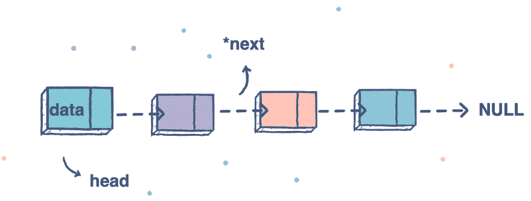
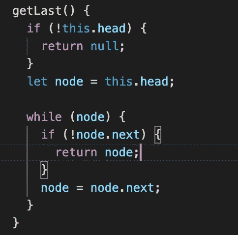
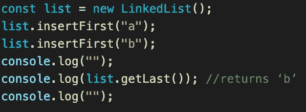
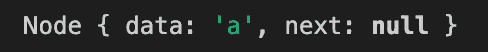
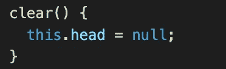
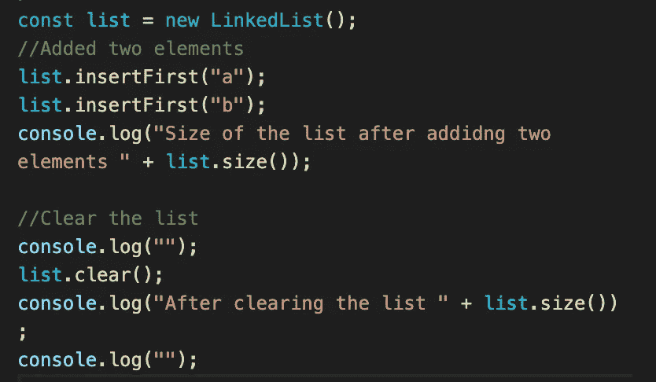
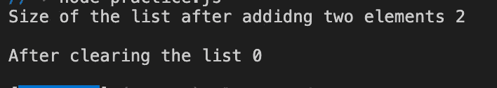

# JavaScript。链接列表。获取列表中的最后一个元素。清除列表。

> 原文：<https://blog.devgenius.io/javascript-linked-lists-get-last-element-in-the-list-clear-the-list-d46a00769c51?source=collection_archive---------4----------------------->



大家好，欢迎回到我们的博客。今天我们将讨论和学习如何为链表编写一个新方法。像往常一样，我想注意一件事，那就是以前的博客。我会建议从他们开始。

*链接到以前的博客:*

[](https://medium.com/dev-genius/javascript-linked-lists-sizing-a-list-get-first-element-in-the-list-d7ba6dac6791) [## JavaScript。链接列表。调整列表大小。获取列表中的第一个元素。

### 今天我们继续我们的链表，今天我们的目标是得到一个链表的大小并得到第一个…

medium.com](https://medium.com/dev-genius/javascript-linked-lists-sizing-a-list-get-first-element-in-the-list-d7ba6dac6791) 

# 获取列表中的最后一个元素

**函数→“get last()”**

# 方向

*返回链表的节点。*

# 例子

```
const list = new LinkedList();list.insertFirst(‘a’)list.insertFirst(‘b’)list.getLast(); //returns node with data ‘a’
```

首先，我们需要检查是否有任何元素，如果没有我们就返回 null。然后我们创建变量节点，指向头部(第一个元素)。我们创建 while 循环来移动到最后一个元素。如果下一个元素为空，我们返回节点。



getLast()方法

我们正在使用我在上面与你分享的例子。



例子



结果

```
class Node {
 constructor(data, next = null) {
 this.data = data;
 this.next = next;
 }
}class LinkedList {
 constructor() {
  this.head = null;
 } insertFirst(data) {
  const node = new Node(data, this.head);
  this.head = node;
 } size() {
  let counter = 0;
  let node = this.head;
  while (node) {
   counter++;
   node = node.next;
  } return counter;
 } getFirst() {
  return this.head.data;
 } 

 getLast() {
  if (!this.head) {
  return null;
  } let node = this.head;
  while (node) {
   if (!node.next) {
    return node;
   }
  node = node.next; 
 }
}}const list = new LinkedList();list.insertFirst(“a”);list.insertFirst(“b”);console.log(list.getLast()); //returns ‘b’
```

# 清除列表

**功能→“清除()”**

# 方向

*清空所有节点的链表*

# 例子

```
const list = new LinkedList();
list.insertFirst(‘a’);
list.insertFirst(‘b’);
list.clear();
list.size();// returns 0
```

你可能在想一些疯狂的事情，但是说实话，这非常简单。你只需要将 head 赋值为空。



```
class Node {
 constructor(data, next = null) {
 this.data = data;
 this.next = next;
 }
}class LinkedList {
 constructor() {
  this.head = null;
 }insertFirst(data) {
  const node = new Node(data, this.head);
  this.head = node;
 }size() {
  let counter = 0;
  let node = this.head;
  while (node) {
   counter++;
   node = node.next;
  }return counter;
 }getFirst() {
  return this.head.data;
 } 

 getLast() {
  if (!this.head) {
  return null;
  }let node = this.head;
  while (node) {
   if (!node.next) {
    return node;
   }
  node = node.next; 
  }
 } clear() {
   this.head = null;
 }
}const list = new LinkedList();//Added two elements
list.insertFirst("a");
list.insertFirst("b");
console.log("Size of the list after adding two elements " + list.size());//Clear the list
console.log("");
list.clear();
console.log("After clearing the list " + list.size());
console.log("");
```

感谢您的阅读，我希望它对您有用，我们下次再见。