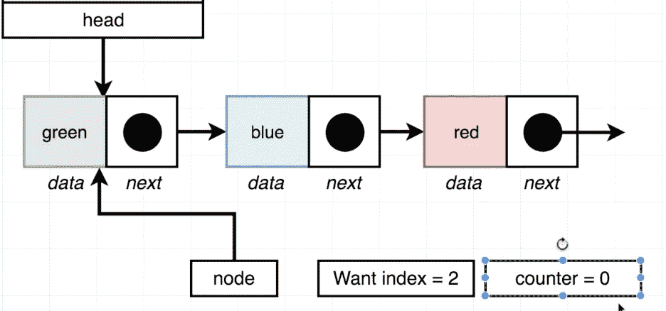
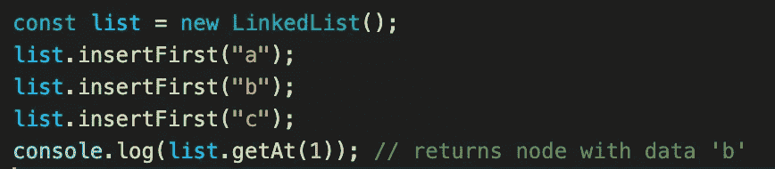
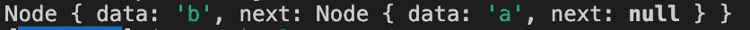

# JavaScript。链接列表。最后插入。了解。

> 原文：<https://blog.devgenius.io/javascript-linked-lists-insert-last-get-at-25e0ae2f6be9?source=collection_archive---------9----------------------->


嘿大家好。欢迎回到我们的链表会议，也欢迎那些刚刚加入我们的人。今天，我们将学习如何在列表的末尾插入元素，并通过索引从列表中获取元素。在我看来，我们正在一步一步变得更好，今天我们将会更上一层楼。让我们开始吧。

之前关于移除第一个和最后一个元素的博客:

[](https://medium.com/dev-genius/javascript-linked-lists-remove-first-element-remove-last-element-dfa8adce432) [## JavaScript。链接列表。拆下第一个元件。删除最后一个元素。

### 欢迎回到关于链表及其特性的长期博客会议。我真的很乐意分享我的经历…

medium.com](https://medium.com/dev-genius/javascript-linked-lists-remove-first-element-remove-last-element-dfa8adce432) 

如果有人决定从头开始读:

[](https://medium.com/dev-genius/javascript-linked-lists-what-is-linked-lists-create-a-node-class-api-9aa0fa460075) [## JavaScript。链接列表。什么是“链表”？创建节点类 API

### 新读者们你们好，欢迎回到我身边。只是想提一下，我已经不再写关于…

medium.com](https://medium.com/dev-genius/javascript-linked-lists-what-is-linked-lists-create-a-node-class-api-9aa0fa460075) 

# 在列表末尾插入元素

**函数→ "insertLast()"**

# 方向

在链的末尾插入一个包含所提供数据的新节点。

# 例子

```
const list = new LinkedList();
list.insertFirst('a');
list.insertFirst('b');
list.insertLast('c');
list.getLast(); //returns node with data 'c'
```

列表中已经有三个节点，我们想再添加一个。当然，我们可以遍历所有元素，找到最后一个元素，并连接到最后一个新元素。但是在我看来，我们不需要再做一次。我们已经有了可以帮助我们找到最后一个元素的方法，我想这将是最好的主意。方法是 getLast()。我们还需要检查我们的列表是否为空。如果它是空的，我们需要添加第一个元素。


开头三个元素


将橙色元素添加到我们的列表


InsertLast 函数


例子


结果

# 按索引获取元素

**函数→“getAt()”**

# 方向

返回提供的索引处的节点。

# 例子

```
const list = new LinkedList();
list.insertFirst('a');
list.insertFirst('b');
list.insertFirst('c');
list.getAt(1); // returns node with data 'b'
```

我们将从三个节点开始。其中一个解决方案是这样的:

我们创建变量节点并指向列表中的第一个节点。我们还要求列表的索引为 2(这将是最后一个元素，因为我们在数组中从 0 开始计数)。我们将一直循环下去，直到我们的计数器显示出与“需要索引”相同的数字。最后我们需要返回带有数据的节点。



从第一个元素开始循环(索引为 0)


现在我们在第二个元素上(索引为 1)


我们的“节点”在第三个元素上(索引为 2)。我们想要接收的相同元素(节点)。



**完整代码:**

```
class Node {
  constructor(data, next = null) {
   this.data = data;
   this.next = next;
  }
}class LinkedList {
  constructor() {
    this.head = null;
  }insertFirst(data) {
    const node = new Node(data, this.head);
    this.head = node;
  }

  size() {
    let counter = 0;
    let node = this.head;
    while (node) {
     counter++;
     node = node.next;
    }
    return counter;
  }

  getFirst() {
    return this.head.data;
  }

  getLast() {
    if (!this.head) {
      return null;
    }
    let node = this.head;
    while (node) {
     if (!node.next) {
      return node;
     }
     node = node.next;
    }
  }

  clear() {
    this.head = null;
  } 

  removeFirst() { 
    if (!this.head) {
     return;
    }
    this.head = this.head.next;
   }removeLast() {
    if (!this.head) {
      return;
    }

    if (!this.head.next) {
     this.head = null;
    }

    let previous = this.head;
    let node = this.head.next;

    while (node.next) {
      previous = node;
      node = node.next;
    }

    previous.next = null;
   } insertLast(data) {
    const last = this.getLast();
    if (last) {
     last.next = new Node(data);
    } else {
      this.head = new Node(data);
    }
   }

   getAt(index) {
    let counter = 0;
    let node = this.head;
    while (node) {
     if (counter === index) {
      return node;
     }
     counter++;
     node = node.next;
    }
   return null;
  }
}
```

感谢您的阅读！