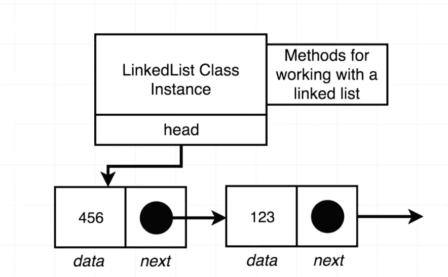

# JavaScript。链接列表。拆下第一个元件。删除最后一个元素。

> 原文：<https://blog.devgenius.io/javascript-linked-lists-remove-first-element-remove-last-element-dfa8adce432?source=collection_archive---------3----------------------->


欢迎回到关于链表及其特性的长期博客会议。我很乐意分享我的经验和新方法的知识。我希望你也喜欢它，并与你的朋友和其他你可能认识的人分享这个博客。当然，我想提一下我之前的博客和第一篇关于链表的博客。

上一个:

[](https://medium.com/dev-genius/javascript-linked-lists-get-last-element-in-the-list-clear-the-list-d46a00769c51) [## JavaScript。链接列表。获取列表中的最后一个元素。清除列表。

### 大家好，欢迎回到我们的博客。今天我们要讨论和学习如何为…写一个新的方法

medium.com](https://medium.com/dev-genius/javascript-linked-lists-get-last-element-in-the-list-clear-the-list-d46a00769c51) 

第一个:

[](https://medium.com/dev-genius/javascript-linked-lists-what-is-linked-lists-create-a-node-class-api-9aa0fa460075) [## JavaScript。链接列表。什么是“链表”？创建节点类 API

### 新读者们你们好，欢迎回到我身边。只是想提一下，我已经不再写关于…

medium.com](https://medium.com/dev-genius/javascript-linked-lists-what-is-linked-lists-create-a-node-class-api-9aa0fa460075) 

让我们从一个叫做“先移除”的新方法开始

# 从列表中删除第一个节点

**函数→“remove first()”**

# 方向

仅移除链表的第一个节点。列表的头部现在应该是第二个元素。

# 例子

```
const list = new LinkedList();list.insertFirst(‘a’);
list.insertFirst(‘b’);
list.removeFirst();
list.getFirst();// returns node with data ‘a’
```

我们的目的是移除第一个节点。我们不需要过度思考这个问题。重要的是，我们需要将头指向第二个节点，它将与第一个节点断开连接。我们的结果将是没有第一个元素的节点。



指向第一个


指向第二个

还有一件更重要的事情是，当我们在列表中有一个节点，我们想删除第一个节点，它将指向空。在这种情况下，我们的结果将是空列表。


## 代码解决方案


removeFirst()方法


console.log()第一个元素


结果


如果我们只有一个节点并删除第一个元素


结果

## 密码

```
class Node {
  constructor(data, next = null) {
   this.data = data;
   this.next = next;
  }
}class LinkedList {
  constructor() {
    this.head = null;
  } insertFirst(data) {
    const node = new Node(data, this.head);
    this.head = node;
  }

  size() {
    let counter = 0;
    let node = this.head;
    while (node) {
     counter++;
     node = node.next;
    }
    return counter;
  }

  getFirst() {
    return this.head.data;
  }

  getLast() {
    if (!this.head) {
      return null;
    }
    let node = this.head;
    while (node) {
     if (!node.next) {
      return node;
     }
     node = node.next;
    }
  }

  clear() {
    this.head = null;
  } 

  removeFirst() { 
    if (!this.head) {
     return;
    }
    this.head = this.head.next;
   }
}const list = new LinkedList();
list.insertFirst("a");
// list.insertFirst("b");
list.removeFirst();
console.log(list.size()); // returns 0 after removing first element
```

# 从列表中删除最后一个节点

**功能→“remove last()”**

# 方向

移除链的最后一个节点。

# 例子

```
const list = new LinkedList();
list.insertFirst('a')
list.insertFirst('b')
list.removeLast();
list.size(); returns 1
list.getLast(); returns node with data of 'b'
```

去掉最后一个元素会有一点挑战，但还是可以理解的。例如，我们有三个节点的列表。我们创建变量“前一个”和“节点”。并且循环它们，直到“节点”位于最后一个元素上。当“node”是最后一个元素时，我们将“previous.next”赋给 null。和“节点”。变得空虚。我们还需要检查列表是否为空，我们不需要返回任何内容。如果列表只有一个元素，我们需要指定' this.head = null '。


列表中的三个节点


创建两个变量:“上一个”和“节点”


迭代并将“previous.next”元素赋值为 null

## 代码解决方案


## 密码

```
class Node {
  constructor(data, next = null) {
   this.data = data;
   this.next = next;
  }
}class LinkedList {
  constructor() {
    this.head = null;
  }insertFirst(data) {
    const node = new Node(data, this.head);
    this.head = node;
  }

  size() {
    let counter = 0;
    let node = this.head;
    while (node) {
     counter++;
     node = node.next;
    }
    return counter;
  }

  getFirst() {
    return this.head.data;
  }

  getLast() {
    if (!this.head) {
      return null;
    }
    let node = this.head;
    while (node) {
     if (!node.next) {
      return node;
     }
     node = node.next;
    }
  }

  clear() {
    this.head = null;
  } 

  removeFirst() { 
    if (!this.head) {
     return;
    }
    this.head = this.head.next;
   }removeLast() {
    if (!this.head) {
      return;
    }

    if (!this.head.next) {
     this.head = null;
    }

    let previous = this.head;
    let node = this.head.next;

    while (node.next) {
      previous = node;
      node = node.next;
    }

    previous.next = null;
   }
}const list = new LinkedList();
list.insertFirst("a");
list.insertFirst("b");
list.removeLast();
console.log(list.size()); //returns 1
console.log(list.getLast()); //returns node with data of 'b'
```

我希望你喜欢它，并很快见到你。感谢您的阅读！