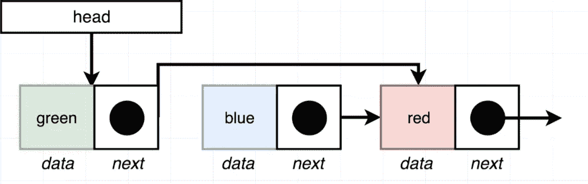

# JavaScript。链接列表。使用提供的索引删除或插入节点。

> 原文：<https://blog.devgenius.io/javascript-linked-lists-remove-or-insert-node-with-provided-index-4b4b5469bab4?source=collection_archive---------4----------------------->


欢迎回来。让我们继续学习不同的方法，并在我们的列表中添加新的方法。今天，我们将讨论如何在链表中通过索引实现 Remove 和 Insert 方法。我相信你已经知道很多了。或许，你可以编码并创建你自己的算法，但是让我们检查一下如何解决它的其他选项。我希望你用前面的方法多练习，并且已经烂熟于心。好的，在我看来是时候开始了，我只是想提醒那些刚刚开始关注我们的人，我们有第一个博客，你可以从课程开始和上一课开始。了解前面课程中的内容非常重要，因为我们将使用这些课程中的方法。

上一个:

[](https://medium.com/dev-genius/javascript-linked-lists-remove-first-element-remove-last-element-dfa8adce432) [## JavaScript。链接列表。拆下第一个元件。删除最后一个元素。

### 欢迎回到关于链表及其特性的长期博客会议。我真的很乐意分享我的经历…

medium.com](https://medium.com/dev-genius/javascript-linked-lists-remove-first-element-remove-last-element-dfa8adce432) 

首先:

[](https://medium.com/dev-genius/javascript-linked-lists-what-is-linked-lists-create-a-node-class-api-9aa0fa460075) [## JavaScript。链接列表。什么是“链表”？创建节点类 API

### 新读者们你们好，欢迎回到我身边。只是想提一下，我已经不再写关于…

medium.com](https://medium.com/dev-genius/javascript-linked-lists-what-is-linked-lists-create-a-node-class-api-9aa0fa460075) 

# 移除具有所提供索引的节点

**函数→“remove at(integer)”**

# 方向

移除提供的索引处的节点。

# 例子

```
const list = new List();
list.insertFirst('a');
list.insertFirst('b');
list.insertFirst('c');
list.removeAt(1);
list.getAt(1); //returns node with data 'a'
```

让我们从模式示例开始，我们将包括所有选项，什么可能发生，以及我们将使用哪个算法来使它工作。

1.首先，我们有三个相互连接的节点。我们的“头”连接到索引为 0 的绿色节点。绿色与蓝色相关(索引 1)，蓝色与红色相关(2)。我们希望创建所有不破坏我们代码的选项，并包括不同的条件来避免这种情况。

*—如果‘head’为‘null’，我们将不返回任何内容。*

*—如果我们只有一个索引为 0 的元素(当在链表中只有一个元素‘绿色’时)，我们指向空值。*

— *当我们放置 removeAt(12)时包含条件，但是我们只有三个元素。我们不能删除索引为 12 的元素，因为它不存在。*


2.例如，我们想删除索引为 1 的元素。在我看来，用我们之前的方法“getAt()”是个不错的选择。我们将找到我们想要删除的元素。该算法的主要目标是找到前一个元素(在我们的例子中是“绿色”)并指向索引为 2 的元素(“红色”元素)。



3.我们将创建变量“previous”来指示我们要删除的元素中的前一个元素。


## 代码解决方案


# 用提供的索引插入节点

**函数→“insertAt(Data，integer)”**

# 方向

创建一个在提供的索引处插入新节点的。如果索引超出界限，则将节点添加到列表的末尾。

# 例子

```
const list = new List();
list.insertFirst('a');
list.insertFirst('b');
list.insertFirst('c');
list.insertAt("hi",2);
list.getAt(1); //returns node with data 'Hi'
```

让我们再次从模式开始，并提及我们案例中的所有条件。

1.  同样，我们创建了 3 个节点，并希望再插入一个元素“橙色”。

—如果列表为空，我们需要将此元素作为列表中的第一个元素插入。

—如果我们想将此元素作为第一个元素(索引为 0)推送，我们需要将头指向新元素，新元素指向过去的第一个元素。

—如果我们想插入索引比我们的列表高的元素，我们应该把它推到列表的末尾。例如，我们有三个元素，但我们说，让我们把指数=12。它不存在，所以我们将作为最后一个元素推进。


2.正如您提到的，我们通过索引 2 添加了“橙色”元素。所以“蓝色”元素指向橙色而不是“红色”，橙色开始指向“红色”元素。


## 代码解决方案


## 完整代码:

```
class Node {
  constructor(data, next = null) {
   this.data = data;
   this.next = next;
  }
}class LinkedList {
  constructor() {
    this.head = null;
  }insertFirst(data) {
    const node = new Node(data, this.head);
    this.head = node;
  }

  size() {
    let counter = 0;
    let node = this.head;
    while (node) {
     counter++;
     node = node.next;
    }
    return counter;
  }

  getFirst() {
    return this.head.data;
  }

  getLast() {
    if (!this.head) {
      return null;
    }
    let node = this.head;
    while (node) {
     if (!node.next) {
      return node;
     }
     node = node.next;
    }
  }

  clear() {
    this.head = null;
  } 

  removeFirst() { 
    if (!this.head) {
     return;
    }
    this.head = this.head.next;
   }removeLast() {
    if (!this.head) {
      return;
    }

    if (!this.head.next) {
     this.head = null;
    }

    let previous = this.head;
    let node = this.head.next;

    while (node.next) {
      previous = node;
      node = node.next;
    }

    previous.next = null;
   }   insertLast(data) {
    const last = this.getLast();
    if (last) {
     last.next = new Node(data);
    } else {
      this.head = new Node(data);
    }
   }

   getAt(index) {
    let counter = 0;
    let node = this.head;
    while (node) {
     if (counter === index) {
      return node;
     }
     counter++;
     node = node.next;
    }
   return null;
  } removeAt(index) {
  if (!this.head) {
    return;
  } if (index === 0) {
    this.head = this.head.next;
    return;
  }

  const previous = this.getAt(index - 1);
  if (!previous || !previous.next) {
    return;
  }
  previous.next = previous.next.next;
 } insertAt(data, index) {
   if (!this.head) {
    this.head = new Node(data);
    return;
   }
   if (index === 0) {
    this.head = new Node(data, this.head);
    return;
   }
  const previous = this.getAt(index - 1) || this.getLast();
  const node = new Node(data, previous.next);
  previous.next = node; 
 }
}
```