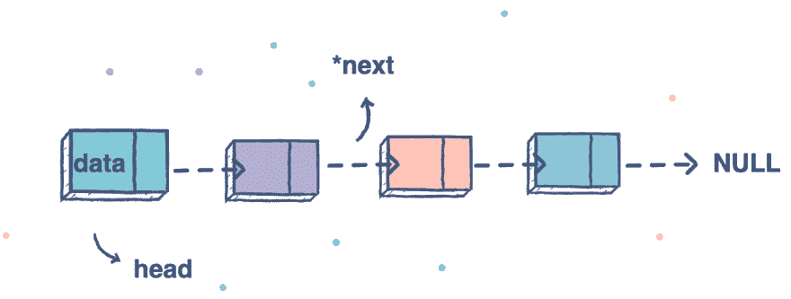
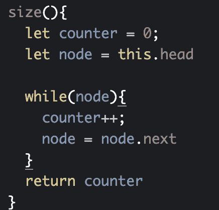
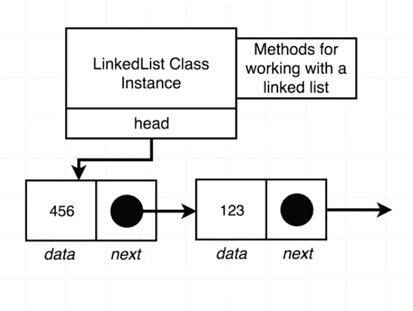
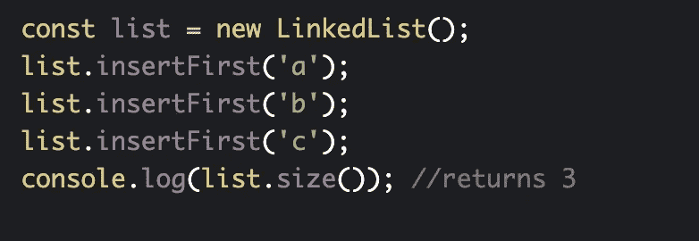
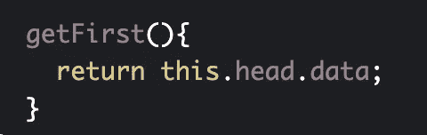
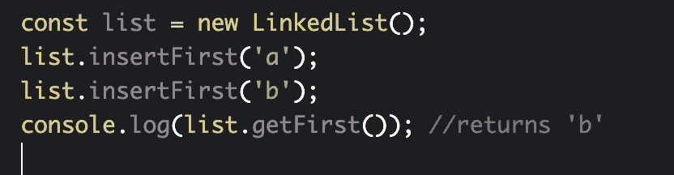

# JavaScript。链接列表。调整列表大小。获取列表中的第一个元素。

> 原文：<https://blog.devgenius.io/javascript-linked-lists-sizing-a-list-get-first-element-in-the-list-d7ba6dac6791?source=collection_archive---------15----------------------->



今天我们继续我们的链表，今天我们的目标是得到一个链表的大小，并得到第一个元素。我强烈推荐你阅读前面关于链表的部分，因为涵盖我之前提到的所有基础知识是非常重要的，所有代码都将更容易理解。如果你觉得继续很棒，就这样吧。

*链接到以前的博客:*

[https://medium . com/dev-genius/JavaScript-linked-lists-create-a-linked list-class-API-insert-first-c 309 f 41 b 24 ca](https://medium.com/dev-genius/javascript-linked-lists-create-a-linkedlist-class-api-insert-first-c309f41b24ca)

# 列表的大小

**函数→“size()”，应该会返回整数**

## 方向

*返回链表中节点的个数。*

## 例子

```
const list = new LinkedList();
list.insertFirst(‘a’);
list.insertFirst(‘b’);
list.insertFirst(‘c’);list.size(); //returns 3
```



链表类中的 weSize 函数

我们在“链表”类中创建了一个 size 方法。我们指定“head”指向节点(如果创建了这个节点的话),我们还创建了“counter”。当“node.next”不为空时，我们将计算我们有多少个节点。



## 让我们创建我们的例子。



## 全部代码。

```
class Node{
 constructor(data, next = null){
 this.data = data
 this.next = next
 }
}
class LinkedList {
 constructor(){
 this.head = null;
 }

 insertFirst(data){
 const node = new Node(data, this.head);
 this.head = node;
 }

 size(){
 let counter = 0;
 let node = this.head

 while(node){
 counter++;
 node = node.next
 }
 return counter
 }
}const list = new LinkedList();
list.insertFirst(‘a’);
list.insertFirst(‘b’);
list.insertFirst(‘c’);
console.log(list.size()); //returns 3
```

# 获取列表中的第一个元素。

**我们将创建一个函数→ getFirst()**

## 方向

*返回链表的第一个节点。*

## 例子

```
const list = new LinkedList();list.insertFirst(‘a’);list.insertFirst(‘b’);list.getFirst(); //returns Node instance with data ‘b’
```



列表头总是包含列表的第一个元素。

## 全部代码。

```
class Node{
 constructor(data, next = null){
 this.data = data
 this.next = next
 }
}
class LinkedList {
 constructor(){
 this.head = null;
 }

 insertFirst(data){
 const node = new Node(data, this.head);
 this.head = node;
 }

 size(){
 let counter = 0;
 let node = this.head

 while(node){
 counter++;
 node = node.next
 }
 return counter
 }

 getFirst(){
 return this.head.data;
 }
}const list = new LinkedList();
list.insertFirst(‘a’);
list.insertFirst(‘b’);
console.log(list.getFirst()); //returns ‘b’
```

我希望你喜欢它，并将在下一篇博客中讨论更多与链接有关的事情。

感谢您的阅读。