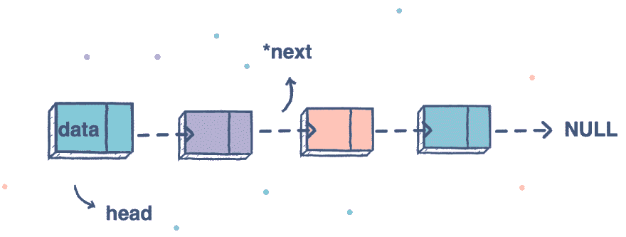

# JavaScript。链接列表。什么是“链表”？创建节点类 API

> 原文：<https://blog.devgenius.io/javascript-linked-lists-what-is-linked-lists-create-a-node-class-api-9aa0fa460075?source=collection_archive---------22----------------------->



新读者们你们好，欢迎回到我身边。我只想提一下，我有一段时间没有写关于数据结构和不同算法的博客了，但是我会带着充沛的精力和愉快的心情(我希望你也一样)来分享我关于链表的知识，以及其他人关于链表的知识。我想在一个博客中收集所有的信息，让每个人都能理解，不管你现在处于什么水平。

## **链表**

链表是一种线性数据结构，其中的元素不是存储在连续的内存位置。链表中的元素使用指针进行链接。

**简单来说:**

*   链表由节点组成，其中每个节点包含一个数据字段和对列表中下一个节点的引用(链接)。
*   有序的数据收集
*   节点链


## 为什么需要学习链表？

1.  链表是**的动态数据结构**。
2.  链表**可以在运行时**增长和收缩。
3.  **插入和删除**操作更容易
4.  **高效的内存利用**，即无需预分配内存
5.  更快的访问时间，可以在**常数时间内扩展，没有内存开销**
6.  堆栈、队列等线性数据结构可以使用链表**轻松实现**

## 数组 vs 链表？

*数组可用于存储相似类型的线性数据，但数组有以下限制。*
**1)** 数组的大小是固定的:所以我们必须事先知道元素个数的上限。此外，一般来说，不管使用情况如何，分配的内存都等于上限。
**2)** 在元素数组中插入一个新元素代价很高，因为必须为新元素创建空间，并且必须移动现有元素来创建空间。

如果我们想插入一个新的 ID 1005，那么为了保持排序的顺序，我们必须移动 1000 之后的所有元素(不包括 1000)。除非使用一些特殊的技术，否则删除数组的开销也很大。例如，要删除 id[]中的 1010，1010 之后的所有内容都必须移动。

**例如**，在一个系统中，如果我们在一个数组 id[]中维护一个 id 的排序列表。

id[] = [1000，1010，1050，2000，2040]。

我想这将是有益的阅读这篇文章是在这一段。他们比较数组和链表。此外，他们有更多关于它的信息。

[](https://www.studytonight.com/data-structures/linked-list-vs-array) [## 链表 vs 数组| Studytonight

### 链表和数组是相似的，因为两者都是线性数据结构，但是它们在很多方面是不同的，比如…

www.studytonight.com](https://www.studytonight.com/data-structures/linked-list-vs-array) 

## 简单节点的示例


# 但是让我们从创建节点类 API 开始

**构造器** →是我们的函数；**数据，节点→** 参数；**节点** →我们必须返回。

## 方向

创建一个类实例来表示一个节点。该节点应具有属性:“数据”和“下一步”。接受这两个参数作为“Node”构造函数的参数，然后将它们作为属性“data”和“next”分配给实例。如果未向构造函数提供“next”，则将其值默认为“null”。


**代码:**

```
class Node{
 constructor(data, next = null){
 this.data = data
 this.next = next
 }
}
```

看起来很简单，但这只是开始，我们将在下一篇博客中继续努力。感谢您的阅读。