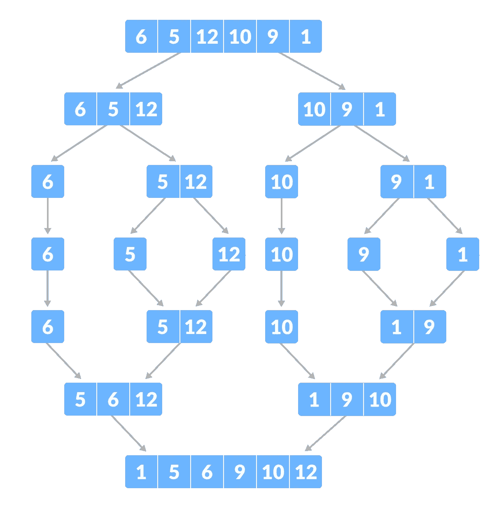
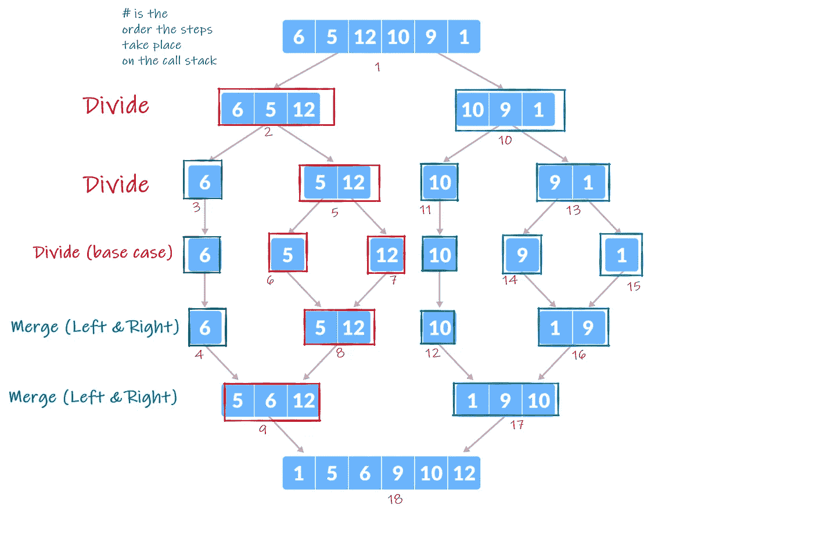

# JavaScript:合并排序算法

> 原文：<https://blog.devgenius.io/javascript-merge-sort-algorithm-bf46d42f175?source=collection_archive---------3----------------------->



[https://www.programiz.com/dsa/merge-sort](https://www.programiz.com/dsa/merge-sort)

# 什么是排序？

排序是将一组数据重新排列成特定的顺序，如数字从升序到降序，反之亦然。排序算法接受给定的数组或列表，并输出排序后的数组或列表。

排序无处不在。当我们在一个网站上按最低价格到最高价格、评级等对列表进行排序时。或者在图书馆找一本书。排序的概念使数据集的排列变得更容易，从而使搜索变得更容易。

# 排序算法的类型

排序算法有很多种。排序技术主要通过[时间复杂度和空间复杂度来区分。](https://www.hackerearth.com/practice/basic-programming/complexity-analysis/time-and-space-complexity/tutorial/#:~:text=Time%20complexity%20of%20an%20algorithm,the%20length%20of%20the%20input.)顾名思义，时间复杂度是算法运行所需的时间，它是输入长度的函数，而空间复杂度是输入长度所需的空间或内存量。下面列出了几种不同类型的排序算法:

*   快速排序
*   冒泡排序
*   **合并排序**
*   插入排序
*   堆排序

[](https://www.interviewbit.com/tutorial/sorting-algorithms/) [## 排序算法- InterviewBit

### 排序算法是将大量项目重新组织成某种特定顺序的方法，例如从高到低…

www.interviewbit.com](https://www.interviewbit.com/tutorial/sorting-algorithms/) 

# 什么是合并排序？

本文涵盖了合并排序。合并排序是一种基于分而治之的排序技术。最坏情况的时间复杂度是 O(n log(n))，空间复杂度是 O(n)。

合并排序是一种非常流行的排序算法，它使用递归方法。

# **合并排序是如何工作的？**

要使合并排序起作用，需要执行以下递归步骤:

1.  将给定数组的值分成两半
2.  继续分割，直到达到单一值的基本情况
3.  通过比较值，以排序的方式合并两半。
4.  用排序后的一半弹出调用栈，继续划分、合并和排序。

下面显示了使用合并排序的示例输入的图表和步骤。



[https://www.programiz.com/dsa/merge-sort](https://www.programiz.com/dsa/merge-sort)

步骤 1、2、3 我们将阵列进行分割，直到达到基本情况。基本情况是，当我们到达一个点，我们不能再划分数组的值。数组中只有一个值。与步骤 5、6、7 相同，我们递归地划分数组，直到我们达到基本情况并弹出调用堆栈。第 8 步合并左半部分和右半部分以排序的方式合并，一旦合并，我们从调用堆栈中弹出这个返回值，这是第 9 步的右半部分。步骤 9 以排序的方式合并左半部分和右半部分。步骤 10 现在再次重复相同的递归过程。

# 这个算法是什么样子的？

```
const mergeSort = function (array) {
  if (array.length <= 1) {
    return array;
  }
  let mid = Math.floor(array.length / 2);
  let left = mergeSort(array.slice(0, mid));
  let right = mergeSort(array.slice(mid));
  return merge(left, right);
};
```

merge sort 函数接受一组值。这个数组被递归分割，直到它达到长度为 1 的基本情况。一旦这些子数组被返回并弹出调用堆栈，该函数继续并合并左右子数组。在合并函数中，它将返回一个合并排序数组。每次使用 merge 函数时，左侧和右侧的子数组已经被排序。因此，我们合并排序后的数组。

下面如果合并功能。

```
const merge = function (left, right) {
  let sorted = []; while (left.length > 0 && right.length > 0) {
    if (left[0] < right[0]) {
      sorted.push(left.shift());
    } else {
    sorted.push(right.shift());
    }
  } if (left.length > 0) {
    sorted = sorted.concat(left);
  }
  if (right.length > 0) {
    sorted = sorted.concat(right);
  }
  return sorted;
};
```

merge 函数接受两个排序的数组。该函数将使用一个简单的 while 循环合并这些排序后的数组，比较每个数组中的第一个值，然后将它们弹出并添加到新的排序后的数组中。

希望这有助于您更好地理解合并排序。检查所有其他排序技术，我知道我需要。

我刚刚完成了黑客反应堆训练营的初级阶段。在上周末进行了 6 个小时的技术评估。兴奋地进入我的高级阶段，并开始实际建设一些非常酷的项目！