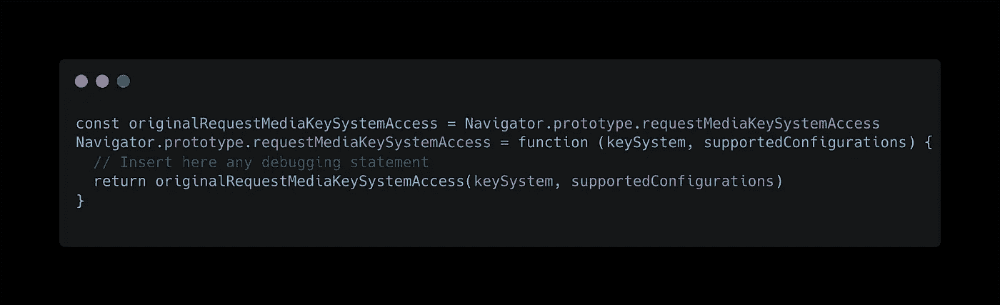
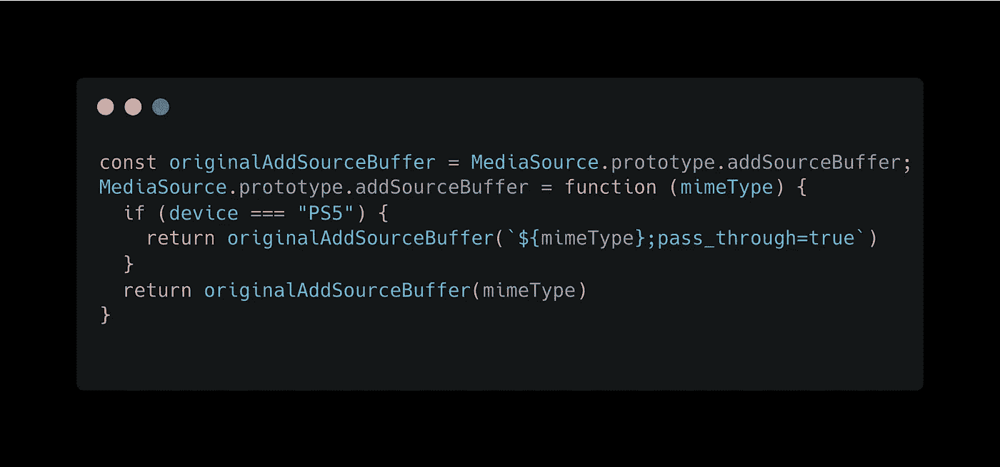

# Javascript 猴子补丁，间谍的艺术

> 原文：<https://blog.devgenius.io/javascript-monkey-patching-the-art-of-spying-cb78a117da91?source=collection_archive---------5----------------------->

代码检查

# 什么是猴子打补丁？

**术语“猴子补丁”似乎来自一个更早的术语，游击补丁**，它指的是在运行时偷偷改变代码，并且可能与其他此类补丁不兼容。

事实上，monkey patching 是一种扩展或修改动态编程语言(如 javascript、python、ruby 等)运行时间的方法。

游击队这个词，几乎和大猩猩同音，为了让声音不那么吓人，变成了猴子。

# 何时使用猴子补丁的用例

Monkey patching 更多的是一种调试、体验、修补或破解现有代码的方式，而不是一种针对代码库的长期解决方案，即使它可以在少数特定情况下作为自然解决方案使用。我主要使用猴子补丁来窥探浏览器中现有的应用程序代码库，以了解他们在内部做什么。事实上，偷偷获取一些关于其他开发人员如何想到潜在解决方案的有价值的知识是很方便的。

# 示例 1:窥探内置浏览器 API

让我举一个最近的真实例子，猴子补丁帮助我解决了这个问题。

当时我在一家流媒体公司上班。我们在网上发布视频。然而，这很复杂，因为我们需要考虑许多标准，包括加密。

每个流媒体公司都在使用 EME 的 API T4。这是一个存在于浏览器中的 API，并不为广大公众所熟知，但对于与底层模块进行交互非常有用，这将有助于解密视频内容。

这将我们带到这个 API 的核心组件之一:[requestMediaKeySystemAccess](https://developer.mozilla.org/en-US/docs/Web/API/Navigator/requestMediaKeySystemAccess)。

我们想知道网飞调用那个 API 的理由是什么，以了解他们在新的微软 Edge 浏览器上使用了什么解密的内容模块。

猴子补丁解决方案是显而易见的！

Monkey 修补 requestMediaKeySystemAccess 方法

然后，我们可以插入任何调试语句，以便在调用该函数之前监视它的调用。

在这里，我将描述它的功能:

*   我们首先需要保存原来的方法`requestMediaKeySystemAccess`。
*   然后，我们将通过改变方法所依赖的原型来改变方法的初始运行时间。
*   最后，我们通过传递正确的参数并返回它们来使用方法的副本。

我们可能会问的一个显而易见的问题是，为什么我们之前应该保存原始方法？

很好的问题！打开你的开发工具，尽量不要这样做。

当你一遍又一遍地重复调用你试图改变的方法时，它不会工作。它会导致无限循环。

最后，记得在应用程序调用它之前调用它，否则什么都不会发生，因为应用程序将在设置补丁之前调用原始函数调用。

# 示例 2:修补外部库调用

Monkey patching 还可以修补您将在应用程序中使用的外部库的一些方法调用。

让我们再举一个我过去遇到的真实世界的例子。

在我开发的应用中，我依赖于一个外部库，它忙于处理浏览器中的视频数据。这意味着一个视频块一个视频块地下载，并将这些视频块放入视频 HTML 元素的缓冲区中。

然而，我偶然发现了猴子补丁帮我解决的一个问题。事实上，我需要这个应用程序在 PS5 游戏机上运行。与视频元素相关的 API 的工作方式不符合传统规范。

所以，我问自己的第一件事是，我们是否可以更新我正在使用的库，以考虑 PS5 的情况，但我们很快发现，库应该严格遵循规范，不能偏离它。因此，我们决定进行猴子补丁，所以我们只更新了需要在 PS5 上工作的应用程序。

Monkey 修补 addSourceBuffer 方法

如前所述，如果您想将 monkey 补丁发布到生产环境中，通常不应该使用 monkey 补丁，但是上面的例子是让它工作的唯一方法。

# 结论

Monkey patching 可以用在动态编程语言中，这些语言大多数时候是高级语言。相比之下，大多数其他静态编程语言是在编译时而不是运行时完成的。

我还推荐 [TamperMonkey](https://chrome.google.com/webstore/detail/tampermonkey/dhdgffkkebhmkfjojejmpbldmpobfkfo?hl=en) ，这是一个 chrome 扩展，允许你在浏览器中运行的页面/标签范围内运行额外的脚本。

像[幻影](https://github.com/pretenderjs/pretender/blob/a6d53af7d5d16c3b68670a00aa2b0706a09b6ae6/src/pretender.ts#L113)这样的一些项目使用猴子修补风格来修补任何`fetch`或`XMLHTTPRequest`来即时拦截任何请求并将其重定向到另一个逻辑。

我希望你喜欢那个帖子。

感谢您的阅读，请不要犹豫提供任何反馈。

谢谢！

更多的故事可以在我的个人博客上找到:[https://me.paulrossethings.com/](https://me.paulrossethings.com/)