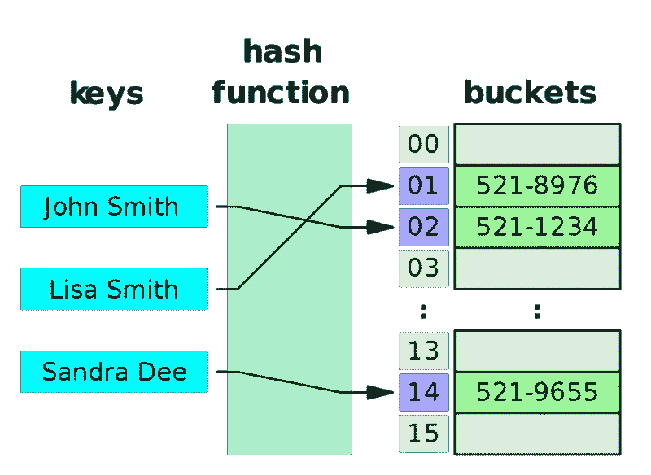
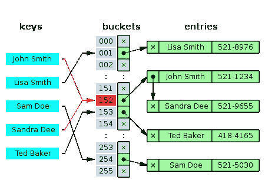
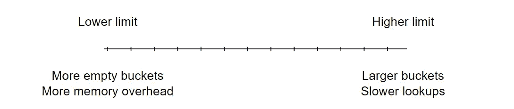

# 哈希表中的 JavaScript 新手

> 原文：<https://blog.devgenius.io/javascript-newbies-on-hash-table-c56b1e562721?source=collection_archive---------5----------------------->

约书亚·索蒂诺在 [Unsplash](https://unsplash.com?utm_source=medium&utm_medium=referral) 上拍摄的照片

在计算机科学中，[数据结构](https://en.wikipedia.org/wiki/Data_structure#:~:text=In%20computer%20science%2C%20a%20data,be%20applied%20to%20the%20data.)是一种存储和组织数据的方式，这样你就可以有效地访问或操作这些信息。[哈希表](https://en.wikipedia.org/wiki/Hash_table)是一种数据结构。在其他语言中，它们可以被称为字典、哈希映射或映射。哈希表对于快速查找一组数据非常有用。它们是实现键值对映射的快捷方式。

听起来熟悉吗？JavaScript 对象！本质上，对象是由散列表构造的。

概括来说，哈希表包括:

*   要存储的数据(键值),然后在给定密钥时进行访问
*   [散列函数](https://en.wikipedia.org/wiki/Hash_function#:~:text=A%20hash%20function%20is%20any,%2C%20digests%2C%20or%20simply%20hashes.)是一个将任意大小的数据映射到计算出的索引的函数
*   存储桶是存储要访问的值的位置

下面这个简单的例子存储了人们的电话号码以便快速查找。

参考:[https://www . freecodecamp . org/news/how-to-implementation-a-simple-hash-table-in-JavaScript-CB 3b 9 C1 f 2997/](https://www.freecodecamp.org/news/how-to-implement-a-simple-hash-table-in-javascript-cb3b9c1f2997/)

显然，构造散列函数不是我们需要做的事情。它们是由真正聪明的博士们创建的，他们编写了一个散列函数，根据提供的存储大小，神奇地将我们的关键输入分解成一个索引。互联网是一个我们可以寻找一个好的散列函数来利用的地方。一般来说，一个[好的哈希函数](https://www.geeksforgeeks.org/what-are-hash-functions-and-how-to-choose-a-good-hash-function/):

*   可高效计算，哈希值完全由被哈希的数据决定
*   每次被散列的数据都是一致的
*   在存储桶之间均匀地(理想地)分布数据
*   避免碰撞(解释如下)

# **碰撞**

如果这个神奇的哈希函数将两个不同的键映射到同一个索引会怎么样？这叫做碰撞。在下面的例子中，约翰·史密斯和桑德拉·狄都散列到相同的桶地址#152。

参考:[https://en.wikipedia.org/wiki/Hash_table](https://en.wikipedia.org/wiki/Hash_table)

哈希表冲突通过一种称为链接的方法来解决。[链接](https://www.educative.io/edpresso/what-is-chaining-in-hash-tables#:~:text=Chaining%20is%20a%20technique%20used,to%20store%20a%20single%20element.)将这些冲突项作为一个列表存储在上面例子中演示的同一个桶地址中。还有其他方法来处理冲突；然而，链接是一种简单、有效、可追踪的方法。

假设散列表已满。添加条目将导致额外的冲突。此外，由于长链表，检索值会导致频繁的迭代。这不是实现哈希表的有效方法。如果发生这种情况，我们需要调整哈希表的大小来容纳数据集。

# **调整大小**

[动态调整大小](https://en.wikipedia.org/wiki/Hash_table#Resizing_by_copying_all_entries)是指进行了一次插入，现在条目的数量超过了[加载因子](https://programming.guide/hash-table-load-factor-and-capacity.html)和哈希表的当前容量。

参考:[https://programming . guide/hash-table-load-factor-and-capacity . html](https://programming.guide/hash-table-load-factor-and-capacity.html)

# 从统计上来说，哈希表的最佳性能是在 **25 %和 75%的负载系数**之间运行。

如果超过 75%的加载因子，则存储桶很可能会有一个较长的列表，从而导致查找速度变慢。如果小于 25%的负载系数，这将导致比所需更多的内存使用。

哈希表构造函数将跟踪加载因子，一旦超出限制范围，哈希表将调整大小。这种调整大小操作将要求所有现有的键值再次被重新散列(通过散列函数运行),因为散列函数使用存储大小作为被更新的参数。因此，哈希函数的计算索引可能是不同的索引。总结一下调整大小的方法:

*   如果键值对计数/存储桶数量为< 25%, reduce storage size by half
*   If key-value pair count / number of buckets is > 75%，则存储大小加倍
*   存储中的所有键-值对都必须用散列函数重新散列，以新的大小作为参数
*   将键-值对移动到哈希函数提供的新映射索引地址
*   应该移除键值对的旧位置

# **时间复杂度**

哈希表的主要好处是速度和性能。快速插入、检索和删除数据的能力。

插入、检索和删除的时间复杂度为**常数时间或 O(1)** 。如果数据集很小或者有数百万个条目，那么访问数据的时间不取决于条目的数量。

这是基于假设所使用的散列函数是好的。

需要注意的是，在调整大小时，这个特定的方法具有线性或 O(n)时间复杂度。这是因为所有的键值对都必须被迭代并重新散列到它们新映射的地址中。如果哈希表设置得很好，那么与上面列出的其他方法相比，动态调整大小将很少使用。因此，哈希表总体上是一个常数时间数据结构。

下面是 JavaScript 中一个简单哈希表数据结构的例子

这是 Hack Reactor 的第三周结束。仍然对全日制学生如何在第 4 天吸收所有这些信息印象深刻！