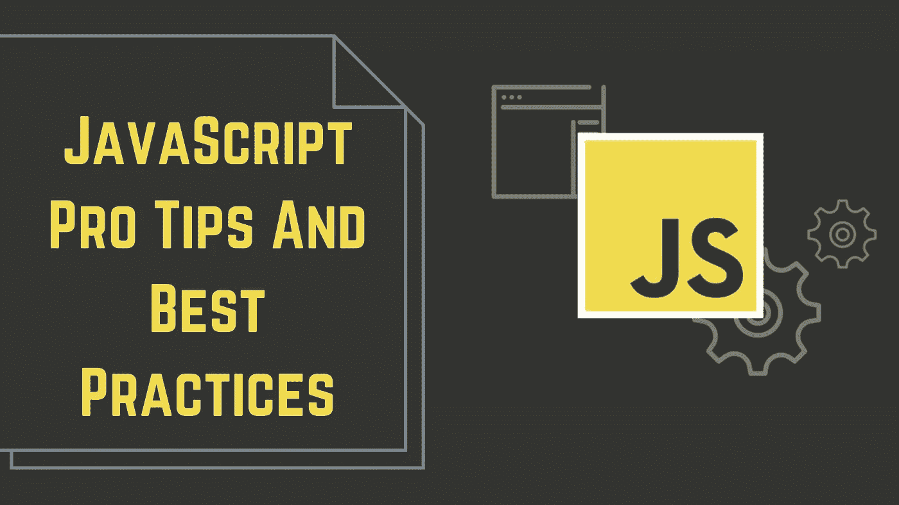
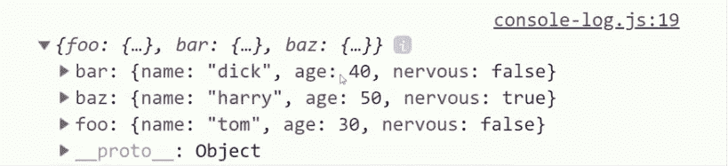
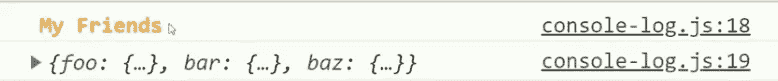
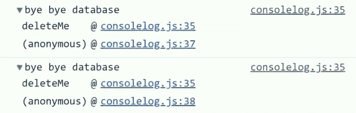

# Javascript 专业技巧

> 原文：<https://blog.devgenius.io/javascript-pro-tips-159029088776?source=collection_archive---------2----------------------->



在本文中，我将讨论 Javascript Pro 技巧。请学习如何编写可靠的现代 Javascript，避免过去的糟糕代码。

# 排除故障

实际上，它是关于控制台日志的东西。

你如何使用控制台日志？控制台日志有好方法和坏方法。想象你有三个不同的物体。每个都像这样分配给自己的变量。

```
const foo = { name: 'tom', age: 30, nervous: false } 
const bar = { name: 'dick', age: 40, nervous: false }
const baz = { name: 'harry', age:50, nervous: false }
```

记录这些的最明显的方法就是一个接一个地记录。

例如:

```
console.log(foo);
console.log(bar);
console.log(baz);
```

但是主要的问题是我们不知道变量的名字，当它被记录的时候，但是有一个技巧我们可以在这里使用，叫做计算属性名，我们把变量添加到一个对象中。

所以你可以这样做:

```
console.log({ foo, bar, baz });
```

这不仅减少了代码的使用量，还准确地告诉我们哪个变量定义了这个数据。一行代码，一个控制台日志和我们需要的所有信息。



但是也许这个数据是额外重要的，所以我们想用一些定制的 CSS 样式来突出它。您可以使用`%`符号替换数据和 CSS 样式。所以我们将添加`%c`，然后让第二个参数成为我们实际的 CSS 样式。

例如:

```
console.log('%c My Friends', 'color: orange;')
console.log({ foo, bar, baz });
```

开始了。



你可能已经注意到的一件事是，这些对象都有共同的属性，所以也许我们应该把它们显示为一个表格。

```
console.table([foo, bar, baz]);
```

当你有一个对象数组时，这真的很有用。你只要用阵列做控制台表。

如果你在基准测试性能，你实际上可以跟踪时间。控制台。

```
console.time('looper');let i = 0;
while (i < 1000000) { i ++ }console.timeEnd('looper')
```

记录时间很棒，但是如果你需要知道一个`console.log`从哪里来呢？

让我们想象一下，我们有一个非常重要的函数，它从我们的数据库中删除项目，我们希望确保我们不会意外地调用这个方法两次。在这种情况下，您可以将控制台跟踪添加到您的函数中，它会为您提供调用它的位置和定义它的内容的堆栈跟踪。如果我们运行这段代码，我们会得到一个控制台日志，告诉我们该函数是在第几行定义的。

例如，如果我们写:

```
const deleteMe = () => console.trace('bye bye database')
```

您可以获得:



# 解构

在这里，我将向您展示几种不同的方法，让您的代码尽可能简洁高效。假设我们有一个包含动物数据的对象，我们需要一个告诉我们如何喂养动物的函数。

例如:

```
function feed(animal) {
    return `Feed ${animal.name} ${animal.meal} kilos of ${animal.diet}`
}
```

这看起来不太糟，但是你会注意到我们一遍又一遍地重复动物这个词。有一种叫做对象析构的技术，我们可以用它来消除这里的大部分重复。

如果我们有一个接受一个对象的函数，但是我们只需要使用它的一些属性。我们可以在论点中分解它们。我们只是把它放在括号中，然后传入我们想要使用的对象属性的名称。

```
function feed({ name, meal, diet }) {
    return `Feed ${name} ${meal} kilos of ${diet}`
}
```

所以现在我们可以格式化同样的字符串，但是我们实际上从来不需要直接使用动物这个词。对于这个简单的函数来说，这似乎是一个不大的收获，但是当你有一个具有很多属性的大对象时，这可能会产生很大的不同。

如果你不喜欢 object 参数中的这种括号语法，实际上还有另一种同样好的方法。

```
function feed(animal) {
    const { name, meal, diet } = animal;
    return `Feed ${name} ${meal} kilos of ${diet}`
}
```

现在你可以在整个函数中使用像变量这样的属性，如果你有多个对象 2d 结构和一个函数，这可能是更好的方法。

# 模板文字

在这一部分，我将讨论我们已经在代码中使用的模板文字。但实际上这里还有更多要谈的。

例如，如果我们有:

```
const horse = {
   name: 'Topher',
   size: 'large',
   skills: ['jousting', 'racing'],
   age: 7
}let bio = horse.name + ' is a ' + horse.size + ' horse skilled in ' + horse.skills.join(' & ')
```

你会看到很多字符串连接，就像上面一样，你有一个变量加一个字符串，你必须管理中间的空格加一个表达式加一大堆其他的东西。这种类型的代码很难处理，但是现代 Javascript 中的模板文字完全解决了这个问题。

实际上，我们可以将它们直接插入到字符串中，而不是将值连接在一起。你可以这样做，用反斜杠定义你的字符串，然后用美元符号括号，然后在里面放上你想要的任何变量或表达式。像这样:

```
const horse = {
   name: 'Topher',
   size: 'large',
   skills: ['jousting', 'racing'],
   age: 7
}bio = `${name} is a ${size} skilled in ${skills.join(' & ')}`
```

这看起来可读性更强，维护起来也更容易。

但是实际上你可以更进一步，用纯函数的方式构建字符串。所以我们在这里写一个名为马龄的函数，它接受一个字符串数组作为第一个参数，然后它可以接受任何其他想要的参数。想象我们有这个函数:

```
function horseAge(str, age) {
   const ageStr = age > 5 ? 'old' : 'young';
   return `${str[0]}${ageStr} at ${age} years`;
}
```

但有趣的是，我们可以将它附加到一个模板文字上，它会解析其中的参数，而不是将一个常规参数传递给这个函数。例如:

```
const bio2 = horseAge`This horse is ${horse.age}`;
```

然后，它将按照出现在美元符号括号中的顺序处理所有其他参数。换句话说，你可以用一个参数在返回的字符串中组成多个值。这对于模板来说是一个非常强大的概念。

# 扩展语法

假设我们有一个口袋妖怪的对象，另一个是定义其各种属性的统计数据。

```
const pikachu = { name: 'Pikachu' }
const stats = { hp: 40, attack: 60, defense: 45 }
```

假设我们想将 stats 对象的属性分配给 Pikach 对象。一种方法是在原始皮卡丘对象上逐个重新定义它们。

```
pikachu['hp] = stats.hp
pikachu['attack'] = stats.attack
pikachu['defense'] = stats.defense
```

首先，这真的很难看而且冗长，但是当我们很可能想要创建一个新的不可变对象时，我们也在改变原始对象，因为假设我们的口袋妖怪随着时间的推移而升级，我们希望将每个级别都表示为它自己的对象。

我们可以在这里使用`Object.assign()`,将原始对象与统计数据合并，这样会从左到右将它们合并在一起。

```
const lv10 = Object.assign(pikachu, stats)
const lvl1 = Object.assign(pikachu, { hp: 45 })
```

这并不太坏，但是有一种更简洁的方法可以用 spread 语法来实现。通过创建一个新的对象，并把我们现有的对象放在前面有三个点。例如:

```
const lvl0 = { ...pikachu, ...stats }
const lvl1 = { ...pikachu, hp: 45 }
```

这将从左到右组成一个新的对象。所以最右边的财产有优先权。同样，这主要是语法上的好处，它只是让你的代码可读性更好，更容易维护。

也可以在数组上使用 spread 语法。让我们假设我们有一个字符串数组，我们需要将额外的项推到这个数组中。

```
let pokemon = ['Arbok', 'Raichu', 'Sandshrew']
```

传统的方法是把新的项目一个接一个地放入数组。例如:

```
pokemon.push('Bulbasaur')
pokemon.push('Metapod')
pokemon.push('Weedle')
```

但是在今天的世界中，我们可以通过用新的项和原始数组的 spread 语法定义一个数组，将这三行代码减少到一行。像这样:

```
pokemon = [...pokemon, 'Bulbasaur', 'Metapod', 'Weedle']pokemon = ['Bulbasaur', ...pokemon, 'Metapod', 'Weedle']
```

# 环

让我们想象一下，我们这里有一个表示其他总数的数字数组。

```
const orders = [500, 30, 99, 15, 223]
```

现在我们需要基于这个数组计算一些值，比如订单总数。也许我们需要给每个订单加一些税，并过滤掉高价值的订单，由经理审核。一种选择是只使用一个经典的 for 循环，就像你在几乎每种编程语言中都可以找到的那样。例如:

```
const total = 0;
const withTax = [];
const highValue = [];
for(i = 0; i < orders.length; i ++) { // Reduce
  total += orders[i]; // Map
  withTax.push(orders[i] * 1.1); // Filter
  if (orders[i] > 100) {
    highValue.push(orders[i])
  }}
```

这段代码非常难看，它的变异值可能会让我们的代码变得更加不可预测。幸运的是，通过使用现代的 Javascript 数组方法，我们可以将它减少到只有三行代码。像这样:

```
// Reduce
const total = orders.reduce((acc, cur) => acc + cur)// Map
const withTax = orders.map(v => v * 1.1)// Filter
const highValue = orders.filter(v => v > 100)
```

# 异步/等待

让我们创建一个名为 random 的方法，该方法返回一个异步解析为随机数的承诺。

```
const random = () => {
  return Promise.resolve(Math.random())
}
```

现在我们想一个接一个地检索三个不同的异步数字，然后在最后把它们加在一起。这可能看起来像一个愚蠢的例子，但这实际上是现实世界中很多时候的工作方式，当你必须从数据库中检索一个项目，从 API 中获取一些数据检索另一个项目，等等。

对于承诺，你等待一个异步值被解析，然后用 then 中的回调函数处理它。例如:

```
const sumRandomAsyncNums = () => {
  let first;
  let second;
  let third;return random()
       .then(v => {
           first = v;
           return random();
       })
       .then(v => {
           second = v;
           return random();
       })
       .then(v => {
           third = v;
           return first + second + third;
       })
}
```

我们可以重写承诺链。唯一的区别是在函数前面添加了 async，这将迫使它返回一个承诺。像这样:

```
const sumRandomAsyncNums = async () => {

    const first = await random();
    const second = await random();
    const third = await random(); return first + second + third;
}
```

这里真正的好处是，我们可以在承诺前使用 await，并让它们解析为实际的变量值。因此，我们可以只说`const first = await random();`,对第二个和第三个数字做同样的事情，而不是使用那些 then 回调。现在阅读和理解这段代码要容易得多，因为我们可以一行一行地看，看到我们在等待一个数，等待另一个数，等等。

这个 async/await 概念是 Javascript 有史以来最棒的事情之一！

今天到此为止。

感谢您的阅读！