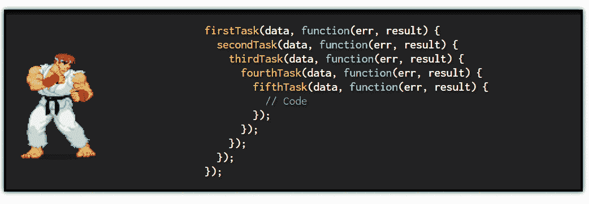

# JavaScript 承诺链——避免回调地狱

> 原文：<https://blog.devgenius.io/javascript-promise-chaining-avoid-callback-hell-6e04818d4464?source=collection_archive---------9----------------------->



如果你从事 JavaScript web 开发，我猜你已经熟悉了一个`Promise`,并且曾经多次面临回调地狱。JavaScript 中的承诺链是解决回调地狱问题的一种方法，我们将在本文中讨论它。但是，对于那些不熟悉这些概念的人，让我们稍微回顾一下。

# 什么是 JavaScript `Promise`？

在 JavaScript (ES6 和更高版本)中，`Promise`是一个对象，表示异步操作的状态和结果，比如 API 调用或 IO 读/写。状态包括*未决*、*完成*和*拒绝*。

*   挂起:操作正在进行，尚未返回结果。
*   完成:一次操作成功，结果返回。
*   拒绝:操作失败，返回错误。

一个`Promise`有两种方法:`then`和`catch`。`then`方法接受一个*回调*一个要在承诺完成后发起的动作，同时`catch`在承诺被拒绝时运行。

```
// Asynchronous API call operation
getWeatherTodayPromise
   .then((weatherForecast) => { // Fulfilled
      // Synchronous operation
      display(weatherForecast)
   })
   .catch((error) = > { // Rejected
      console.error(error)
   })
```

# 什么是回调地狱？

简而言之，当你的回调被多层嵌套时，它就变得难以管理了。这在任何编程语言中都可能发生，在异步操作中更常见。JavaScript 中深度嵌套的承诺和回调只是回调地狱的一种形式，本文中的例子都是基于这种回调地狱的变化。

```
// A typical callback hell which involves multiple JavaScript promises
firstPromise
   .then(secondPromise
      .then(thirdPromise
         .then(...).catch(...)
      ).catch(...)
   ).catch(...)
```

可读性是一方面，但是回调函数会导致其他范围问题。一个典型的例子是当一个内在承诺引起的错误没有被发现时的错误隐藏(吞咽)。

```
// Asynchronous API call operation
getWeatherTodayPromise
   .then((weatherForecast) => {
      // Asynchronous IO operation
      writeWeatherForecastToLogFilePromise(weatherForecast) // FAILED ... // Unlike try-catch, there is no outer "catch-all" solution
         // You must have a "catch" at every nested promise
         // Or else, the promise is not terminated, and the error information is lost
         .catch((error) => {
            // IO error is caught here
            console.error("Inner promise", error)
         })
   })
   .catch((error) = > {
       // IO error is NOT caught here
       console.error("Outer promise", error)
   })
```

# JavaScript 中的承诺链是什么？

你刚刚学到了回调地狱表示不可管理的嵌套层次的回调。也就是说，解决这个问题的一个方法是让回调不再嵌套。弄浅一点！

JavaScript 中的承诺链接是指连续调用多个`then`和`catch`方法来完全移除嵌套层次，同时仍然保持预期的输出。你可以说这是重构代码库的一种方式。

```
// Promise chaining
firstPromise
   .then(() => secondPromise)
   .then(() => thirdPromise)
   .then(...)
   .catch(...)
   .catch(...)
   .catch(...)
   .then(...)// A typical callback hell which involves multiple JavaScript promises
firstPromise
   .then(secondPromise
      .then(thirdPromise
         .then(...).catch(...)
      ).catch(...)
   ).catch(...)
```

如果您处理的是常规的基于回调的函数(而不是承诺)，那么您需要首先对函数进行承诺，以应用承诺链。有很多方法可以做到这一点，比如使用一个`[es6-promisify](https://github.com/mikehall314/es6-promisify)`库。

# JavaScript 中的承诺链是如何工作的？

*   `then`和`catch`是一个`Promise`对象的方法，所以要创建一个链，`then`方法中的回调必须返回一个新的`Promise`。

```
// Correct implementation
// "() => something" is a shorthand for "() => {return something})
const secondPromise = firstPromise.then(() => newPromise)
secondPromise.then(() => anotherPromise).then(...)// Wrong implementation and an exception is raised
firstPromise.then(() => null).then(...)
```

*   一个承诺的结果被带到下一个`then`。

```
getWeatherTodayPromise
   .then(weatherForecastResult => writeWeatherForecastToLogFilePromise(weatherForecastResult))
   // writeWeatherForecastToLogFilePromise(weatherForecastResult) if fulfilled will provide "ioWriteResult"
   .then(ioWriteResult => Promise.all([
      anotherPromise(ioWriteResult),
      andSomethingElsePromise(),
    ]))
   .then(listOfResults => ...)
```

*   我们可以手动初始化并返回一个新的`Promise`对象来形成承诺链。您可以应用这种技术将代码库分割成更小的块，而不是在一个回调中执行任务。

```
firstPromise
   .then(() => {
       const isSuccess = synchronousOperation() // boolean
       return isSuccess ? Promise.resolve("Success") : Promise.reject(new Error("404"))
    })
    .then((result) => console.log(result)) // Print "Success"
    .catch(error) => console.error(error)) // Print an error with "404" message
```

*   一个`then`方法有第二个可选的`onRejectedCallback`参数，但是因为我们不使用它，所以每当出现异常时，浏览器会沿着整个承诺链查找给定错误的第一个可接受的`catch`。
*   通过使用 promise chaining，您可以拥有一个类似于`try-catch`的外部“无所不包”的解决方案，因此不再有错误吞咽的可能性。对于多个错误，您可以在一个`catch`中有一个条件语句，或者您可以将它们分割成多个单独的`catch`，如下所示。

```
rejected5xxPromise
   .catch(HTTP 4xx) // Browser: "Not here"
   .catch(HTTP 5xx) // Browser: "Okay, this catches the 5xx error"
   .catch(Other unexpected errors) // Skip
```

*   您可以在`catch`后链接一个`then`。这意味着“无论如何都要操作”。

```
rejected5xxPromise
   .catch(HTTP 5xx)
   .then(console.log("This line is always printed out"))
```

# 包裹

JavaScript promise chaining 是一个简单但强大的特性，可以解决常见的嵌套回调问题(回调地狱)。要兑现承诺，你需要记住两个要点。

1.  可以连续调用多个`then`和`catch`，如`promise.then(...).then(...).catch(...).catch(...)`。
2.  在`then`方法中的回调必须返回一个新的`Promise`对象，这样链才能继续。

该规则也适用于 TypeScript。ES2016(又名 ES7)中引入了`async/await`功能，它让我们的生活变得更加轻松。也就是说，如果你因为某种原因不能使用 ES7 特性，那么 promise chaining 是重构你的代码库的一个很好的选择。

对网页开发感兴趣？我的其他文章可能对你有帮助！

*   [你应该知道的前端、顶级框架和库](https://hungvu.tech/front-end-tech-stack-components)
*   [GitHub CLI 3 分钟](https://hungvu.tech/github-cli-in-3-minutes)