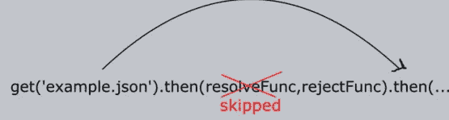

# JavaScript 承诺:温和的介绍

> 原文：<https://blog.devgenius.io/javascript-promises-a-gentle-introduction-8fec479c2998?source=collection_archive---------0----------------------->


每个新程序员在开始他们的旅程后都会偶然发现一些要点，其中之一就是承诺。

## 让我给你一些介绍，你首先必须知道为什么要使用它们！

JavaScript 是一种单线程语言，不同于 Java 或其他多线程语言。这意味着只有一个线程在循环，寻找要执行的代码。这个线程一步一步地运行所有的代码，一行一行地运行，直到结束并停止。这一切都进行得很顺利，直到您编写的代码是同步的！你可能会问，没有任何延迟就执行的代码是同步代码吗？将打印带到控制台，在 div 数组上循环，您就明白了！另一方面，异步任务可能需要一些时间来执行，这反过来会使您的主线程等待，直到它完成执行。异步任务的例子可以是从外部数据源提取数据，或者将文件上传到服务器，使用 web worker(它允许您创建多个线程，让我们把它留到以后再说)等。因此，我们需要注意它们是如何执行的，这样你的用户就不会以为你的应用崩溃了就跑了。异步执行某些功能基本上意味着让主线程做其他事情，直到任务解决。

TL；DR →当您同步执行某个任务时，您会等待它完成，然后再继续执行另一个任务。当您异步执行某项任务时，您可以在它完成之前继续执行另一项任务。

> “Promise 对象用于延迟和异步计算”。-MDN

# 还有其他方法来处理异步任务，但是使用承诺是如何有效的呢？

处理此类任务最常用的替代模式是通过函数回调。我们知道 JavaScript 是一种函数式编程语言，一旦第一个任务完成，我们可以使用回调的力量来执行其他任务。回调基本上是说，“完成后再做”。

让我们看看如何使用回调来处理异步任务:

```
function loadImage(src, parent, callback){
  let img = document.createElement('img');
  img.src = src;
  img.onload = callback;
  parent.appendchild(img);
}
```

loadImage 函数简单地从 src 加载图像，然后调用回调函数来做它应该做的事情。乍一看，这似乎是一个很好的模式，但是一旦我们有更多的图像要加载，这就变得很麻烦了。想想看，嵌套的回调将继续加载图像，我们必须显式地定义它们。下面的代码片段说明了这一点:

```
loadImg('img1.jpg', imgContainer, function(){
  loadImg('img2.jpg', imgContainer, function(){
    loadImg('img3.jpg', imgContainer, function(){
      loadImg('img4.jpg', imgContainer)
      }
    }
  }
)
```

这只是 4 个图像，想想当你有更多的图像要加载时的场景，这种场景通常被开发人员称为“末日回调金字塔”。

嗯，不是这样的，这种模式中的错误处理是痛苦的。

最佳实践是假设任何操作都可能在任何时候失败，尤其是异步操作。如果有错误，回调应该接收什么？如果有 JavaScript 错误怎么办？还是网络错误？你必须为每一次回调分配接球。我告诉过你，痛苦。

# 作为救世主的承诺

让我们来看看如何使用承诺来解决上述问题。

```
let sequence = get('example.json)
  .then(doSomething)
  .then(doSomething)
```

这只是给你一个承诺是如何工作的概念，我们还没有深入研究承诺，但是你仍然可以知道这段代码会做什么。不是吗？

## 承诺可以有四种状态:

1.  完成(解决):成功了
2.  被拒:没用
3.  待定:仍在等待
4.  已解决:履行或拒绝

## 语法:

```
new Promise(function(resolve, reject){
  if(workDone){
    resolve()
  }else{
    reject()
  }
})
```

Promise 是一个构造函数，你可以把它存储为一个变量，也可以在你创建它的时候对它进行处理。

您向 promise 传递一个带有两个参数的函数，resolve 和 reject。这两个是回调，用于指定承诺何时实现或拒绝。

## 你传递什么来 resolve()和 reject()？

当 resolve 或 reject 被调用时，承诺被解决，此时链的下一部分，通常是. then()或。然后执行 catch()，传递给 resolve 或 reject 的任何值都将被传递给后续的。然后()或。catch()。(我们接下来会谈到它们。)

注意:如果没有传递任何东西给 resolve 或 reject，那么这完全没问题，链中的下一个链接只是接收 undefined。

所以，你可以通过任何事情来解决和拒绝。但是你能通过一个承诺吗？是的，你可以。如果传递的值是一个承诺，那么传递的承诺将首先执行，然后无论它解析为什么值，都将传递给链中的下一个链接。

注意:一个承诺只能解决一次，这意味着你不能给它两次解决的机会。我是说你可以，只是第二个不行。

```
new Promise(function(resolve, reject {
  resolve("First"); // Works
  resolve("Second); // Doesn't work
})
```

我要给出的另一个类比是把承诺想象成你的代码周围的一个 try/catch 块，它将在一个不可预知的时间结束。

## 连锁承诺/使用。然后()和。catch():

异步工作很少是孤立的，因此，您可能有许多相互依赖的异步操作。使用 Promise API。然后()也返回承诺。所以如果可以的话。然后()取消最初的承诺，你可以。然后()关闭。那么()是因为它们也是承诺。

开发人员通常使用术语“then-able”来描述 then()中的承诺。任何返回. then()的方法或对象都是“thenable”。

请注意，其他一些库也包含可命名对象。

回想一下我们谈到的第一个例子，它说明了。那么()很清楚:

```
let sequence = get('example.json)
  .then(doSomething)
  .then(doSomething)
```

当创建一个异步工作链时，链中的每个后续链接要么接收前一个承诺的已实现值，要么接收前一个承诺的返回值。then()函数。

这样，您可以将从一个异步方法收集的信息传递给下一个异步方法。

能够链接这些变量是一种非常强大的技术，可以简化复杂的异步工作序列。

## 更深入地探究链接:

看看这两段代码:

```
get('example.json')
  .then(resolveFunc)
  .catch(rejectFunc)
```

而且，

```
get('example.json')
  .then(resolveFunc)
  .then(undefined, rejectFunc)
```

他们基本上在做同样的事情。

的完整函数签名。catch()是:

```
.then(undefined, rejectFunc)
```

的完整函数签名。那么()就是:

```
get('example.json').then(resolveFunc, rejectFunc)
```

如果在此解析之前没有 resolveFunc 和承诺，则此。然后()被一遍又一遍地跳过。然后调用()。



## 所有承诺:

还有最后一个许诺法，你要学会用→。全部()

```
Promise.all(arrayOfPromises)
  .then(function(arrayOfValues){
    //your code
  }
)
```

它接受一个承诺数组，执行这些承诺，然后按照与原始承诺相同的顺序返回一个值数组。如果所有的承诺都解决了，那么只有它有效。即使一个承诺不能解决，所有的失败。

请注意，arrayOfPromises 和 arrayOfValues 的顺序应该相同。

结论:承诺是非常强大的，因为它们是可组合的，是一个完美 JS 开发的好工具。

我希望这有所帮助。

别忘了你可以点击那个拍手图标 50 次。