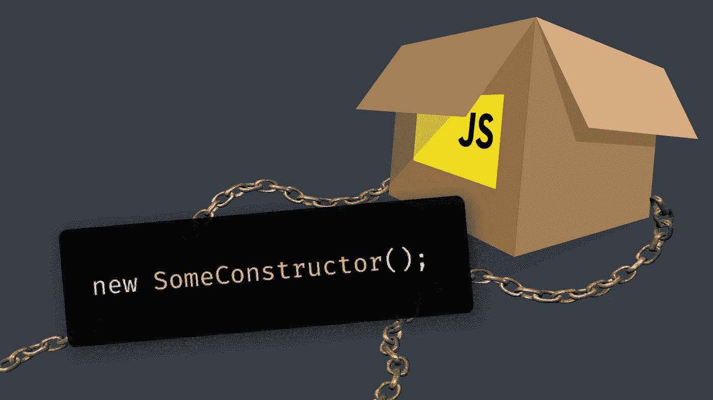
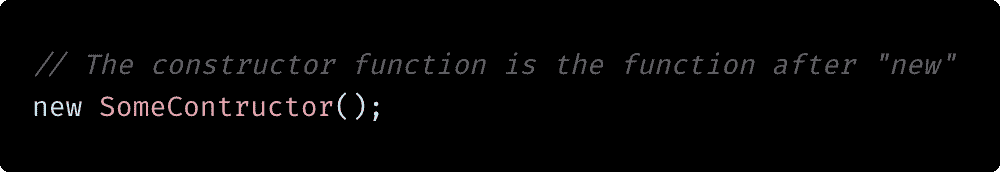
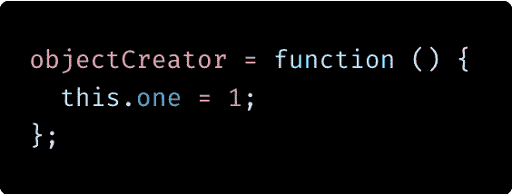
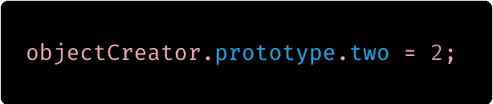
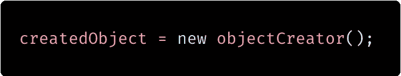
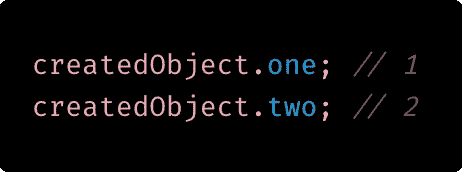
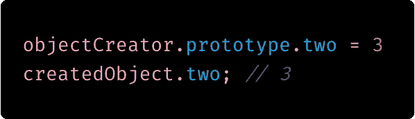

# Javascript 原型和“new”关键字——尽可能简单

> 原文：<https://blog.devgenius.io/javascript-prototypes-and-the-new-keyword-as-simple-as-possible-df303c84167b?source=collection_archive---------19----------------------->

JavaScript 是一种基于 T2 原型的语言。这种语言有一个不太常见但很强大的特性，你可以直接创建对象而不需要类或其他抽象。这是语言的核心部分。

所有 JavaScript 对象都从原型继承属性和方法，其中 Object.prototype 位于原型继承链的顶端。

我将用[[Prototype]]来引用这个链中的一个链接。所以每当你看到[[Prototype]]的时候，就把它当成一个对象到另一个对象的链接。

**边注:** [[Prototype]]在大多数但不是所有的 Javascript 环境中被称为“__proto__”。

为了更深入地研究 Javascript 原型，看一看“new”操作符是个好主意。

当您使用“新”关键字时，会发生 5 种情况:

1.  创建了一个新对象。这个对象的类型就是 object。

2.在这个新对象上，[[Prototype]]属性被设置为构造函数的原型对象。

3.“this”变量被设置为指向新创建的对象。

4.每当使用“this”时，它就使用新创建的对象来执行构造函数。

5.除非构造函数返回对象引用，否则将返回新创建的对象。

最难理解的一步可能是第二步。每个对象和函数都有这个[[Prototype]]属性，并且有一些限制。它只能在创建时设置，并且只能通过 object . getprototypeof(someObject)读取。

除了[[Prototype]]，函数还有另一个属性叫做“Prototype”，这个可以像我们习惯的那样读取和更改。此属性可用于为您创建的对象实现继承的属性和方法。如果请求了 ourNewThing 的一个未定义的属性，Javascript 将检查该对象的[[Prototype]]对象以获得该属性。这就是 Javascript 如何实现类似于类继承的东西。

让我们看看上面的例子。objectCreator 只不过是您的标准 Javascript。它什么也不返回，只是在“this”上添加一个名为“one”的属性，值为 1。

objectCreator 的原型现在已经用新的属性进行了修改。

有了这个改变。让我们试试我们的 objectCreator 构造函数。

刚刚发生了什么？我可以分成四个步骤:

1.创建了一个名为 createdObject 的对象。作为这样一个新生的对象，createdObject 就像你从 object literal {}中得到的一样。

2.createdObject 的[[Prototype]]属性被设置为 objectCreator.prototype 的当前值。

3.运行 objectCreator 函数，将“this”设置为 createdObject。因此，createdObject.one 被设置为 1。

4.新创建的对象被返回。

让我们通过查看 createdObject 的属性来研究它:

createdObject 没有名为“two”的属性，因此 JavaScript 查看
它的[[Prototype]]。createdObject 的[[Prototype]]与 objectCreators.prototype 相同，其中有一个值为 2 的“two”属性。

如您所见，这很容易让人联想到类继承。

现在是压轴戏！如果我们改变 objectCreator.prototype 会发生什么？

如果 objectCreator.prototype 被赋予一个新的对象值，createdObject 的[[Prototype]]将不会改变。但是！如果您
修改 objectCreator.prototype 的属性，那么
原型和[[Prototype]]都会被修改。所以 createdObject 也变了。

# 一些结尾词

呸。那是很难接受的。如果你能走到这一步，我向你致敬。

以我的经验来看，理解这些概念可能需要几年的时间，所以不要为此而紧张。如果这对你来说是新的，你可能会理解它，然后感到困惑。然后再理解一遍，多次。

我希望我说服了你，理解 Javascript 中的原型、“新”和“这个”是值得投资的。

祝你在未来的 Javascript 背书中好运！