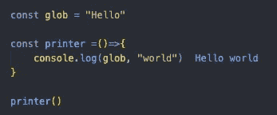
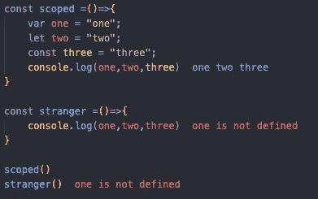
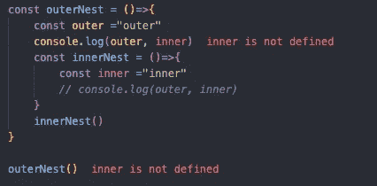
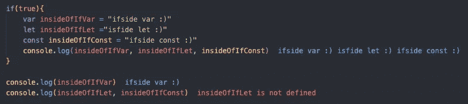
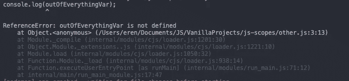

# 解释了 JavaScript 作用域

> 原文：<https://blog.devgenius.io/javascript-scopes-and-closures-explained-8125844a6ca6?source=collection_archive---------5----------------------->

大家好，今天我将尝试解释什么是 JavaScript 作用域和闭包，以及如何通过真正理解作用域来正确地编写代码。所以，事不宜迟，让我们直接进入示波器，看看它们是怎么回事。

# 范围是什么？

在 JavaScript 中，作用域通常是定义如何访问变量的方式。它基本上在全局变量和局部变量之间画了线。主要有两种作用域:局部作用域和全局作用域。

# 全球范围

在 JavaScript 中，当你在任何括号或函数之外定义一个变量时，你的变量被定义为一个全局变量，这意味着它可以被全局访问。不管你尝试使用变量的地方是一个函数还是一个有很多外部函数的嵌套函数。

这是一种不受欢迎的行为，因为它通常会导致一些不可预测且难以发现的错误。更好的做法是通过使用作用域来限制变量的可用性。现在让我们来看看如何使用示波器。

# 功能范围

当你在一个函数中定义一个变量的时候，你的函数将自动属于这个函数的作用域。让我们看看例子。

正如我们在上面看到的，虽然我们可以在“作用域”函数内部达到“一、二、三”,但是我们不能在它的外部达到同样的效果。

# 嵌套函数

在另一个函数中定义一个新函数是许多编程语言中广泛使用的做法。当你在 JavaScript 中定义一个嵌套函数时，内部函数可以到达外部函数，反之则不可能。

从上面我们可以看到，当“innerNest”函数可以到达“outer”变量时，“outerNest”函数不能到达“inner”变量。

# 块范围

在添加了“let”和“const”之后，JavaScript 创建作用域的能力也随之改变。当你在任何带有“const”或“let”关键字的括号内定义一个变量时，它将自动属于那个作用域，而“var”的行为就像一个全局变量。让我们来看看。

正如我们在上面看到的，虽然我们可以很容易地在我们定义的“if check”之外找到“insideOfIfVar”变量，但我们不能对其他变量做同样的事情。

# 模块范围

中声明的所有内容。js”文件属于该特定文件，如果它们没有被显式导出。当你试图在模块之外访问一个变量而不导出它时，你很可能会看到类似这样的情况。

# 结论

作用域是 JavaScript 的一个基本部分，因为它们是大多数其他语言的一部分，因此学习如何正确使用它们来编写像样的代码非常重要。

好了，各位，今天就到这里。我希望你喜欢它。下次见，保重:)

*最初发表于*[*【https://blog.akbuluteren.com】*](https://blog.akbuluteren.com/blog/javascript-scopes-and-closures-explained)*。*