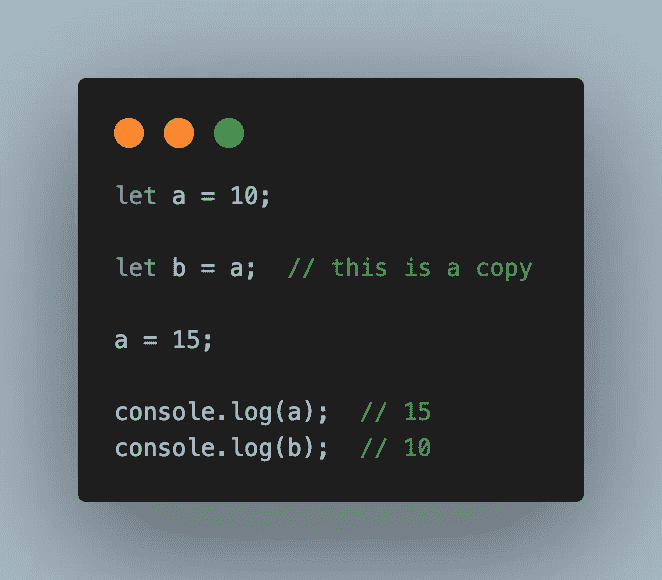
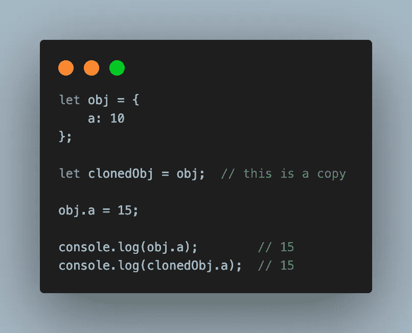
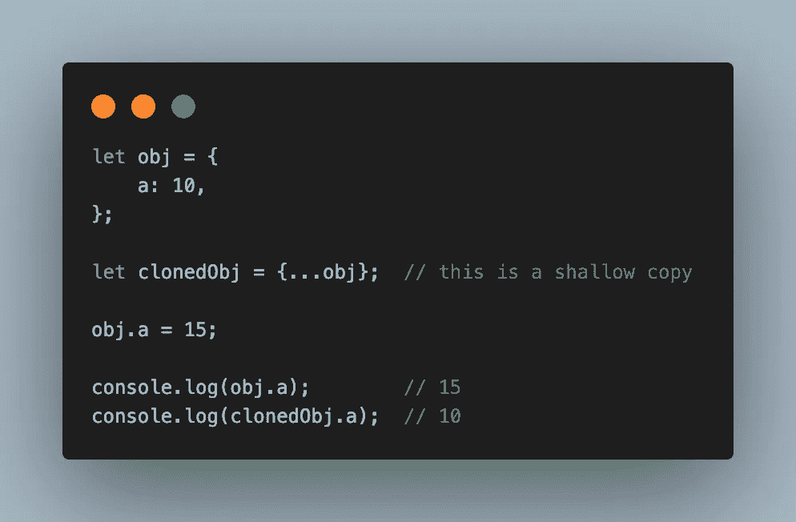
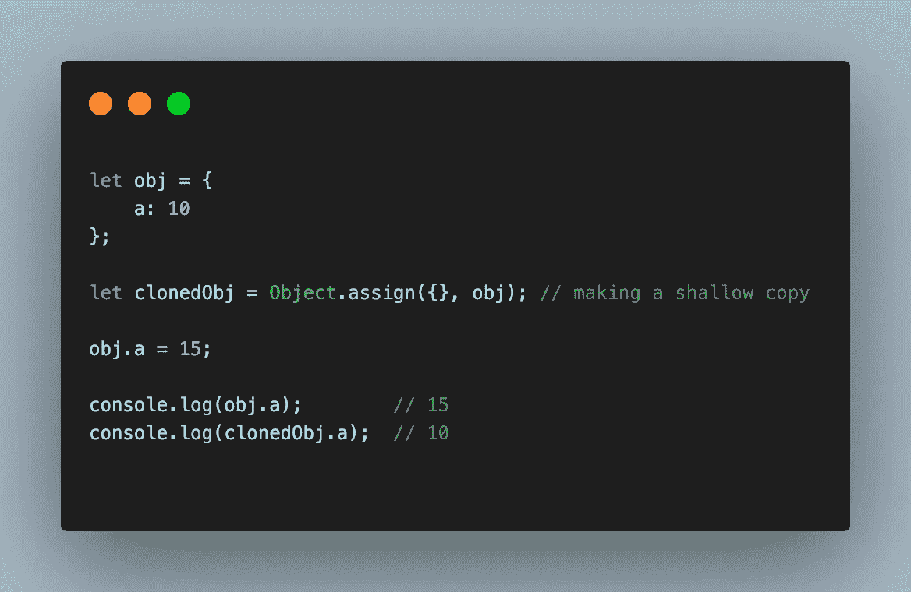
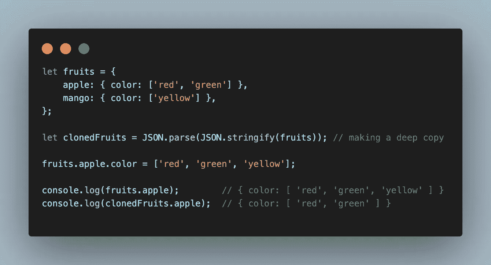
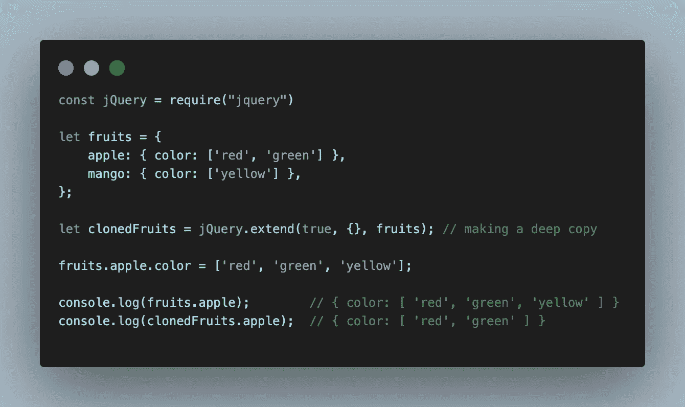
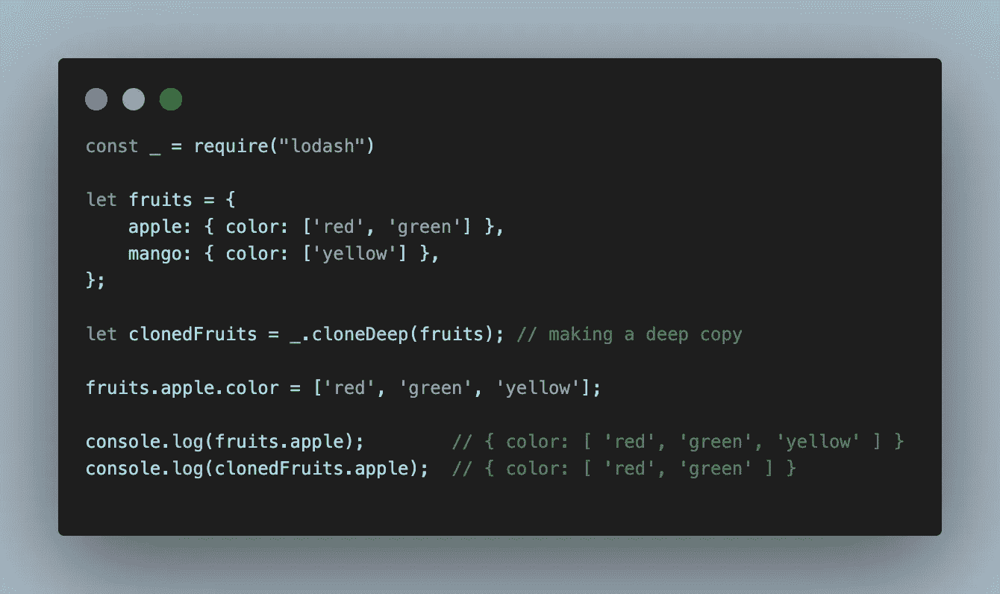
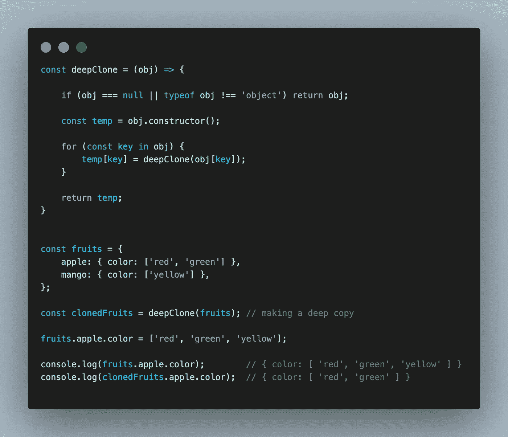

# JavaScript:浅层复制和深层复制

> 原文：<https://blog.devgenius.io/javascript-shallow-copy-deep-copy-287e19d64e92?source=collection_archive---------6----------------------->

罗曼·辛克维奇·🇺🇦在 [Unsplash](https://unsplash.com?utm_source=medium&utm_medium=referral) 上拍摄的照片

即使您没有意识到这一点，您也很可能以前在 JavaScript 中处理过副本。也许你也听说过函数式编程范例，它说你不应该改变任何已经收集的数据。为了实现这一点，您必须了解如何在 JavaScript 中安全地复制值。

在深入研究复制值之前，我们应该理解 JavaScript 中的数据类型。

变量在编程中用作数据容器/数据存储。最新的 ECMAScript 标准定义了八种数据类型，

七种基本数据类型:

1.  **布尔** : `true`和`false`。
2.  **null** :表示空值的特殊关键字。(因为 JavaScript 是区分大小写的，`null`不同于`Null`、`NULL`或任何其他变体。)
3.  **未定义**:未定义值的顶层属性。
4.  **数字**:整数或浮点数。比如:`42`或者`3.14159`。
5.  **BigInt** :任意精度的整数。比如:`9007199254740992n`。
6.  **字符串**:表示文本值的字符序列。比如:`"Howdy"`。
7.  **符号**:实例唯一且不可变的数据类型。

JavaScript 中只有一种非原始/复合数据类型:

1.  **对象**:对象可以看作是属性的集合。属性值可以是任何类型的值，包括其他对象，这使得能够构建复杂的数据结构。使用*键*值识别属性。例如，对象，数组，函数。

当我们复制原始数据类型时，它将是一个真正的副本。

例如。

在上面的例子中， **b** 是 **a** 的副本，a**a**的变化不会影响 **b** 的值。

如果同样的情况也适用于非原始类型，那么源对象的变化会影响克隆对象的值。因为对象类型指的是内存地址而不是值。

例如。

在上面的例子中 **clonedObj** 是 **obj** 的副本，在 **obj** 中的改变会影响 **clonedObj** 中的属性。

## 浅拷贝

对象的浅表副本是这样一种副本，其属性与从中制作副本的源对象的属性共享相同的引用(指向相同的基础值)。因此，当您更改源或副本时，您也可能会导致其他对象发生更改，因此，您可能会无意中导致源或副本发生您不希望的更改。

浅表副本是对象的按位副本。如果我们对一个对象进行浅层复制，那么基本类型值被复制，非基本/引用类型的内存地址被复制。

这可以通过对象的 **Object.assign** 、 **Spread 运算符**和数组的 **concat** 、 **from** 和 **slice** array 方法来实现。

如果使用第三方库，那么 jQuery 的扩展方法、**下划线的克隆方法**、 **lodash 的克隆方法**会有所帮助。

例如。

使用扩展运算符的浅层复制

使用 Object.assign 进行浅层复制

## 深层拷贝

对象的深层副本是这样一种副本，其属性与从中进行复制的源对象的属性不共享相同的引用(指向相同的基础值)。因此，当您更改源或副本时，您可以确信不会导致其他对象也发生更改；也就是说，您不会无意中导致对源或副本的不期望的更改。

深度复制复制所有字段，并为所有引用类型值提供新的内存地址。

## JSON 对象的方法

这可以通过将 object 传递给 **JSON.stringify** 方法，然后将该值传递给 **JSON.parse** 来实现。但是这种方法有一些性能问题。

使用 JSON 方法的深度复制

## **jQuery 的扩展方法**

使用 jquery 的扩展方法进行深度复制

## 洛达什克隆氏深度法

使用 lodash 的克隆深度方法进行深度复制

也可以通过 ***lodash 的 cloneDeep***/***jquery 的 extend*** 方法来实现。如果你在你的应用程序中使用 lodash/jquery，这将是很好的，否则只使用 lodash/jquery 库进行深度克隆将会很麻烦。

在这种情况下，您可以创建一个实用函数来实现这一点，如下所示:

使用效用函数的深度克隆

全局`structuredClone()`方法使用结构化克隆算法创建给定值的深度克隆。