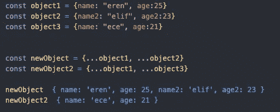

# 解释 JavaScript 扩展语法

> 原文：<https://blog.devgenius.io/javascript-spread-syntax-explained-a617c23f47c8?source=collection_archive---------4----------------------->

图片来自[皮克斯拜](https://pixabay.com/?utm_source=link-attribution&utm_medium=referral&utm_campaign=image&utm_content=3023523)

大家好，今天我将简单解释一下什么是 JavaScript spread 语法，以及在哪里可以使用它们。这将是一篇相当短的文章，因为没有太多关于这个主题的内容，但是我相信 spread 语法对于每个编写 JavaScript 的人来说都是必不可少的，不管他们编写 JavaScript 的频率有多高。你可以在这里找到即将分享的例子[。](https://github.com/eren23/javascript-spread-explained)

# 什么是传播？

" Spread 允许在应该有零个或多个参数(对于函数调用)或元素(对于数组文本)的地方扩展可迭代对象，如数组表达式或字符串。"是 MDN Web 文档中的定义。一切都很酷，但我们实际上可以在哪里使用它，也许我们应该在例子中显示出来。

这里我们创建了一个名为 array1 的数组，并在 spread 操作符的帮助下将数组的元素作为参数传递。

用额外的成员创建一个新的数组也很简单，我们也可以通过改变位置来决定新成员的位置。

这是我最喜欢的 spread 用例之一，正如您在上面看到的，我们可以简单地使用 spread，而不是使用“concat”方法。

在上面我们有另一个非常方便的用途，当创建一个新的数组时，我们可以将一个旧的放入另一个中。

尽管跨页在大多数情况下非常有用，但有时还是要小心，JavaScript 是一种灵活的语言，很可能会出现这种错误。

这一次我们将看看在对象上的使用，我们首先创建 3 个对象，然后用这 3 个对象创建 2 个新对象。正如我们在上面看到的，当键冲突时，spread 总是用新的覆盖旧的，否则，它只会创建一个包含所有键-值对的新对象。

# 结论

spread 语法对 JS 开发人员来说是一个巨大的便利，因为我假设每个编写 JS 的人都知道 spread，所以我尽量让指南对初学者友好。我们也许可以用 React 或 Vue 之类的主流技术覆盖一些流行的传播用例。

好了，大家，感谢阅读到目前为止。我希望下次能见到你。保重:)

*原载于*[*https://blog.akbuluteren.com*](https://blog.akbuluteren.com/blog/javascript-spread-syntax-explained)*。*