# JavaScript :: this & binding。

> 原文：<https://blog.devgenius.io/javascript-this-binding-39428cb65165?source=collection_archive---------7----------------------->

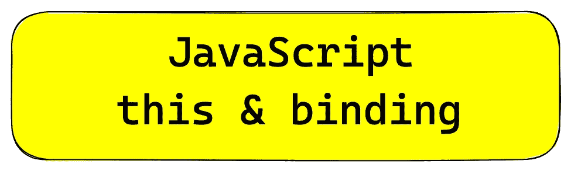

最容易混淆的一个概念就是“**这个**”。我们在确定**这个**的值时一般容易混淆。即使是经验丰富的 JavaScript 开发人员有时也会犯这个错误。

在深入探讨之前，关于确定“this”的值，需要注意的一个关键点是，它是从调用**的地方**开始的，而不是从声明**的地方**开始的。

虽然上面的陈述不能保证你会成为“这个”中的忍者，但至少你会对它有一个更好的了解。

我们举个例子。

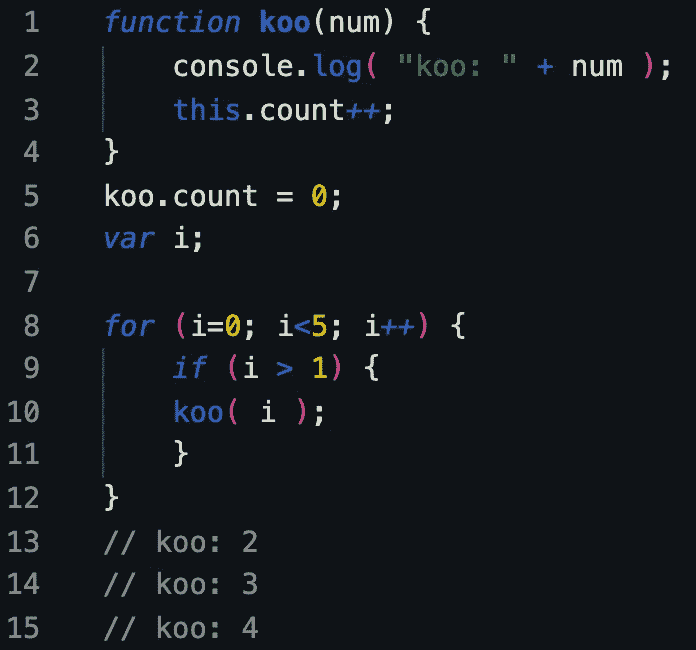

上面的程序不言自明。如果你看到 2，3，4 印在控制台上。

但是，猜猜 koo.count 的输出应该是什么？？// 3.

如果是的话，那么也许我们需要更详细地理解“这个”的概念。

很惊讶。

但是，让我们尝试在 JS 引擎遇到第 3 行时检查上面的代码。

如果我们看到第 5 行，我们在 koo 对象上分配属性“count ”,它被初始化为 0。

但是，我们试图考察这里的“这个”属于全局窗口对象。

> **注意:无论何时调用一个函数，都要记住新的执行上下文和作用域链。**

在第 3 行 this.count++上，在全局窗口对象上创建了一个 count 属性。但是，在第 5 行，koo.count = 0，与 this.count++不同。前者是 koo 函数对象上的属性，后者是全局窗口对象上的属性。目前，this.count++的值将是 NaN。

在上面的例子中，“this”并没有指向所有的函数对象，这就是混乱的地方。

但是，问题是为什么“**这个**没有指向函数对象自己的作用域。

这个问题几乎没有可能的解决办法。

让我们设法找到解决这个问题的第一个办法。

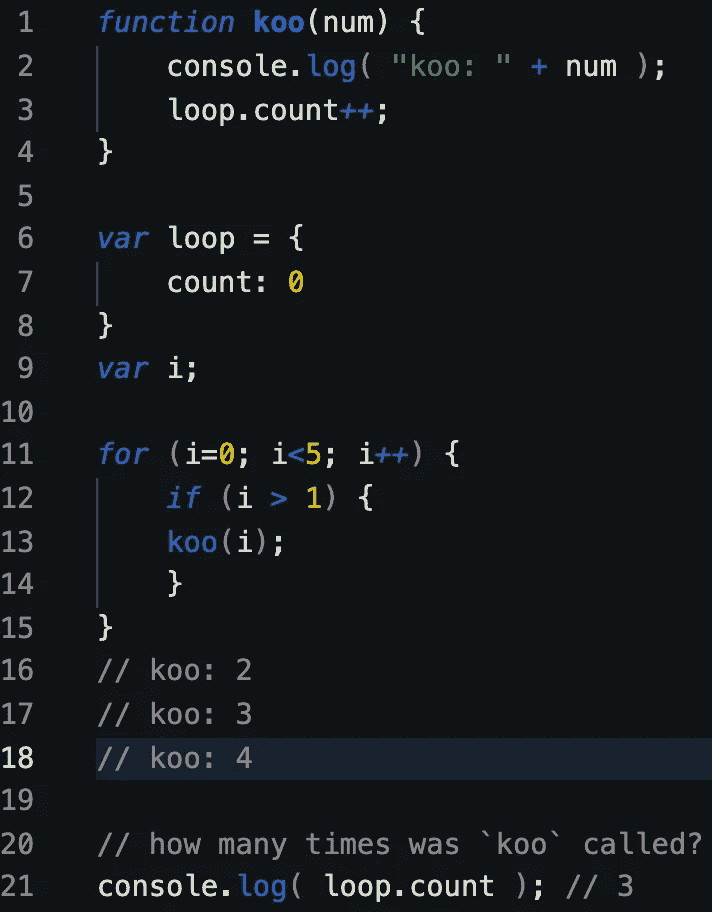

上述问题的解决方案就像我们用窗口全局对象的 count 属性创建一个新的循环对象，并且每当满足 for 循环条件时递增计数。但是，上述解决方案试图转移我们对“这个”的理解。

请继续本教程的其他部分，将会更好地了解 JavaScript 中使用的不同绑定，如调用、应用和绑定。

该问题的另一个解决方案是通过 koo 函数对象的词法范围将 koo.count 属性递增到 koo 函数对象。

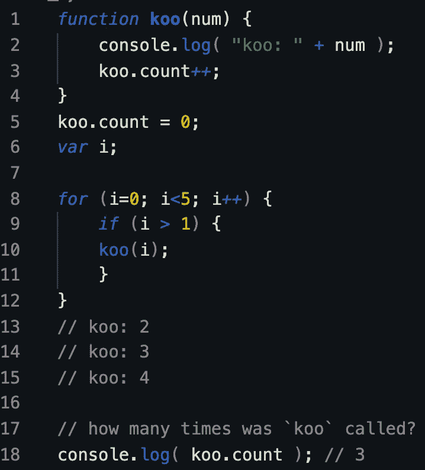

尽管如此，我们并没有强迫我们的问题使用“this”，这使我们处于一种分散“ **this** ”的真实用例的情况。

那么，如何才能强制将“**这个**”绑定到函数对象的范围呢？

这个问题的第一个解决方案是使用 JavaScript 中的“绑定”。

在进一步讨论之前，如何在不猜测的情况下确定“这个”的值？

***什么是“呼叫站点”？***

***检测代码中调用函数的位置，而不是声明函数的位置。***

有时，当代码变得沉重和复杂时，不容易找到调用位置。

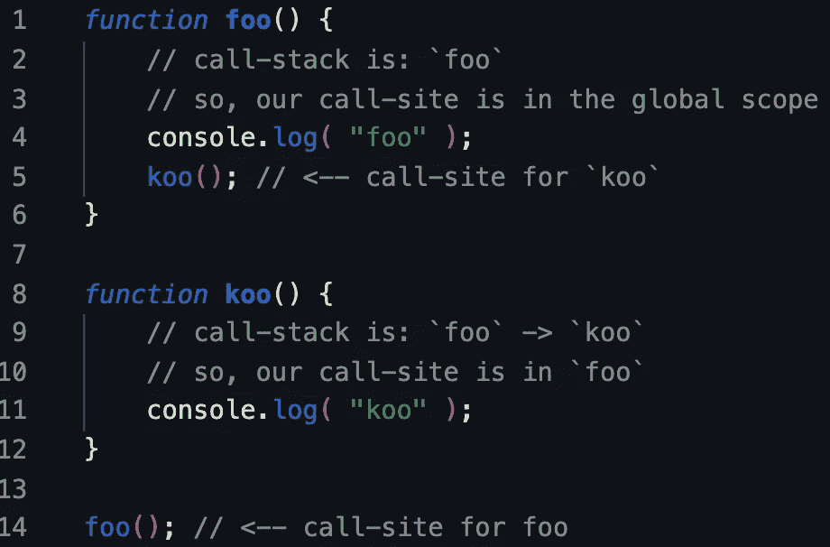

调用站点和调用堆栈

如果你看看 foo 和 koo 这两个方法，我们可以很容易地把它从调用点和调用栈中取出来。

让我们继续使用不同的绑定来强制使用“this”。

基本上，有五个规则适用于绑定。

1.  ***默认绑定***
2.  ***隐式绑定***
3.  ***显式绑定***
4.  ***硬装订***
5.  **新装订**

基于以上 5 条规则，我们将尝试确定“this”的值。

1.  **默认绑定** —如果没有其他规则适用，此规则适用于默认。这里，“ **this** ”被解析为全局对象。

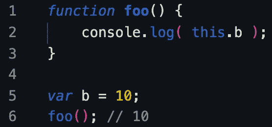

默认绑定

2.**隐式绑定** —当我们检查调用点是否有上下文对象时，这条规则适用。它是负责函数调用“this”绑定的对象。

无论 foo 在代码中的什么地方声明，调用点都使用对函数的 obj 引用。

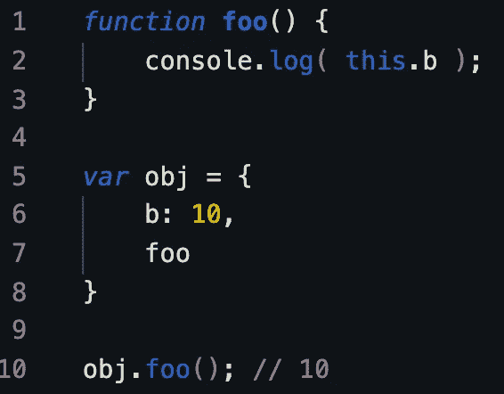

隐式结合

在隐式绑定中，为了加强“this”用法，我们改变了 obj 并在其上调用 foo 函数。但是，如果我们想在不使用对象的附加属性的情况下执行“this ”,该怎么办呢？接下来是“**显式绑定**”。

3.**显式绑定** —它允许我们将**这个**强制为“obj”。它有三种味道。调用(…)、应用(…)和绑定(…)。函数的第一个参数是“this”。

***call 和 apply 的区别在于 call 带单个参数，apply 带一个参数数组。***

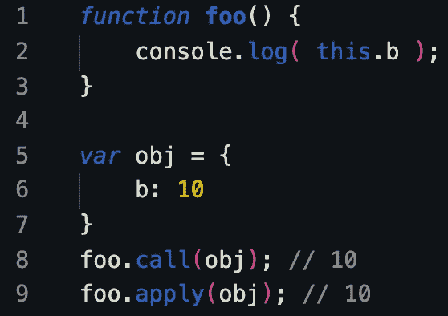

4.**硬绑定** —我们创建一个函数 bar()，在内部调用 foo.call(obj)，从而为此强制调用 foo 与 obj 绑定。不管你怎么操作这个 bar，它总是会用 obj 手动调用 foo。这种绑定既显式又强，所以我们称之为硬绑定。

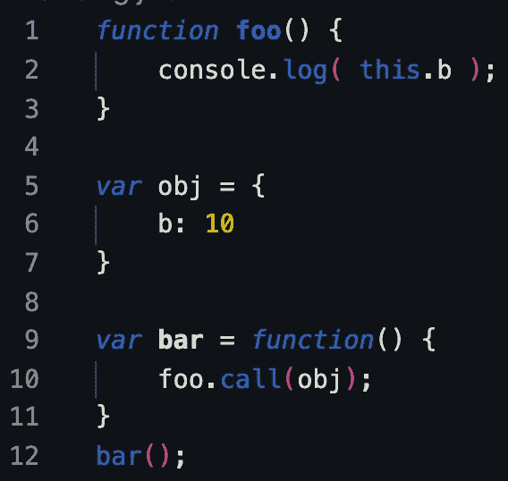

硬装订

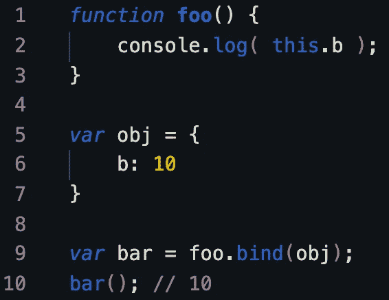

使用绑定方法

5.**新绑定** —通过构造函数调用来调用。

> **现在，应用上述 4 个规则，优先级从新绑定>硬绑定>显式绑定>隐式绑定>默认绑定。如果上述规则都不适用，将自动调用默认绑定。**

绑定优先顺序

我希望你可能已经对“这个”有了更好的理解。

> 请记住:如果您将 null 或 undefined 作为 this binding 参数传递给 call、apply 或 bind，这些值实际上会被忽略，取而代之的是应用于调用的默认绑定规则。

因此，上面的程序可以通过调用、应用和绑定来解决。

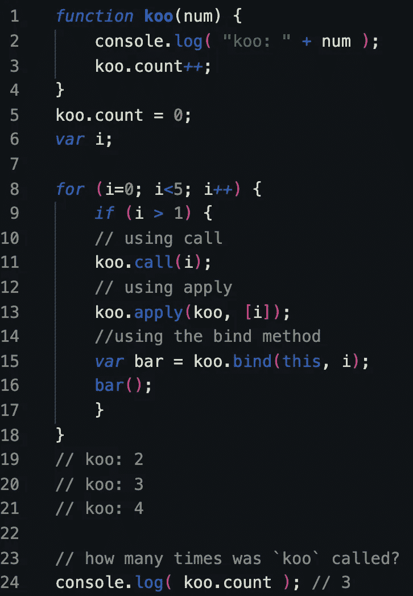

请随意摆弄代码，并掌握好 JavaScript 中的“this”和绑定。

我的意图是使概念解释更加简单化。

> **声明:我学习 JavaScript 的灵感来自 Kyle Simpson 的《你不知道 JS》。**

快乐编码。不断学习。继续探索。😊