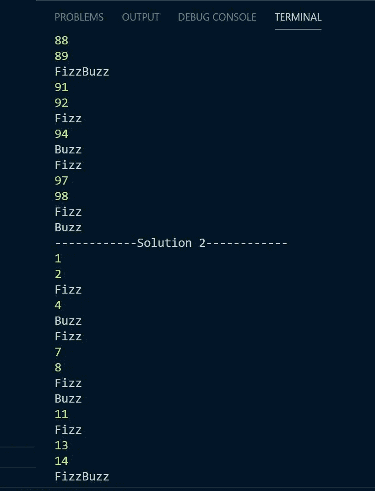
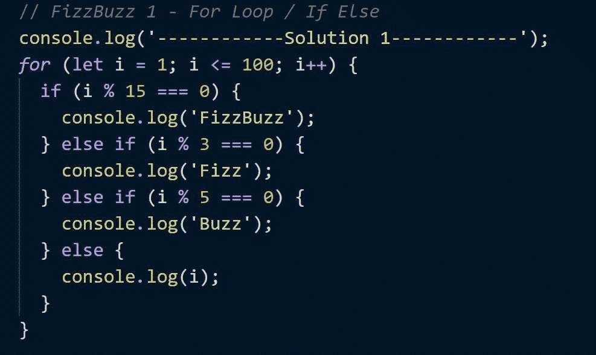
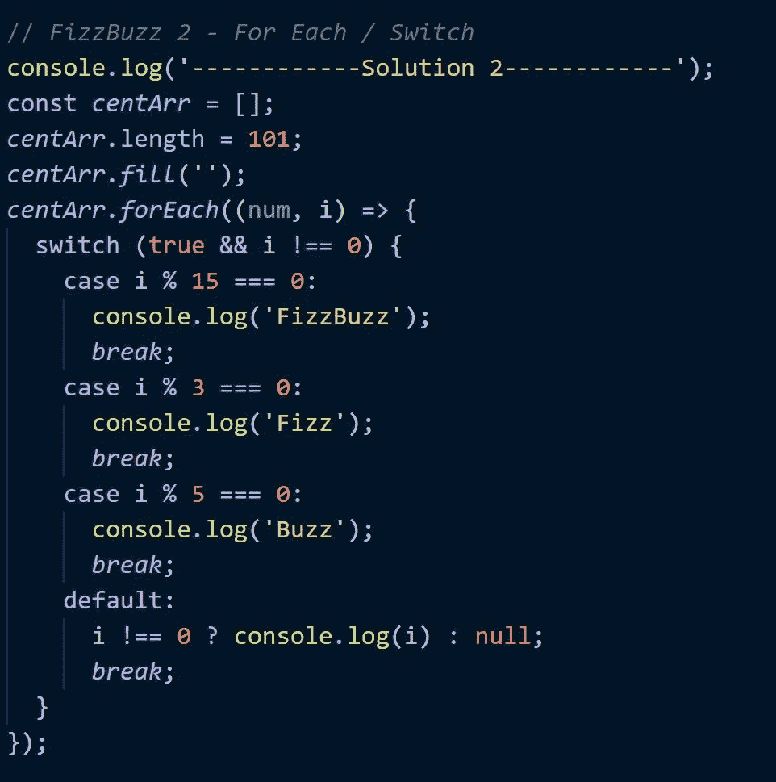
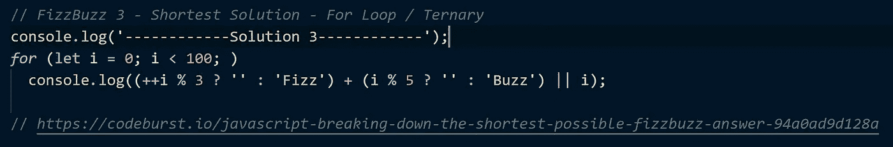
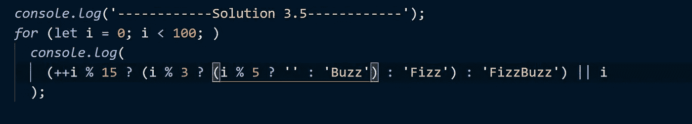

# JavaScript——三个 FizzBuzz 解决方案，包括最短的

> 原文：<https://blog.devgenius.io/javascript-three-fizzbuzz-solutions-including-the-shortest-possible-e2afb95096df?source=collection_archive---------0----------------------->

## 循环、数组方法、三元运算等等，看看用 JavaScript 编写经典 FizzBuzz 解决方案的三种不同但有效的方法

费伦茨·阿尔马西在 [Unsplash](https://unsplash.com?utm_source=medium&utm_medium=referral) 上的照片

# FizzBuzz 是什么？

如果你已经用 JavaScript 写了很长时间的代码，或者参加过一些白板会议，你可能听说过 FizzBuzz。如果没有，FizzBuzz 可以被描述为一个简单的编码挑战，用户评估一定数量的数字，通常在 0(或 1)到 100 之间，并根据当前评估的数字打印不同的响应。对于 3 的倍数，应该打印“Fizz”，对于 5 的倍数，应该打印“Buzz”，当计算 3 和 5 或 15 的倍数时，应该返回“FizzBuzz”。如果这些条件都不满足，那么应该返回正在计算的当前数字。

虽然本文主要关注几个 JavaScript 实现，但毫无疑问，仅 JS 就有几十个独特的解决方案，这个挑战也可以用多种语言编写。此外，这里探讨的三个解决方案绝不是 FizzBuzz 的最佳解决方案，希望它们能启发你探索一些替代方案。

FizzBuzz 解决方案的不同值取决于被评估的数字

作为参考，FizzBuzz solutions 应该打印出类似于左图的东西，这取决于被评估的数字的数量。

此外，如果你对 JavaScript 相对陌生，并且想了解更多关于在没有浏览器的情况下运行 JS 的知识，现在是时候了解一下 [Node.js](https://nodejs.org/en/) 了，这将是开发你的编码技能的一个不可思议的飞跃。

# 解决方案 1 — For 循环和 If Else

简单，有效，也许是最容易掌握的。

解决方案 1，使用 for 循环和 If Else 语句

当我想到 FizzBuzz 时，我会回想起我在 bootcamp 学到的最早的方法之一。该方法使用基本的 for 循环和 if else 语句来确定打印哪些值。

首先检查 Fizz 和 Buzz 的条件是否都满足，即 15 的倍数(3 * 5)，如果不满足，则检查 3 的倍数，如果不满足，则检查 5 的倍数，最后，如果不满足其他条件，则打印 I 或当前数字。

满足任何条件后，打印正确的结果，循环再次开始，I 增加 1(i++)。这个过程将继续，在这种情况下，直到 I 大于或等于 100，在这种情况下，技术上可以通过删除大于来缩短，为了保险起见，我倾向于保留它。

# 解决方案 2 —对于每种&交换机情况

*数组、索引和 ol '开关情况。*

解决方案 2-使用 ForEach 数组方法和 Switch 语句

与上面概述的解决方案 1 类似，解决方案 2 也将针对 I 检查 3 和 5 的倍数，打印出 FizzBuzz、Fizz、Buzz 或 I，并继续，直到 I 的值达到 100。

但是，与以前的解决方案相比，这个特定的实现显然有一些不同，这个解决方案使用一个长度经过修改的数组，该数组中填充了空字符串，然后使用 forEach 方法来检查将要打印的内容。

如果您不熟悉 forEach，它是一个数组方法，允许我们对每个数组元素执行“一些”操作，所以对于 101 个元素，通过设置固定长度，然后用每个元素的空字符串填充数组来实现，我们可以循环遍历一直到 100 的数字(一直到 100，因为我们的第一个索引是 0，尽管我们也不想打印索引 0 的任何内容，请注意添加到开关求值中的' && '。要阅读更多关于 forEach 的内容，请查看 MDN 的这些[文档](https://developer.mozilla.org/en-US/docs/Web/JavaScript/Reference/Global_Objects/Array/forEach)，如果您还没有，请将 MDN 设为书签，这些信息对于继续学习和理解 web 开发至关重要。

该解决方案还引入了 switch 语句，该语句评估表达式的真值，如果发现特定表达式为真，则执行“case ”,这里我们只需检查 I 满足哪些条件，包括第一次检查 I 不等于 0，并打印相应的结果。switch case 是 JS 中强大的工具，在许多方面是 if else 子句的进化，然而它们确实有一些陷阱，要阅读更多关于 switch case 的内容，请查看这些 MDN [文档](https://developer.mozilla.org/en-US/docs/Web/JavaScript/Reference/Statements/switch)。

最后，您会注意到一个三元运算符，即“？”在默认情况下，我们将在探索解决方案 3 时深入了解三元组的更多细节。

# 解决方案 3 — For 循环和三元运算符

*最短的解决方案，三元条件句被证明是有效的。*

JS 中的最短解，条件链和 for 循环

FizzBuzz 有大量可能的代码解决方案，但这是我(目前)能找到的最短的 JavaScript 解决方案，它使用我们熟悉的 for 循环，但也利用三元运算符有条件地打印所需的输出。阅读布兰登·莫雷利的这篇[文章](https://codeburst.io/javascript-breaking-down-the-shortest-possible-fizzbuzz-answer-94a0ad9d128a)获得更多 FizzBuzz 讨论，布兰登的文章也提供了上面概述的解决方案 3。

注意，与解决方案 1 类似，我们继续循环，直到 I 大于 100，在每种情况下，根据满足的条件，打印 Fizz、Buzz、FizzBuzz 或 I。然而，在这种情况下，增量发生在任何其他事情之前，发生' +++I '，然后评估条件，因此在第一次迭代中，在执行任何其他代码之前，I 的值为 1。

然后我们看到使用了三进制，三进制操作符允许我们根据三进制之前代码的真实性返回两个值中的一个，如果为真，则返回第一个值，如果为假，则返回第二个值。三元组是考虑 if else 语句的另一种方式，可以“链接”用于更复杂的计算，尽管在这个特定的解决方案中没有使用链接，事实上，如果链接得到充分利用，它将创建一个比这里给出的解决方案稍大的解决方案。

在这种情况下，如果 I 是 3 的倍数，则返回 Fizz 加上一个空字符串，最后是 Fizz 的对数，如果 I 是 4，因此不是 3 或 5 的倍数，则返回两个空字符串，依此类推，对于 I 的每次迭代。当通过逻辑 OR (||)将这些空字符串与 I 进行比较时，空字符串被视为假值，这就是我返回的原因，因为||返回第一个“真”语句。查看这些 MDN [文档](https://developer.mozilla.org/en-US/docs/Web/JavaScript/Reference/Operators/Conditional_Operator)以获得关于三元运算符的更多阅读资料。

如果你想知道一个使用三元组的更完全条件链接的解决方案会是什么样子，请看下面的解决方案 3.5，注意它比解决方案 3 中的代码稍微长一点。

略长的三元条件链式 FizzBuzz，解决方案 3.5

现在你已经看到了 FizzBuzz 在 JavaScript 中的一些实现，记住，这些只是可以用来在 JS 中解决 FizzBuzz 的众多解决方案中的几个，我希望这些实现能启发你设计一些你自己的解决方案，也许比解决方案 3 和 3.5 更具可读性。当你准备白板面试时，FizzBuzz 也是一个很大的问题。

如果你有其他的 FizzBuzz 解决方案想要分享，或者有任何问题或评论，请在下面发帖！

## 关于 _ 我. txt

我是一名前端开发者@ Kayhan Space，专业是 JavaScript，Node 和 React，对学习 Java 和 Python 有很大兴趣。除了构建用户界面和客户体验，我还喜欢撰写关于技术和非技术概念、工具和技术的文章。此外，我还对社会科学、政治、历史、太空探索和户外活动着迷。

查看我的[作品集](https://jacob-garlick.com/)获取我的作品样本，或者在[推特](https://twitter.com/garlick_jake)上关注我，获取关于新文章的通知和偶尔的科技推特。