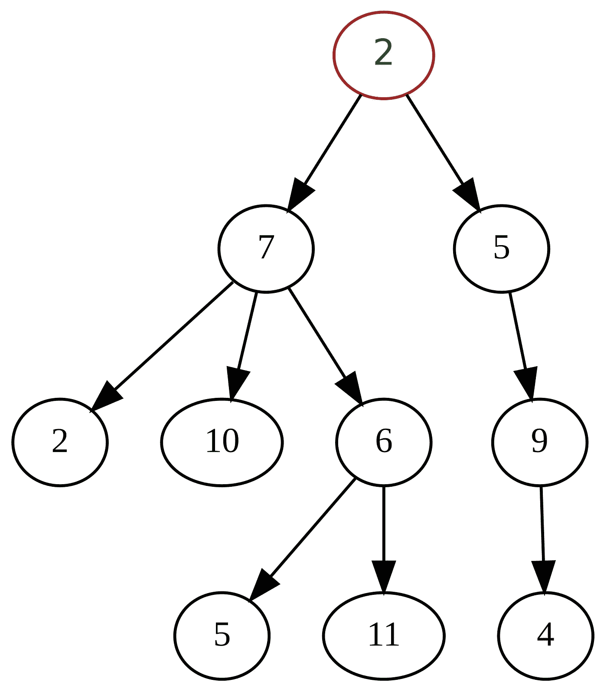
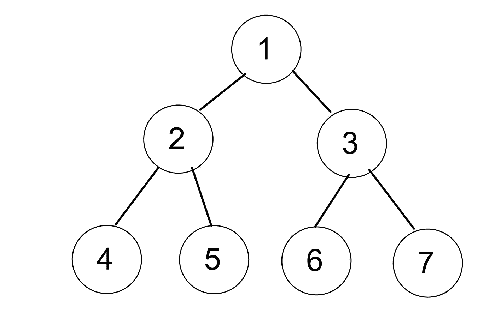
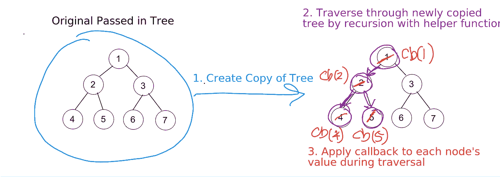
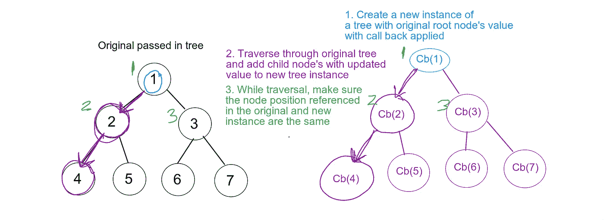

# JavaScript:递归遍历树

> 原文：<https://blog.devgenius.io/javascript-traverse-tree-recursively-2e525cb176e2?source=collection_archive---------1----------------------->

照片由 [niko photos](https://unsplash.com/@niko_photos?utm_source=medium&utm_medium=referral) 在 [Unsplash](https://unsplash.com?utm_source=medium&utm_medium=referral) 上拍摄

遍历树的能力是一个重要的基本概念。[树](https://en.wikipedia.org/wiki/Tree_(data_structure))是一种数据结构，其中包含一组具有分层模式的节点。每个节点都有自己的数据结构。树的结构有一个“根”节点，每个节点都有一个值和一个指向其子节点的引用。

以值 2 为根节点的树形数据结构示例。参考:[https://en . Wikipedia . org/wiki/Tree _(data _ structure)](https://en.wikipedia.org/wiki/Tree_(data_structure))

这篇文章中涉及的简单的树的概念是:

1.  使用[伪经典实例化](https://developer.mozilla.org/en-US/docs/Web/JavaScript/Inheritance_and_the_prototype_chain)模式构建一个树类
2.  创建一个向树中添加子节点的方法
3.  深度优先递归遍历树
4.  创建一个 map 方法，使用递归返回一个与原始树结构相同但值不同(2 种不同方式)的树

[递归](https://javascript.info/recursion#:~:text=Recursion%20is%20a%20programming%20term,that's%20called%20a%20recursion%20step.)是一种解决问题的方法，函数在自己的代码中调用自己。原因是将更大、更复杂的问题分解成更容易解决的更简单的问题。

# **构造一个树类和 add 方法，向树中添加子树**

这是一个简化的树，它接受一个值，并有一个子数组。此时`root1`树看起来如下。

上面代码中的树形白板结构

# **深度优先递归遍历树**

让我们实现一个简单的`contains`方法来深度优先遍历树，看看目标值是否包含在树中。

Contains 方法有一个基本用例来检查当前节点的值是否等于传入的值参数。然后遍历节点的子节点，并递归遍历每个子节点，这导致树遍历深度首先继续检查这个基本情况。如果基本情况从未通过，contains 方法将返回 false。

# **创建地图的方法**

Map 方法将返回一个与原始树结构相同的新树，但是新树将具有与回调函数不同的值。另外，原始树不受影响。让我们来看看用递归来解决这个问题的两种不同的方法，可能还有很多其他的解决方法。

1.  使用带有帮助函数的递归，并在树中创建整个原始文件的初始副本
2.  使用不带帮助函数的递归，并在遍历原始传入树时创建新的树实例和子树

# **让我们来图解第一个解决方案:**

1.  为传入树中的原始文件创建一个副本(不仅仅是指针引用)
2.  通过使用带有帮助函数的递归遍历新复制的树。
3.  在遍历复制的树的过程中，对每个节点的值应用回调

# **让我们来图解第二个解决方案:**

这个解决方案在遍历原始传入树时创建新树。

1.  使用应用回调的原始根节点值创建新实例
2.  遍历原始树并将子节点(带有更新的值)添加到新的树实例中，以模拟原始树的结构。
3.  遍历原始树时，确保新树的节点位置与原始树的节点位置相同，以保留原始树的结构。

下面是图解解决方案的示例代码。

这是黑客反应堆训练营第四周的结束。在过去的一周里，我们集中讨论了函数模式、伪经典模式和 ES6 模式中的类继承和子类。我们还学习了如何:

*   正确设置子类到超类的原型链委托
*   确定`this`引用的是什么以及如何正确绑定`this`,这对我来说仍然是模糊的
*   使用对象继承创建不同的实例，并利用 j Query、HTML 和 CSS 来直观地显示这一点

然而，递归是一个我仍然试图掌握的概念，这让我写了一篇关于它的文章。希望这能对我和其他人有所帮助。