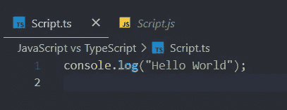
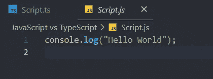
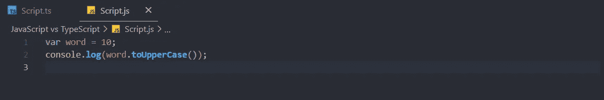
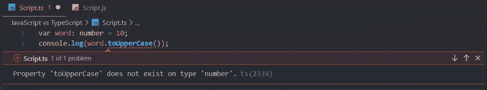
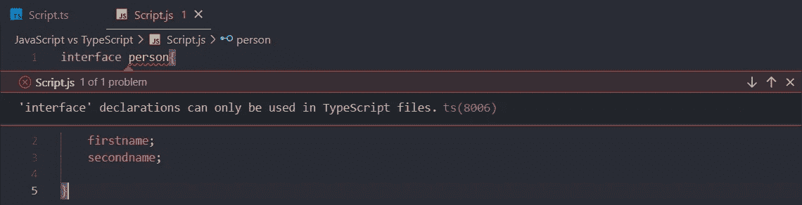

# JavaScript 与类型脚本

> 原文：<https://blog.devgenius.io/javascript-vs-typescript-c26c9a32b919?source=collection_archive---------12----------------------->


克劳迪奥·施瓦兹在 [Unsplash](https://unsplash.com?utm_source=medium&utm_medium=referral) 上的照片

JavaScript 发明的时候，开发者把它作为一种客户端编程语言。随着时间的推移，开发人员意识到他们也可以将 JavaScript 用作服务器端编程语言。作为一个百分比，95%的网站包含 JavaScript。因此，随着这种增长，这种语言变得越来越复杂，无法满足面向对象编程(OOP)的要求。于是 TypeScript 在 2012 年 10 月公开了！

# 打字稿的特点

1.  每个 TypeScript 代码都被转换成 JavaScript 代码。

想象一下，如果您的项目文件夹中有一个 Script.ts 文件。要编译您的 TypeScript 文件，您必须在控制台中键入以下内容。

```
tsc filename.ts
```

完成此操作后，您将看到一个 JavaScript 文件，其名称与您的 TypeScript 文件相同。



2.TypeScript 支持所有的 JavaScript 库。

3.TypeScript 还支持 DOM 操作来添加、更改或删除类似于 JavaScript 的元素。

# TypeScript 相对于 JavaScript 的优势

正如您在“TypeScript”这个名称中所看到的，“类型”这个词描述了 TypeScript 的主要优势。与 JavaScript 不同，TypeScript 有类型注释来描述对象的类型。

```
var word: **string** = "Hello";var num: **number** = 10;var isTrue: **boolean** = true;var isFalse: **boolean** = false;
```

如果不想对变量应用任何类型，可以使用名为 any 的特殊类型。

```
var num: **any** = 10;
```

因此，有了这些类型注释，TypeScript 开发人员可以在编译时看到与类型相关的错误。这就是开发人员喜欢 TypeScript 的原因。这里有一个例子。



当试图打印一个数字的大写字母时，JavaScript 不显示错误



当试图打印一个数字的大写字母时，显示错误的 TypeScript

另一个区别是在使用接口时。JavaScript 不支持接口。但是 TypeScript 有。



试图声明接口时显示错误的 JavaScript

仅此而已。这就是开发人员喜欢 TypeScript 胜过 JavaScript 的原因。希望你能从我的文章中获得一些知识，并跟随我获得更多关于这些话题的知识。