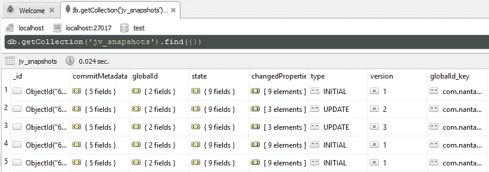

# JaVers:简化领域数据审计

> 原文：<https://blog.devgenius.io/javers-simplify-domain-data-audit-1940eed6e068?source=collection_archive---------1----------------------->

卢克·切瑟在 [Unsplash](https://unsplash.com?utm_source=medium&utm_medium=referral) 上的照片

应用程序或系统通常会在数据库中执行数据处理，例如存储或更改现有数据。这个过程中可能出现的问题是，当我们想知道数据发生变化之前的状态，而数据库只会存储数据的最后状态。此外，当我们想要将状态数据返回到先前的状态时。此外，我们还会发现很难知道谁对数据进行了更改。

从上面关于数据的一些问题出发，有一个开放源代码，我们可以使用它来审计从一个数据状态到另一个数据状态，这样我们就可以找出哪些数据发生了变化，以及谁改变了它。另外，如果我们想回滚到以前的状态，会更容易。开源工具是 **Javers** 。

## 什么是贾维斯

Javers 是一个审计日志框架，可以帮助我们跟踪数据变化。以下是该库的一些优势:

*   它是开源的，可以免费使用，并且仍然被积极维护
*   它支持 RDBMS 或非 RDBMS，如 NoSQL
*   易于与 Spring 框架集成

在本文中，我将给出一个例子，说明如何将 **Javers** 与 Spring Boot 集成，以跟踪 MongoDB 中的数据变化。

## **先决条件**

用 MongoDB 创建一个 spring boot 项目，并添加 Javers 依赖项。

**如何使用**

将*@ javerspringdataauditable*注释添加到存储库中。因此 Javers 可以保存更改，比如被更改、保存或删除的数据，保存在数据库中的一个新集合中，称为 *jv_snapshots* 。此外，Javers 将创建一个新的集合 *jv_head_id* 来存储最后一个提交 id。

在这个 *jv_snapshots* 集合中，将存储数据的每个状态变化。我将解释存储在这个集合中的一些字段。

默认情况下，在 *commitMetadata* 字段中，如果我们不定义谁更改了数据，数据将被保存为未知(匿名)。要更改这个默认配置，我们可以创建一个实现 *AuthorProvider 的 *bean* ，这样*我们就可以根据会话或登录到应用程序的用户来找出是谁进行了数据更改。

## 贾维斯查询

Javers 还提供了一种机制来查询使用 Javers 查询语言(JQL)存储的审计日志数据。有 3 种收集数据的方法:

*   影子:从快照中检索域对象的历史版本
*   变化:表示对象的原子差异
*   快照:作为键值存储和显示的对象的状态历史。

详情请参考本文档:[https://javers.org/documentation/jql-examples/](https://javers.org/documentation/jql-examples/)

## 结论

Javers 非常有助于跟踪数据库中的数据变化。除此之外，还有其他功能需要考虑。我们可以将审计数据存储在一个单独的数据库中，该数据库与应用程序或系统使用的主数据库是同一个数据库。不幸的是，在撰写本文时，仍然不支持与反应式系统(web flux)的集成。

## **参考文献**

 [## JaVers——Java 中对象审计和区分的领先框架

### 比较复杂对象结构提交对您的域对象执行的更改将数据更改历史记录保存在…

javers.org](https://javers.org/) 

【https://www.baeldung.com/javers 

[https://www.baeldung.com/spring-data-javers-audit](https://www.baeldung.com/spring-data-javers-audit)