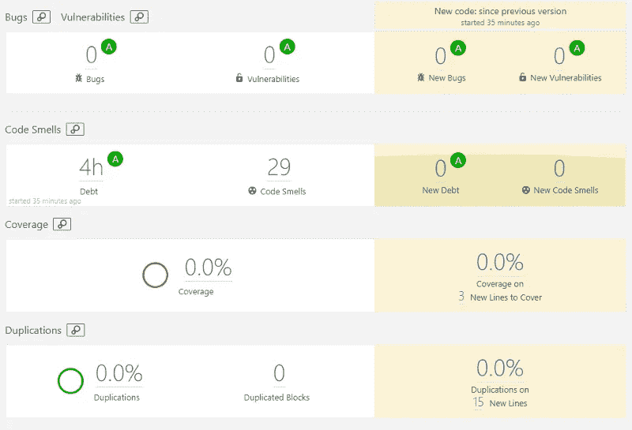
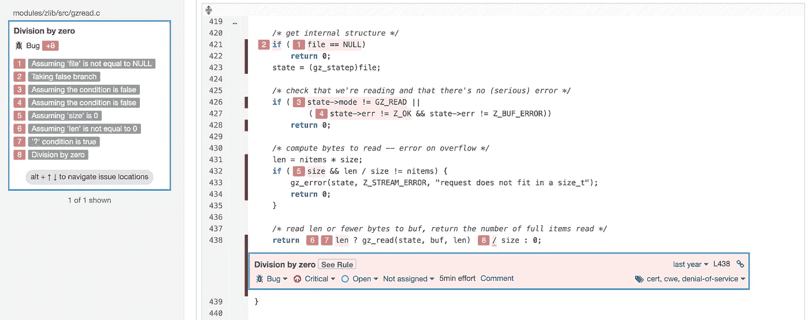

# 单元测试的笑话和笑话

> 原文：<https://blog.devgenius.io/jest-and-sonarqube-of-unit-tests-d19abbe233a8?source=collection_archive---------2----------------------->

想法和解决方案我站在角度测试的前面。


从语法上看，Jasmine Karma 和 Jest 框架没有太大区别。它们之间有很多逻辑上的差异。但是它们非常相似，尽管 Jest 比 Karma 测试快 3 倍，因为 Jest 使用命令行来运行测试，而不是 web 浏览器。

原则上，我更喜欢使用 Jest 框架，这篇文章是基于 Jest 的，但是 Jasmine Karma 是它的前身……很多项目仍然在使用它。

让我们在开始时定义一些常数:

```
beforeEach(() => {
  fixture = TestBed.createComponent(MyComponent);
  component = fixture.componentInstance;
  element = fixture.nativeElement;
  fixture.detectChanges();
});
```

通常单元测试的通用结构由 3 部分组成:

1.  首先，我们定义对象
2.  然后我们调用一个服务或方法来调用一些实现
3.  并且至少检查预期值和接收值

```
***it***("should find the item", () => {
  // given
  const input: HTMLInputElement = element.querySelector("#search");
  input.value = "test";
  input.dispatchEvent(new ***Event***("blur"));
  fixture.detectChanges(); // when calls for real method of Angular
  component.triggerSearch(); // then compare received and expected data
  ***expect***(component.search).not.toBeNull();
});
```

角度测试框架有一些特定的方法来以同步和异步的方式工作。

**Async —** 方法，当这个测试函数中的所有异步调用完成时，该方法将自动完成。

在测试中的异步调用期间，我们在异步调用完成之前等待真正的方法完成。我们经常需要检查呼叫完成时的状态。使用 whenStable()，然后:

```
it(‘should show result after async wait’, async(() => { 
  // here define some variables...
  const input: HTMLInputElement =
    element.querySelector("input[id='number-of-sales'] input"); input.value = "11";
  input.dispatchEvent(new ***Event***("input")); // when
  fixture.detectChanges(); // call for ngOnInit()
  component.applyLeadTimeValues(); //then
  fixture.whenStable().then(() => {
    fixture.detectChanges();
 ***expect***(component.numberOfSalesComponent.value).toEqual("11");
  });
}));
```

**Async + whenStable —** 给出夹具稳定时解决的`Promise`。

通常我们需要触发变更事件，因为这不会自动发生。`Fixture.whenStable()`返回一个在任务队列变空时解决的承诺。我们只需要异步等待。

```
it('should click Apply button', async(() => {
  const btn = fixture.debugElement.query(By.css('.apply'));

  spyOn(component, 'Apply');
  // when
  fixture.detectChanges();
  btn.triggerEventHandler('click', null); //then
  fixture.whenStable().then(() => {
    expect(component.Apply).toHaveBeenCalled();
  });
}));
```

但是很难读懂。语法可能包含许多嵌套对象，这些对象监听一些新的变化:

```
fixture.whenStable().then(() => {
  expect(component.value).toEqual('0'); dispatchEvent(select.nativeElement, 'change');
  fixture.detectChanges(); fixture.whenStable().then(() => {
    btn.triggerEventHandler('click', null); fixture.detectChanges();
    expect(component.value).toEqual('1');
  })
})
```

**tick()方法——fixture . when stable()的替代方法**

它提供了以同步方式工作的能力。原则上，单元测试源代码看起来是同步的。有时它对提高可读性很有用。tick()只能在`fakeAsync` 区域内使用。Tick()也可以不带参数使用，在这种情况下，它会一直等到所有的微任务都完成。

```
it(‘should’, fakeAsync(() => {
 spyOn(component, ‘MyComponent’); let btn=fixture.debugElement.nativeElement.querySelector(‘button’);
 button.click();
 tick();
 expect(component.MyComponent).toHaveBeenCalled();
}));
```

**fakeAsync —** 一切都是同步调用的，所以断言不可能不被调用。没有 HTTP 调用时使用。

```
it(‘should click on button’, fakeAsync(() => {
  spyOn(component, ‘goToPrice’); const btn: HTMLInputElement =
    element.querySelector(“button[label=’Price’] button”);
  btn.click();
  tick(500); expect(component.goToPrice).toHaveBeenCalled(); // sometimes such imitation also could be helpful, but looks awful
  let flag = false;
  setTimeout(() => {
    flag = true;
  }, 1000);
  expect(flag).toBe(true);
}));
```

**waitForAcync()** —有 HTTP 调用时使用

`async()`方法已被替换为`waitForAsync()`中的角度 10。不再需要手动调用方法 done()。

```
***it***("Should apply changes when click on button", waitForAsync(() => {
  fixture.detectChanges();

  spyOn(component, "applyChanges").and.stub();
  const btn: HTMLElement = fixture.debugElement.nativeElement.querySelector(".button"); btn.click(); fixture.whenStable().then(() => {
    ***expect***(component.applyChanges).toHaveBeenCalledTimes(1);
  });
}));
```

**done()方法—** 不带参数调用表示代码完成。

当我们在`then` 之后调用`done()` 来告知测试完成并且没有错误发生时。异步任务已完成，并将解析的数据传递给 done。

原则上，最好不要使用 done()方法。这种方法已经过时了。用`fakeAsync()` 代替，模拟一切都是同步的。

调用该方法的另一个有用的方法是:您已经发现了方法 applyChanges 并将其存根化。

```
it("should check when done", (done) => {
  // given
  // when
  // then
  myEventAction().then(() => {
    expect(component.value).toBeTruthy();
    done();
  });
});it('should render correctly, stupid sample simulation', (done) => {
  component.calculate();
  spyOn(component, "applyChanges").and.stub(); setTimeout(() => {
    expect(component.applyChanges).toHaveBeenCalled();
    done();
  }, 1000);
});
```

**spyOn() —** 用它来嘲弄方法。

在函数依赖于执行的情况下，比如调用 HTTP 请求，对函数使用`spyOn`非常有用。我们可以绕过这些依赖项，测试要调用的方法。

`spyOn` 提供了一些选项来返回对被拦截的方法调用的响应。您可以使用 stub 抑制方法调用，使用`returnValue`方法返回值，还可以使用 callFake 返回一个可观察值。

```
it(“should set mock and returnValue”, fakeAsync(() => {
  const response: Customers[] = [];
  spyOn(userService, ‘getUsers’).and.returnValue(of(response)) // when
  homeComponent.getUsers();
  tick(); // then
  expect(homeComponent.listOfUsers).toEqual(response);
})); it('should call 3 variants of spyOn', () => {
  // we mock the method and return the mock value
  spyOn(component, "calculate").and.returnValue("999");
  expect(component.calculate).toEqual("999"); // we define call the method and stubbed it
  spyOn(component, "applyChanges").and.stub();
  expect(component.applyChanges).toHaveBeenCalled() // mocked the service call using callFake to return an observable.
  spyOn(service, 'setData').and.callFake( () =>
    service.isDataSet = true); expect(service.setData).toHaveBeenCalledWith(true);
});
```

**mockImplementation()** —从不调用原始函数。

原始函数从未被真正调用过。这意味着 jest 方面的行为似乎是正确的。

```
it('should call for service to get list of persons', async(() => {
  const mockResponse = "test"; jest.spyOn(service, 'listPerson').mockImplementation(() =>
    Promise.resolve([mockResponse]);
    console.log('mock function');
  );
  fixture.detectChanges(); const result = service.listPerson();
  expect(result).toEqual([mockResponse]);
}));
```

或者只是简单的计数来检查测试

```
it('should set real mock date', () => {
  jest.spyOn(Date, 'now').mockImplementation(() => 1001);
  expect(Date.now()).toBe(1001);
});
it('does not call the mocked function', () => {
  let originalCount = 0;
  let fakeCount = 0;
  const obj = {fn: () => originalCallCount++}; jest.spyOn(obj, 'fn').mockImplementation(() => fakeCount++); obj.fn();
  expect(originalCount).toBe(0);
  expect(fakeCount).toBe(1);
});
```

**sonar cube—自动化单元测试**



每个项目的声纳统计样本

**detectChanges()和 SonarQube 统计**

Sonar 提供了一种有趣的方法来测试代码并计算测试覆盖了多少源代码的百分比。他使用正面和负面的场景来经历 if/else 条件。但问题是，如果我们用一个未定义的值调用某个对象，应用程序组件将无法初始化和正常工作。

因此我们可以用正确的 mySelected 调用组件，然后调用`detectChanges()`,之后用 mySelected = undefined 检查组合。它将涵盖所有可能的情况，声纳将感到满意。

```
it("check myTariff in hasMainPropertySelected for undefined", ()=> {
  // given
  const tariffs : Tariffs = generateTariffs();
  component.myTariffs = [tariffs, tariffs]; // when
  fixture.detectChanges();
  component.myTariffs = undefined;
  const mySelected : boolean = component.hasMainPropertySelected(); // then
  expect(mySelected).toBeFalsy();
  expect(mySelected).toEqual(undefined);
  expect(component.myTariffs).toBeUndefined();
});
```



带有突出显示错误的常见 SonarQube 语法示例

**结论**

我刚刚写了一些我的经验，因为在过去的几个月里做了这么多的测试。它几乎看起来像一个测试驱动的开发，产生如此多的单元测试，以至于覆盖了源代码的所有方法。此外，SonarQube 允许我们查看哪一行代码没有被测试覆盖，以及已经通过的条件的数量。

**链接**

[](https://codeburst.io/setup-sonarqube-for-angular-application-locally-in-three-easy-steps-8f31e339ac19) [## 用三个简单的(！idspnonenote)在本地设置 Sonarqube 用于角度应用。？！)步骤

### 这是我在本地开发环境和 it 环境中为我们的 Angular 应用程序设置 Sonarqube 的个人经验…

codeburst.io](https://codeburst.io/setup-sonarqube-for-angular-application-locally-in-three-easy-steps-8f31e339ac19) [](https://jestjs.io/ru/docs/mock-function-api) [## mock-функции·杰斯特

### 模拟函数也被称为“间谍”，因为它们让您监视一个名为…

jet js . io](https://jestjs.io/ru/docs/mock-function-api)