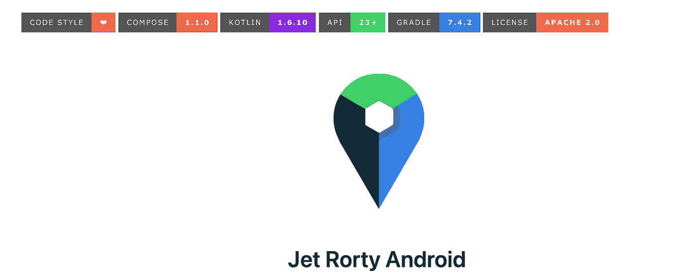
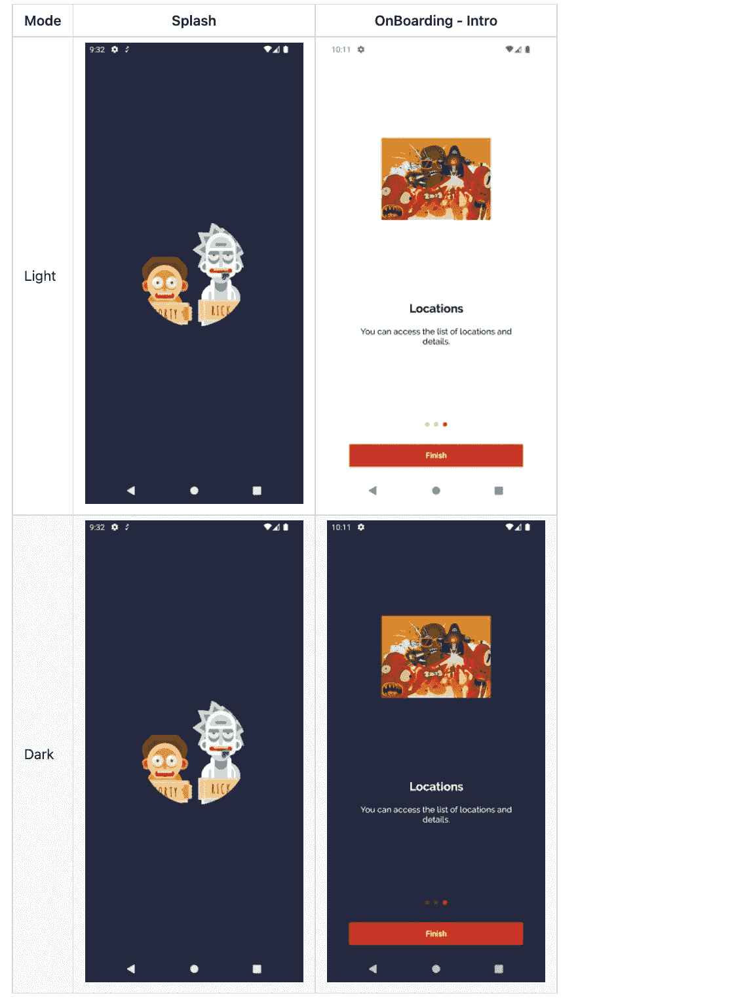
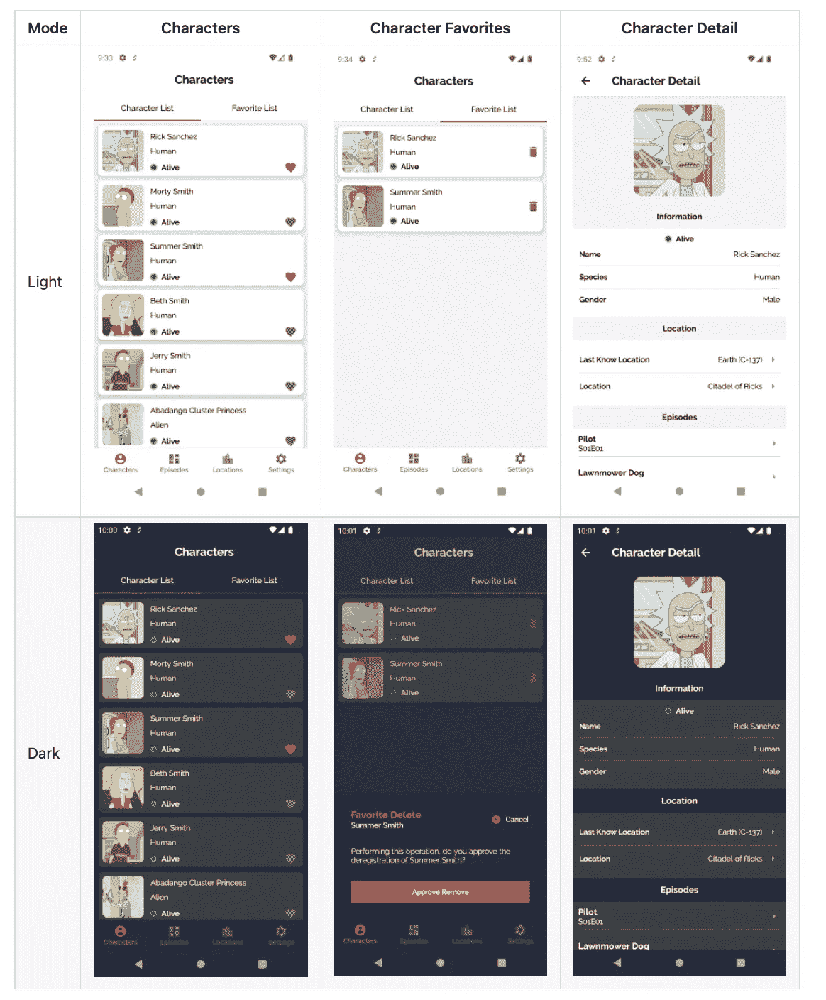
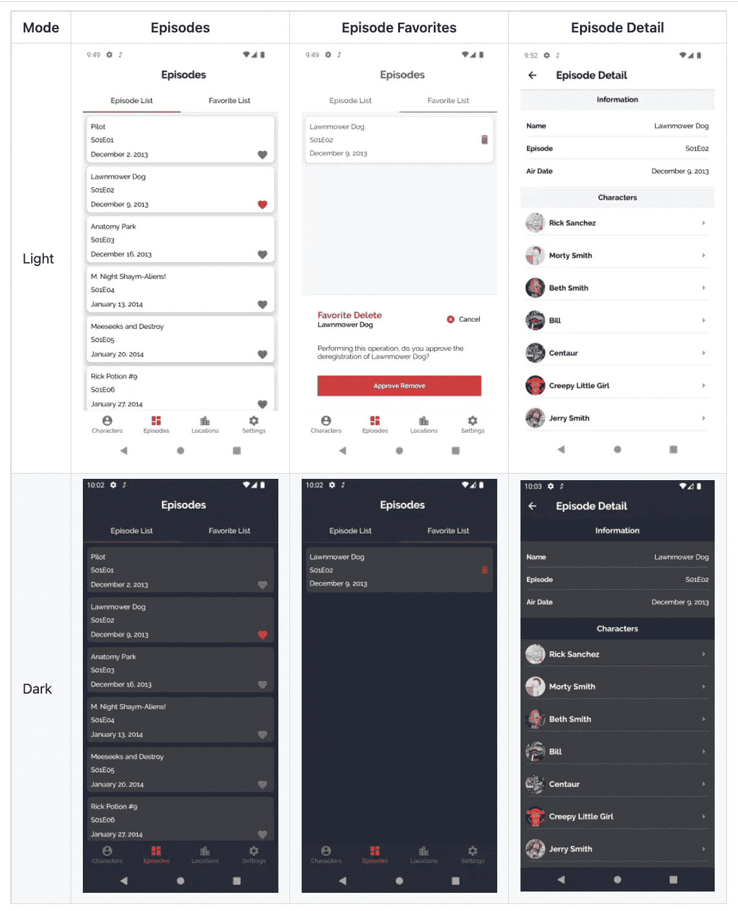
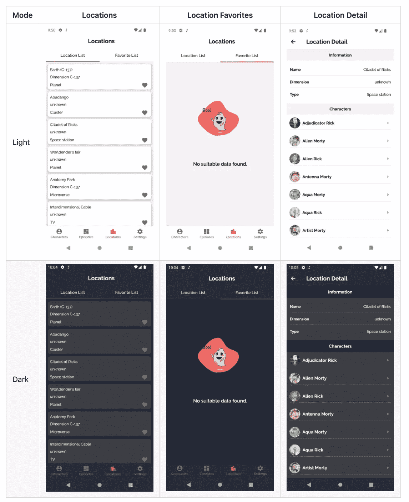
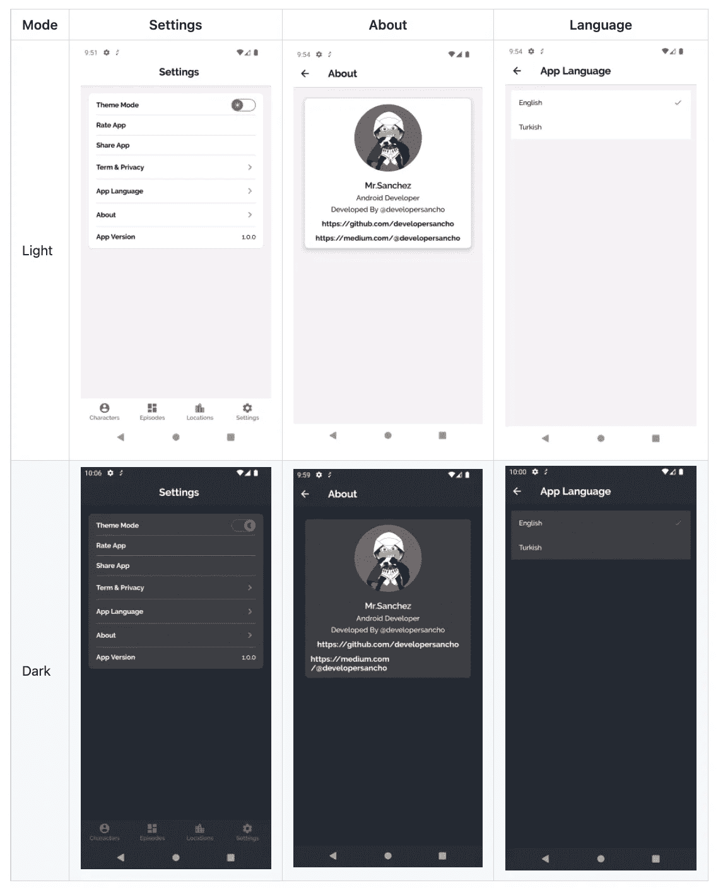
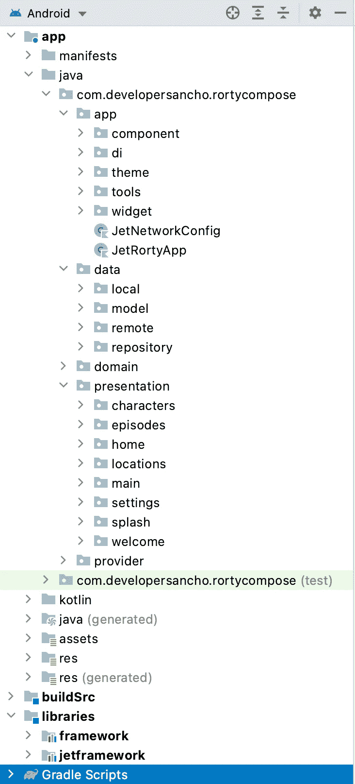

# Jetpack 使用 Rorty 应用程序构建干净的架构

> 原文：<https://blog.devgenius.io/jetpack-compose-clean-architecture-with-rorty-app-e7532da06719?source=collection_archive---------0----------------------->

在 [besthdwallpaper](https://www.besthdwallpaper.com/) 上由 [merveilleux](https://www.besthdwallpaper.com/noel/sakar-minion-dt_tr-7536.html) 拍摄的照片

如果您想在继续阅读简介之前直接查看项目，您可以访问以下链接:

 [## GitHub—developer Sancho/Rory compose。V2:🚀JetRorty 应用程序上的 Android Clean 架构示例…

### 🚀JetRorty 应用程序上的示例 Android Clean 架构侧重于可扩展性、可测试性和可维护性…

github.com](https://github.com/developersancho/RortyCompose.V2) 

# 概观

Jetpack Compose 是 Android 用于构建原生 UI 的现代工具包。它简化并加速了 Android 上的 UI 开发。借助更少的代码、强大的工具和直观的 Kotlin APIs，快速实现您的应用。它使得构建 Android UI 更快更容易。

Android 不是唯一受支持的平台。首先，你可以在 [**Web**](https://compose-web.ui.pages.jetbrains.team/) 和 [**桌面**](https://www.jetbrains.com/lp/compose/) — [**多平台**](https://www.jetbrains.com/lp/compose-mpp/) 应用中使用它。

# Jetpack Compose 的优势(优点)

*   编写更少的代码会影响开发的所有阶段。
*   Compose 使用声明式 API，这意味着您需要做的就是描述您的 UI。
*   Compose 与您现有的所有代码兼容。
*   它易于更新，易于测试。
*   它很容易与 Android 中现有的视图兼容。
*   它提高了[发展速度](https://developer.android.com/jetpack/compose/ergonomics)。
*   它删除了 findViewById 或 ViewBinding 引用的样板文件。

# Jetpack Compose 的缺点(缺点)

*   这种解决方案的缺点是每次代码改变时都要重新渲染预览，构建速度不是很快。
*   呈现更改比 xml 慢一点。(*尝试在关闭调试日志的情况下构建发布版本，应该可以正常工作*😊)
*   有些组件不受支持，有些功能即将推出。你可以看一看 [**路线图**](https://developer.android.com/jetpack/androidx/compose-roadmap) 。

# 介绍

我构建了一个 Android **Rorty** 应用程序(**Rick 和 Morty)来巩固我到目前为止所学到的东西，并提高自己。**

Rorty 关注于用 Kotlin 编写的可伸缩性、可测试性和可维护性，遵循使用 Jetpack Compose 的最佳实践。

# 我开发了什么

该项目介绍了一种现代的 Android 应用程序开发方法，使用 Kotlin 和最新的技术堆栈 Jetpack Compose。

该项目的目标是展示最佳实践，提供一套准则，单模块应用，可扩展，可维护和可测试。这个应用程序可能看起来很简单，但是它拥有所有这些小细节，这些小细节将为适合更大团队和长应用程序生命周期管理的更大应用程序奠定坚实的基础。

对于这个项目，我使用了干净的架构。 [MVP](https://en.wikipedia.org/wiki/Minimum_viable_product) 的特点:

*   溅泼的量
*   入职-简介
*   主页
*   字符列表
*   人物收藏列表
*   字符细节
*   剧集列表
*   剧集收藏列表
*   剧集详情
*   位置列表
*   位置收藏列表
*   位置详细信息
*   设置
*   应用语言
*   关于

# 截屏

飞溅和介绍

特性

插曲

位置

设置

# 环境设置

为了能够构建应用程序，你需要 [Android Studio](https://developer.android.com/studio) 最低版本`Bumblebee (2021.1.1)`

# 应用程序结构

干净架构的一个主要好处是在整个应用程序和源代码中有清晰的导航。查看项目的根文件夹，下面的结构变得清晰。

# 建筑 Src

`buildSrc`层负责依赖关系管理。它通过 Kotlin 在一个地方控制和管理所有依赖项。

# 应用

`app`层负责公共和一般属性。

*   **组件**:负责总视图。
*   **widget** :负责使用 app 的常用视图组件。
*   **主题**:定义主题、颜色、字体和资源文件。

# 供应者

`provider`层负责导航、资源和主题提供者。

# 图书馆

`libraries`层负责基础结构。

*   **框架**:包含不同模块和基础结构可以使用的不同工具。
*   **jetframework** :包含不同的工具，这些工具可以由不同的模块和基础结构使用，仅用于 Jet Compose。
*   **测试**:包含测试工具的定义。

# 数据

`data`层负责为领域层选择合适的数据源。它包含域层中声明的存储库的实现。

数据层的组件包括:

## 型号:

*   **-dto** :定义 ui 模型的 dto，同时进行`domain`、`response`和`entity`模型之间的数据转换。
*   **-local** :定义 SQLite 数据库的模式。
*   **-remote** :定义网络响应的 POJO。

## 本地:

这负责使用[空间](https://developer.android.com/training/data-storage/room)执行缓存操作。

## 远程:

这负责执行网络操作，例如使用[改进](https://square.github.io/retrofit/)定义 API 端点。

## 存储库:

负责向域层公开数据。

# 领域

这是应用程序的核心层。`domain`层独立于任何其他层，因此】领域业务逻辑可以独立于其他层。这意味着其他层的变化不会影响领域层，例如，屏幕用户界面(表示层)或数据库(数据层)的变化不会导致领域层内的任何代码变化。

域层的组件包括:

*   **用例**:它们封装了一个单独的动作，比如从数据库中获取数据或者向服务发送数据。他们使用存储库来解决他们应该做的动作。它们通常覆盖操作符`invoke`，所以它们可以作为一个函数被调用。

# 介绍会；展示会

`features`层包含向用户显示信息所涉及的组件。这一层的主要部分是视图(活动、合成)和视图模型。

# 技术堆栈

这个项目使用了 android 生态系统中许多流行的库、插件和工具。

# -依赖性

## [撰写](https://developer.android.com/jetpack/compose)

*   [**材质**](https://developer.android.com/jetpack/androidx/releases/compose-material) —用现成的材质设计组件构建 Jetpack Compose UIs。
*   [**基础**](https://developer.android.com/jetpack/androidx/releases/compose-foundation) —使用现成的构建块编写 Jetpack 组合应用程序，并扩展基础以构建您自己的设计系统。
*   [**UI**](https://developer.android.com/jetpack/androidx/releases/compose-ui) —构成 UI 与设备交互所需的基本组件，包括布局、绘图和输入。
*   [**ConstraintLayout**](https://developer.android.com/jetpack/androidx/releases/constraintlayout)**—constraint layout-Compose 1.0 提供了 Jetpack Compose 中的 constraint layout 功能。**
*   **[**生命周期-视图模型**](https://developer.android.com/jetpack/androidx/releases/lifecycle) —执行动作以响应另一个组件(如活动和片段)的生命周期状态的变化。**
*   **[**分页**](https://developer.android.com/topic/libraries/architecture/paging/v3-overview) —分页库让你更容易在应用的 [RecyclerView](https://developer.android.com/reference/androidx/recyclerview/widget/RecyclerView) 中逐步优雅地加载数据。**
*   **[**Lottie**](https://github.com/airbnb/lottie/blob/master/android-compose.md)**—Lottie 是一个 Android 和 iOS 的移动库，解析 Adobe After Effects 动画用 Bodymovin 导出为 json，并在移动上原生渲染！****
*   ****[**Coil**](https://coil-kt.github.io/coil/compose/)—kot Lin 协程支持的 Android 镜像加载库。****
*   ****[**导航**](https://github.com/raamcosta/compose-destinations) —用于类型安全的 Jetpack 撰写导航的注释处理库，没有样板文件。****

## ****[伴奏](https://google.github.io/accompanist)****

*   ****[**SwipeRefresh**](https://google.github.io/accompanist/swiperefresh/)——一个库，提供了一个提供滑动刷新 UX 模式的布局，类似于 Android 的 SwipeRefreshLayout。****
*   ****[**systemui Controller**](https://google.github.io/accompanist/systemuicontroller/)**—系统 UI 控制器提供易于使用的实用程序，用于更新 Jetpack Compose 中的系统 UI 栏颜色。******
*   ******[**Insets**](https://google.github.io/accompanist/insets/)**—Insets for Jetpack Compose 吸取了许多推动 Insetter for views 的想法，并将它们应用到 composables 中。********
*   ******[**占位符**](https://google.github.io/accompanist/placeholder/) —一个库，在加载内容时为显示“占位符”UI 提供一个修改器。******
*   ****[**导航**](https://google.github.io/accompanist/navigation-material/) —为 Jetpack 导航作曲提供作曲素材支持的库。此功能具有可组合的底部工作表目的地。****

## ****[喷气背包](https://developer.android.com/jetpack)****

*   ****[**Android KTX**](https://developer.android.com/kotlin/ktx.html)**—为 Jetpack 和 Android 平台 API 提供简洁、惯用的 Kotlin。******
*   ******[**AndroidX**](https://developer.android.com/jetpack/androidx)**—对原有 Android [支持库](https://developer.android.com/topic/libraries/support-library/index)的重大改进，不再维护。********
*   ******[**生命周期**](https://developer.android.com/topic/libraries/architecture/lifecycle) —执行动作以响应另一个组件(如活动和片段)的生命周期状态的变化。******
*   ****[**ViewModel**](https://developer.android.com/topic/libraries/architecture/viewmodel) —旨在以生命周期意识的方式存储和管理 UI 相关数据。ViewModel 类允许数据在配置更改(如屏幕旋转)后仍然存在。****
*   ****[**房间**](https://developer.android.com/training/data-storage/room) —在 SQLite 上提供一个抽象层，用于离线数据缓存。****
*   ****[**分页 3**](https://developer.android.com/topic/libraries/architecture/paging/v3-overview) —分页库让你更容易的逐步加载数据。****
*   ****[**匕首刀柄**](https://dagger.dev/hilt/) —依赖注入库。****
*   ****[**谷歌-KSP**](https://github.com/google/ksp/) —科特林符号处理 API****
*   ****[**改进**](https://square.github.io/retrofit/) —类型安全的 http 客户端，支持开箱即用的协程。****
*   ****[**ok Http-Logging-Interceptor**](https://github.com/square/okhttp/blob/master/okhttp-logging-interceptor/README.md)**—记录 HTTP 请求和响应数据。******
*   ******[**协程**](https://github.com/Kotlin/kotlinx.coroutines) —对协程的库支持。******
*   ****[**流**](https://developer.android.com/kotlin/flow) —流建立在协程之上，可以提供多个值。从概念上讲，流是可以异步计算的数据流。****
*   ****[**材质设计**](https://material.io/develop/android/docs/getting-started/) —打造令人敬畏的美丽 ui。****
*   ****[**协程**](https://github.com/Kotlin/kotlinx.coroutines) —协程库支持，提供测试中使用的运行阻塞协程生成器。****
*   ****[**Timber**](https://github.com/JakeWharton/timber) —一个带有小型可扩展 API 的日志程序，它在 Android 的普通日志类之上提供了实用程序。****
*   ****[**Moshi**](https://github.com/square/moshi)**—一个面向 Kotlin 和 Java 的现代 JSON 库。******
*   ******[**Chucker**](https://github.com/ChuckerTeam/chucker)**—Android 的一个 HTTP inspector&ok HTTP(类似 Charles 但在设备上)。********
*   ******[**grad le Kotlin DSL**](https://gradle.org/kotlin/)**—让我们轻松管理所有模块的依赖关系。********
*   ******[**闪屏**](https://developer.android.com/guide/topics/ui/splash-screen) — Android 12 增加了闪屏 API，当运行在 Android 12 或更高版本的设备上时，可以为所有应用启用新的应用启动动画。******

# ****-测试依赖关系****

*   ****JUnit —一个编写可重复测试的简单框架。它是用于单元测试框架的 xUnit 架构的一个实例。****
*   ****[**模仿**](https://github.com/mockk/mockk) —提供 DSL 来模仿行为。从零开始构建以适应科特林语言。****
*   ****[**Android x**](https://github.com/android/android-test)——Android x 测试库为测试 Android 应用提供了一个广泛的框架。****
*   ****[**Robolectric**](https://github.com/robolectric/robolectric)—Android 的行业标准单元测试框架。****
*   ****[**Turbine**](https://github.com/cashapp/turbine)—kotlinx . coroutines`[Flow](https://kotlin.github.io/kotlinx.coroutines/kotlinx-coroutines-core/kotlinx.coroutines.flow/-flow/).`的小型测试库****
*   ****[**mock web server**](https://github.com/square/okhttp/tree/master/mockwebserver)—用于测试 HTTP 客户端的可脚本化 web 服务器。****
*   ****[**协程**](https://github.com/Kotlin/kotlinx.coroutines/tree/master/kotlinx-coroutines-test) —提供有效测试协程的测试实用程序。****

# ****-代码分析插件****

*   ****[**Ktlint**](https://github.com/pinterest/ktlint) —一款内置格式化器的防自行车脱落 Kotlin 棉绒。****
*   ****[**Detekt**](https://github.com/arturbosch/detekt)—kot Lin 编程语言的静态代码分析工具。****
*   ****[**一尘不染**](https://github.com/diffplug/spotless) —一个代码格式化程序可以做的不仅仅是发现格式化错误。****
*   ****[**版本**](https://github.com/ben-manes/gradle-versions-plugin) —便于确定哪些依赖项有更新。****

# ****你如何能有所贡献？****

*   ****[**未决问题**](https://github.com/developersancho/RortyCompose.V2/issues) 建议更好的应用方法或想法。****
*   ****在 [**Linkedin**](https://www.linkedin.com/in/mesut-g-33b41030/) 上联系我。****
*   ****启动 [**Github**](https://github.com/developersancho/RortyCompose.V2) 资源库。****
*   ****跟随我上 [**Github**](https://github.com/developersancho) 。****

# ****完整项目****

****您可以从下面的链接获得该项目的源代码。****

**** [## GitHub—developer Sancho/Rory compose。V2:🚀JetRorty 应用程序上的 Android Clean 架构示例…

### 🚀JetRorty 应用程序上的示例 Android Clean 架构侧重于可扩展性、可测试性和可维护性…

github.com](https://github.com/developersancho/RortyCompose.V2) 

***您可以查看和回顾我的 jet compose 多模块清洁架构培训项目和下面的 medium 链接。***

 [## Jetpack 使用 Rorty App 构建模块化清洁架构

### 如果您想在继续阅读介绍之前直接检查项目，您可以通过访问…

developersancho.medium.com](https://developersancho.medium.com/jetpack-compose-modular-clean-architecture-with-rorty-app-58d801571ab9)  [## GitHub—developer Sancho/jet Rorty。安卓系统:🚀JetRorty 应用程序上的 Android Clean 架构示例…

### 🚀JetRorty 应用程序上的示例 Android Clean 架构侧重于可扩展性、可测试性和可维护性…

github.com](https://github.com/developersancho/JetRorty.Android) 

# 谢谢🚀

希望对你有帮助。如果对你有用，可以拍拍这篇文章，关注我这样的这些文章。

快乐健康编码！

**一个美好的夜晚，持续不断**😊**🏄‍** 🚀****