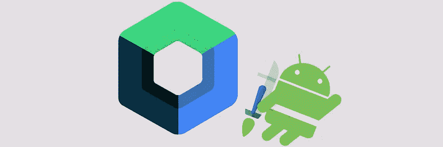
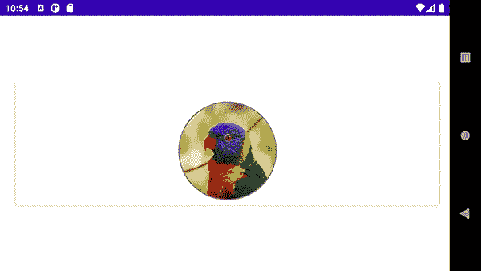
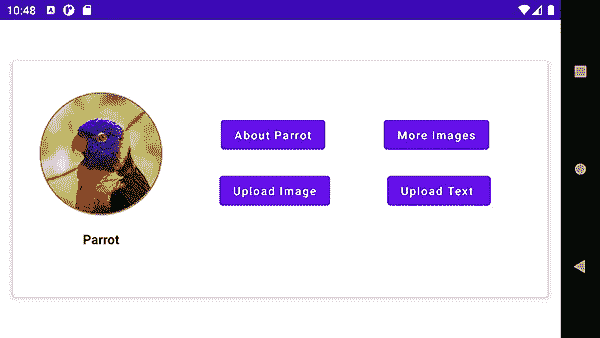

# 用 ConstraintLayout 示例编写的 Jetpack

> 原文：<https://blog.devgenius.io/jetpack-compose-with-constraintlayout-sample-24d720cffa4a?source=collection_archive---------5----------------------->



基于 developer.android 网站，Jetpack Compose 是一个用于构建原生 Android UI 的现代工具包。Jetpack Compose 通过更少的代码、强大的工具和直观的 Kotlin APIs 简化并加速了 Android 上的 UI 开发。

现在让我们看看如何在我们的项目中使用 Jetpack Compose:

*   *转到新项目页面，选择空合成活动*
*   它的语言只有一个选项，就是 Kotlin(不能用 Java 编写 Jetpack Compose 组件)
*   你不需要使用 XML 文件来设计 UI
*   通过使用“@Composable”的注释，您可以设计 UI
*   通过使用“@Preview”注释，您可以看到您的设计结果

下图是一个简单的用户界面设计:


由[米哈伊尔·瓦西里耶夫](https://unsplash.com/@miklevasilyev?utm_source=unsplash&utm_medium=referral&utm_content=creditCopyText)在 [Unsplash](https://unsplash.com/?utm_source=unsplash&utm_medium=referral&utm_content=creditCopyText) 上拍摄的鹦鹉照片

为了实现上述设计，

在您的 Gradle 文件中添加以下依赖项

```
implementation 'androidx.constraintlayout:constraintlayout-compose:1.1.0-alpha03'
```

然后创建一个新的 Kotiln 文件，并编写以下代码:

```
@Composable
fun SimpleComposePage(){
    *Card*(elevation = 5.*dp*,
        modifier = Modifier
            .*border*(width = 3.*dp*, color = Color.White, shape = *RoundedCornerShape*(20.*dp*))
            .*padding*(top = 100.*dp*, bottom = 100.*dp*, start = 24.*dp*, end = 16.*dp*)
            .*fillMaxSize*()) **{** *ConstraintLayout*() **{** val (animalImage, animalName, btnAbout, btnImage, btnUploadImage, btnUploadText) = createRefs()

            *Image*(painter = *painterResource*(id = R.drawable.*parrot*), contentDescription = "Parrot",
                contentScale = ContentScale.Crop,
                modifier = Modifier
                    .*padding*(top = 30.*dp*)
                    .*size*(150.*dp*)
                    .*clip*(*CircleShape*)
                    .*border*(width = 2.*dp*, color = Color.Gray, shape = *CircleShape*)
                    .*constrainAs*(animalImage) **{** top.linkTo(parent.top)
                        start.linkTo(parent.start)
                        end.linkTo(parent.end)
                    **}**)

            *Text*(text = "Parrot", fontWeight = FontWeight.Bold, modifier = Modifier
                .*padding*(top = 10.*dp*)
                .*constrainAs*(animalName) **{** top.linkTo(animalImage.bottom)
                    start.linkTo(parent.start)
                    end.linkTo(parent.end)
                **}**)

            *Button*(onClick = **{** /*Write onClick code here*/ **}**,
                modifier = Modifier.*constrainAs*(btnAbout)**{** start.linkTo(parent.start, margin = 16.*dp*)
                    top.linkTo(animalName.bottom, margin = 32.*dp*)
                    end.linkTo(btnImage.start)

            **}**) **{** *Text*(text = "About Parrot")
            **}** *Button*(onClick = **{** /*Write onClick code here*/ **}**,
                modifier = Modifier.*constrainAs*(btnImage)**{** start.linkTo(btnAbout.end)
                    top.linkTo(animalName.bottom, margin = 32.*dp*)
                    end.linkTo(parent.end)
                **}**) **{** *Text*(text = "More Images")
            **}** *Button*(onClick = **{** /*Write onClick code here*/ **}**,
                modifier = Modifier.*constrainAs*(btnUploadImage)**{** start.linkTo(parent.start, margin = 16.*dp*)
                    top.linkTo(btnAbout.bottom, margin = 32.*dp*)
                    end.linkTo(btnUploadText.start)
                **}**) **{** *Text*(text = "Upload Image")
            **}** *Button*(onClick = **{** /*Write onClick code here*/ **}**,
                modifier = Modifier.*constrainAs*(btnUploadText)**{** start.linkTo(btnAbout.end)
                    top.linkTo(btnImage.bottom, margin = 32.*dp*)
                    end.linkTo(parent.end)
                **}**) **{** *Text*(text = "Upload Text")
            **}
        }
    }** }

@Preview(showBackground = true)
@Composable
fun Preview() {
    *JetpackComposeTestTheme* **{** *SimpleComposePage*()
    **}**
```

现在，在主活动中，您可以删除“Greeting ”,代之以输入 Kotlin 文件的名称，以便在模拟器中查看结果。

这是一个简单的设计与 Jetpack 组成，但正如你可以从下面的图片看到，这个设计有一个问题与景观模式。



米哈伊尔·瓦西里耶夫在 [Unsplash](https://unsplash.com/?utm_source=unsplash&utm_medium=referral&utm_content=creditCopyText) 上拍摄的鹦鹉照片

因此，一种方法是将我们的 Compose 方法中的位置值分成两种不同的方法(纵向和横向)，并将我们所有的布局代码放在“BoxWithConstraints”中，在其中，您应该定义条件来确定手机是纵向还是横向，并使用其相关功能。

```
*BoxWithConstraints*() **{** val constraintStatus = if(minWidth < 600.*dp*){
        *portraitLayout*()
    }else{
        *landscapeLayout*()
    }
```

以下是它的最终结果:



米哈伊尔·瓦西里耶夫在 [Unsplash](https://unsplash.com/?utm_source=unsplash&utm_medium=referral&utm_content=creditCopyText) 上拍摄的鹦鹉照片

这是它的相关代码:

```
@Composable
fun PortLandCompose(){
    *Card*(elevation = 5.*dp*,
        modifier = Modifier
            .*border*(width = 3.*dp*, color = Color.White, shape = *RoundedCornerShape*(20.*dp*))
            .*padding*(top = 50.*dp*, bottom = 50.*dp*, start = 16.*dp*, end = 16.*dp*)
            .*fillMaxSize*()) **{** *BoxWithConstraints*() **{** val constraintStatus = if(minWidth < 600.*dp*){
                *portraitLayout*()
            }else{
                *landscapeLayout*()
            }

            *ConstraintLayout*(constraintStatus, modifier = Modifier.*fillMaxSize*()) **{** *Image*(painter = *painterResource*(id = R.drawable.*parrot*), contentDescription = "Parrot",
                    contentScale = ContentScale.Crop,
                    modifier = Modifier
                        .*padding*(top = 30.*dp*)
                        .*size*(150.*dp*)
                        .*clip*(*CircleShape*)
                        .*border*(width = 2.*dp*, color = Color.Gray, shape = *CircleShape*)
                        .*layoutId*("animalImage"))

                *Text*(text = "Parrot", fontWeight = FontWeight.Bold, modifier = Modifier
                    .*padding*(top = 10.*dp*)
                    .*layoutId*("animalName"))

                *Button*(onClick = **{** /*Write onClick code here*/ **}**,
                    modifier = Modifier.*layoutId*("btnAbout")) **{** *Text*(text = "About Parrot")
                **}** *Button*(onClick = **{** /*Write onClick code here*/ **}**,
                    modifier = Modifier.*layoutId*("btnImage")) **{** *Text*(text = "More Images")
                **}** *Button*(onClick = **{** /*Write onClick code here*/ **}**,
                    modifier = Modifier.*layoutId*("btnUploadImage")) **{** *Text*(text = "Upload Image")
                **}** *Button*(onClick = **{** /*Write onClick code here*/ **}**,
                    modifier = Modifier.*layoutId*("btnUploadText")) **{** *Text*(text = "Upload Text ")
                **}
            }
        }

    }** }

private fun portraitLayout(): ConstraintSet{
    return *ConstraintSet* **{** val animalImage = createRefFor("animalImage")
        val animalName = createRefFor("animalName")
        val btnAbout = createRefFor("btnAbout")
        val btnImage = createRefFor("btnImage")
        val btnUploadImage = createRefFor("btnUploadImage")
        val btnUploadText = createRefFor("btnUploadText")

        constrain(animalImage)**{** top.linkTo(parent.top)
            start.linkTo(parent.start)
            end.linkTo(parent.end)
        **}** constrain(animalName)**{** top.linkTo(animalImage.bottom)
            start.linkTo(parent.start)
            end.linkTo(parent.end)
        **}** constrain(btnAbout)**{** start.linkTo(parent.start, margin = 16.*dp*)
            top.linkTo(animalName.bottom, margin = 32.*dp*)
            end.linkTo(btnImage.start)
        **}** constrain(btnImage)**{** start.linkTo(btnAbout.end)
            top.linkTo(animalName.bottom, margin = 32.*dp*)
            end.linkTo(parent.end)
        **}** constrain(btnUploadImage)**{** start.linkTo(parent.start, margin = 16.*dp*)
            top.linkTo(btnAbout.bottom, margin = 32.*dp*)
            end.linkTo(btnUploadText.start)
        **}** constrain(btnUploadText)**{** start.linkTo(btnAbout.end)
            top.linkTo(btnImage.bottom, margin = 32.*dp*)
            end.linkTo(parent.end)
        **}
    }** }

private fun landscapeLayout(): ConstraintSet{
    return *ConstraintSet***{** val animalImage = createRefFor("animalImage")
        val animalName = createRefFor("animalName")
        val btnAbout = createRefFor("btnAbout")
        val btnImage = createRefFor("btnImage")
        val btnUploadImage = createRefFor("btnUploadImage")
        val btnUploadText = createRefFor("btnUploadText")

        constrain(animalImage)**{** top.linkTo(parent.top, margin = 8.*dp*)
            start.linkTo(parent.start, margin = 32.*dp*)
        **}** constrain(animalName)**{** top.linkTo(animalImage.bottom, margin = 8.*dp*)
            start.linkTo(animalImage.start)
            end.linkTo(animalImage.end)
        **}** constrain(btnAbout)**{** top.linkTo(animalImage.top, margin = 64.*dp*)
            start.linkTo(animalImage.end)
            end.linkTo(btnImage.start)
        **}** constrain(btnImage)**{** top.linkTo(animalImage.top, margin = 64.*dp*)
            start.linkTo(btnAbout.end)
            end.linkTo(parent.end)
        **}** constrain(btnUploadImage)**{** top.linkTo(btnAbout.bottom, margin = 32.*dp*)
            start.linkTo(animalImage.end)
            end.linkTo(btnUploadText.start)
        **}** constrain(btnUploadText)**{** top.linkTo(btnImage.bottom, margin = 32.*dp*)
            start.linkTo(btnUploadImage.end)
            end.linkTo(parent.end)
        **}

    }** }

@Preview(showBackground = true)
@Composable
fun preview() {
    *JetpackComposeTestTheme* **{** *PortLandCompose*()
    **}** }
```

祝你好运