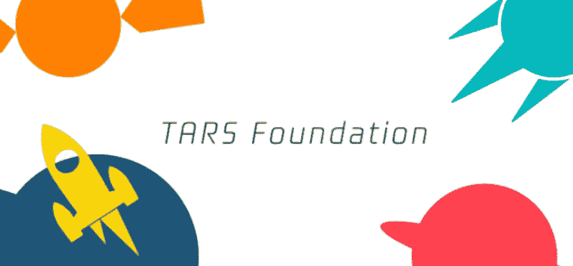
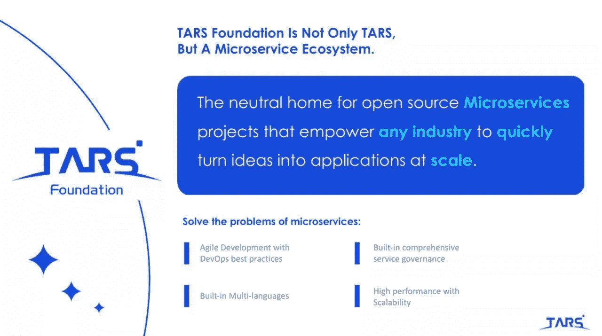

# 吉姆·泽姆林:TARS 基金会，一个微服务生态系统

> 原文：<https://blog.devgenius.io/jim-zemlin-the-tars-foundation-a-microservices-ecosystem-d7f304b4460c?source=collection_archive---------11----------------------->

2020 年 7 月 30 日，Linux 基金会执行董事吉姆·泽姆林(Jim Zemlin)在中国云原生+开源虚拟峰会上做主题演讲。他的评论触及了开源技术的重要性，尤其是在正在进行的疫情中。

> “疫情使我们的全球社会陷入了一场健康和经济危机。好像每天都有来自世界各地的冲突。今天，我想提醒大家，开源是一个伟大的运动，在这个运动中，协作、一起工作和相处是我们工作的本质。开源不是一个零和游戏，但它以一种积极的方式对我们产生了不可思议的影响。我想提醒大家，开源是公共产品，将免费提供给世界各地的每个人，无论政治或经济变革给我们带来什么样的风。Linux 基金会致力于这一切。”—吉姆·泽姆林

然后，他继续向观众概述了一些激动人心的 LF 项目，这些项目旨在帮助处于困难时期的人们。有了超过 25 万美元的新捐款，Linux 基金会扩大了它的指导计划，为人们提供学习新技能的机会。最值得注意的是，Linux 基金会公共卫生倡议(LFPH)最近推出了七个创始成员:Cisco、doc.ai、Geometer、IBM、NearForm、腾讯和 VMware。它主持暴露通知项目，如 COVID-Shield 和 COVID-Green，这些项目目前正在加拿大、爱尔兰和美国几个州部署，以帮助发现和减少新冠肺炎的传播。

峰会的目标是促进对云计算的进一步理解和发展。因此，有必要讨论一下微服务，它将是云原生技术的重要组成部分。TARS 项目是一个成熟的高性能微服务框架，支持多种编程语言。

自从两年前 TARS 项目加入 Linux 基金会以来，TARS 的社区一直在增长，新的项目和贡献者不断涌现。就像 Linux 基金会不仅仅是关于 Linux 一样。TARS 项目已经不仅仅是 TARS。它已经转变为一个微服务生态系统。

不幸的是，由于新冠肺炎疫情，Linux 基金会不得不取消了去年春天的会员峰会，他们无法在那时宣布启动 TARS 基金会。然而，在他的主题演讲中，Jim Zemlin 正式宣布 TARS 项目已成为 TARS 基金会。它是 Linux 基金会整体框架内的一个开源微服务基金会。无论是对于 TARS 项目还是与 TARS 相关的项目，其成果都在快速增长。微服务生态系统一直在增长，并迅速将应用和想法规模化。

Linux 基金会希望 TARS 基金会为解决围绕微服务的关键问题的其他项目创建一个中立的家园。TARS 基金会致力于提供敏捷开发、DevOps 最佳实践和综合治理，以实现多语言、高性能和可扩展的解决方案。

在演讲的最后，Zemlin 对 TARS 在开源社区取得的成就表示祝贺。

许多公司的贡献有助于建立 TARS 的微服务生态系统。TARS 基金会是他们努力工作和创新的证明。TARS 基金会拥有 Arm 和腾讯作为首要成员，以及五个普通成员:AfterShip、Ampere、API7、Kong 和 Zenlayer。

在 TARS 应用方面，它为来自不同行业的 100 多家公司提供服务，包括 Edge、电子竞技、金融科技、流媒体、电子商务、娱乐、电信、教育等。请查看以下视频了解更多详情。

[https://youtu.be/NpixKfkt1ds](https://youtu.be/NpixKfkt1ds)

世界各地的开发者开始意识到 TARS 不可思议的价值，并为此做出贡献。有 12，000 名开发人员在积极使用 TARS。此外，150 名开发人员为 TARS 项目贡献代码，他们来自 Arm、腾讯、谷歌、微软、Vmware、微众银行、TAL、中国文学、科大讯飞、龙图游戏等公司。

最后，TARS 基金会努力扩展其微服务生态系统，整合更多功能，如测试、网关和边缘等。到目前为止，TARS 基金会在他们的 GitHub 库上有超过 30 个项目:【https://github.com/TarsCloud】T2。

**关于 TARS 基金会的更多信息，请访问以下链接:**

网址:[http://tarscloud.org/](http://tarscloud.org/)

推特:[https://twitter.com/TarsCloud](https://twitter.com/TarsCloud)

https://www.facebook.com/TheTarsFoundation/脸书

LinkedIn:[https://www . LinkedIn . com/company/the-tars-foundation/about/？viewAsMember=true](https://www.linkedin.com/company/the-tars-foundation/about/?viewAsMember=true)

焦油基金会景观:[https://landscape.tarscloud.org/](https://landscape.tarscloud.org/)