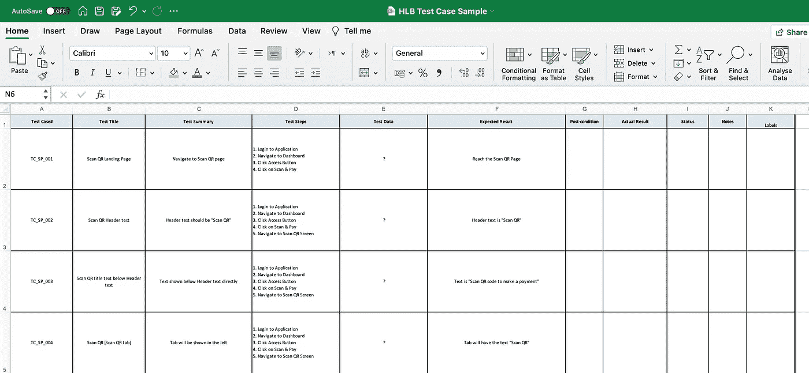
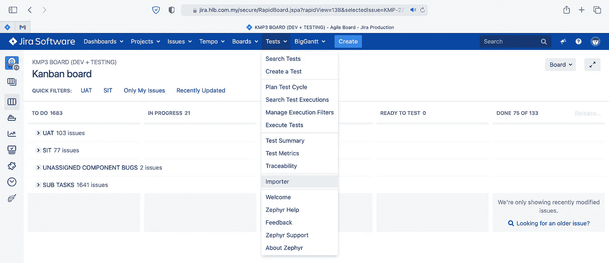
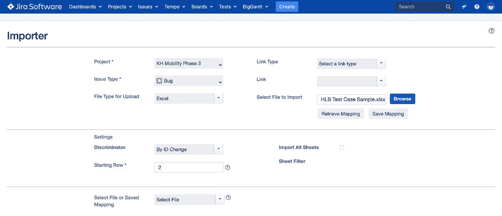
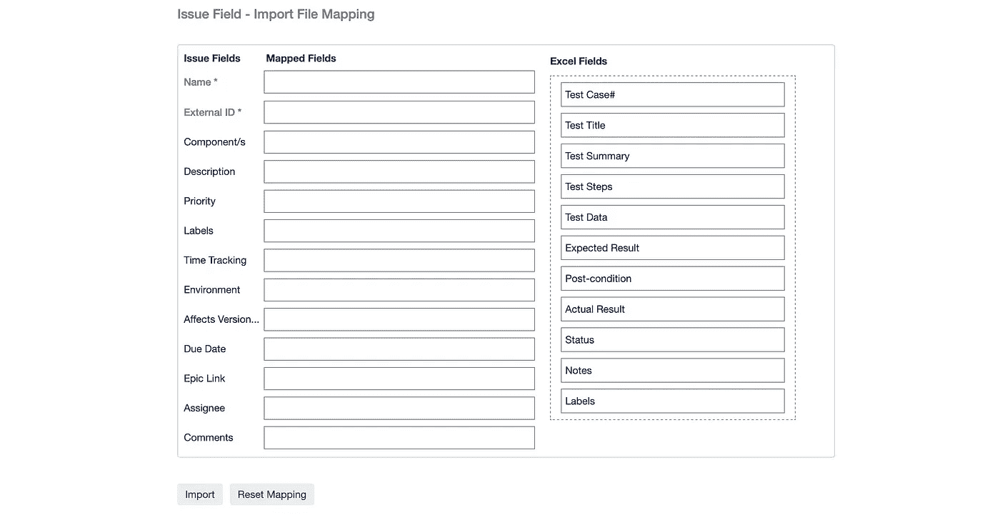
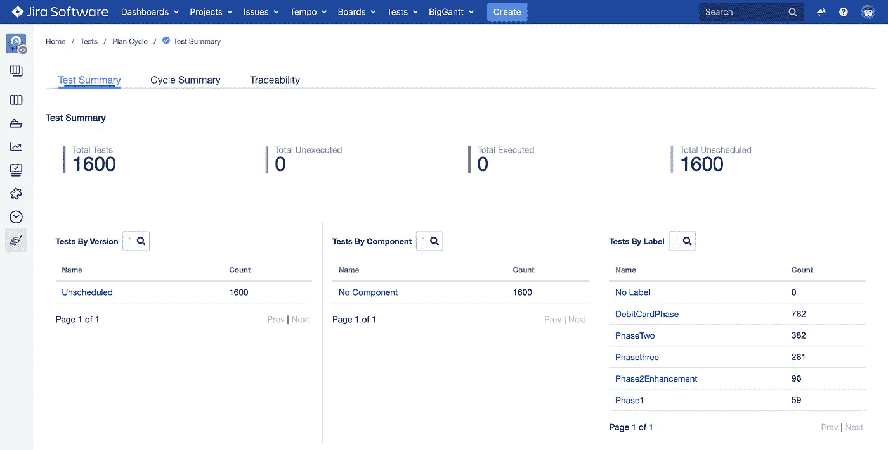
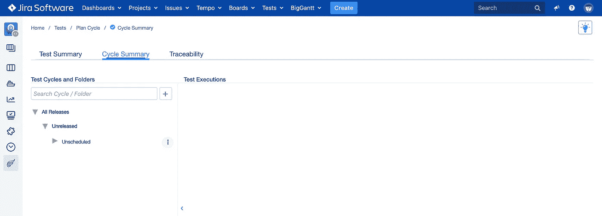

# JIRA 软件|如何导入你的测试用例？

> 原文：<https://blog.devgenius.io/jira-software-how-to-import-your-test-cases-3f2b4d14ffa1?source=collection_archive---------1----------------------->

在吉拉导入测试用例是跟进先前使用 excel 表格或任何电子表格创建的策略和场景的另一种方式。

一步一步的手工测试过程就是开发一个测试用例，知道测试什么，如何测试等等。

当在吉拉导入测试用例时，您需要知道一些事情，比如要填充的字段是什么，以及如何在正确的项目中正确地导入它。

将测试用例导入吉拉的好处是，测试人员可以在一个网站或应用程序中同时测试和提出错误，而不是使用多应用程序和多任务，从而轻松执行测试用例。

要知道如何导入你的测试用例，你首先需要在一个电子表格中准备测试用例，然后将它们导入到吉拉。

要导入测试用例，您需要点击[吉拉网站](https://www.atlassian.com/software/jira)工具栏中的 Tests 选项卡。

点击测试选项卡->点击导入程序->导入程序屏幕

选择如上图所示的字段后，如下所示:

1.  项目
2.  问题类型
3.  上传的文件类型
4.  链接类型
5.  环
6.  选择要导入的文件

选择要导入的文件后，用户将点击**检索映射。**

然后进一步过滤以选择以下内容:

1.  鉴别器**“通过 ID 改变”**
2.  起始行**“2”**

如**问题字段-导入文件映射中所示，**您将看到将在左栏显示的已填写或需要填写的问题字段(如果字段上有星号)。

而在右栏，应该是被映射到**映射字段**上的 **Excel 字段**。

最后你可以点击 **Import** 按钮，确认你的测试用例被导入到 [**吉拉**](https://www.atlassian.com/software/jira) 中的某个项目中。

成功导入测试用例后，您可以通过进入**测试总结**屏幕来检查导入的测试用例。

点击测试选项卡->点击测试摘要->导航至测试摘要屏幕

正如您在上面的屏幕中所看到的，您会注意到，它清楚地显示了关于导入的测试用例的非常详细的信息。

它总是显示测试总数、已执行总数、未执行总数和未计划总数。

为了过滤掉更多内容，**吉拉**提供了如下特定过滤器:

1.  按版本测试
2.  按组件测试
3.  标签测试

对于测试用例的执行，用户将点击测试概要屏幕中测试概要标签旁边显示的周期概要。

从那里，用户将能够执行它们，或者通过测试用例，或者对所创建的特定测试用例开罚单。

我们下一篇关于吉拉的文章也将为你提供一些新的知识，因为我们今天讨论的是关于测试用例的导入和执行。

对于刚刚推出新网站或新应用程序的公司，我们为您提供了优惠。如果您不确定您的网站/移动应用程序是否安全无故障，我们可以为您提供免费的基础设施测试审计。

所以你可以知道你的应用程序是否让你的潜在客户感到沮丧。要申请免费审计，请发邮件到 stackedqa@gmail.com 给我们，并注明你的主题为“免费测试审计”

在社交媒体上关注我们:

[推特](https://twitter.com/stackedqa)， [Instagram](https://instagram.com/stackedqa) ，& [Linkedin](https://www.linkedin.com/company/stackedqa)