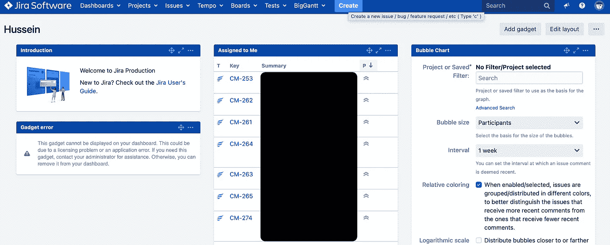
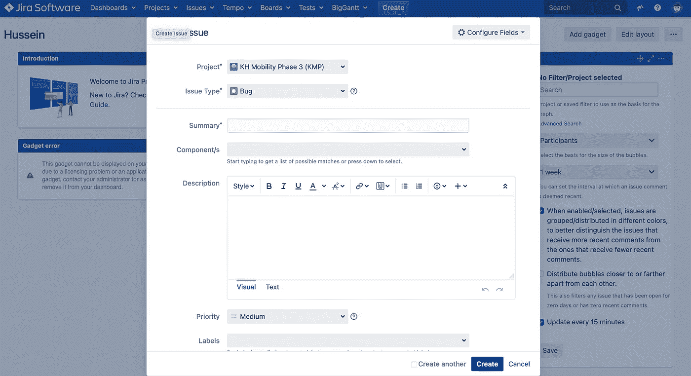
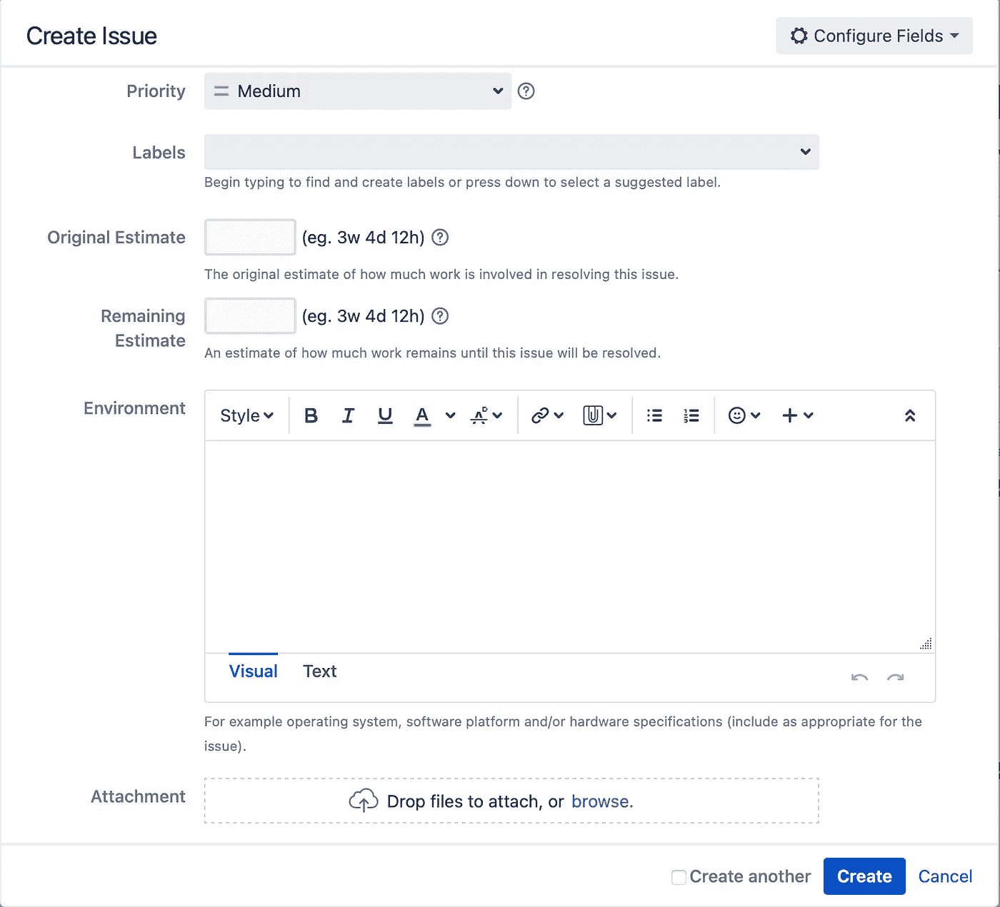
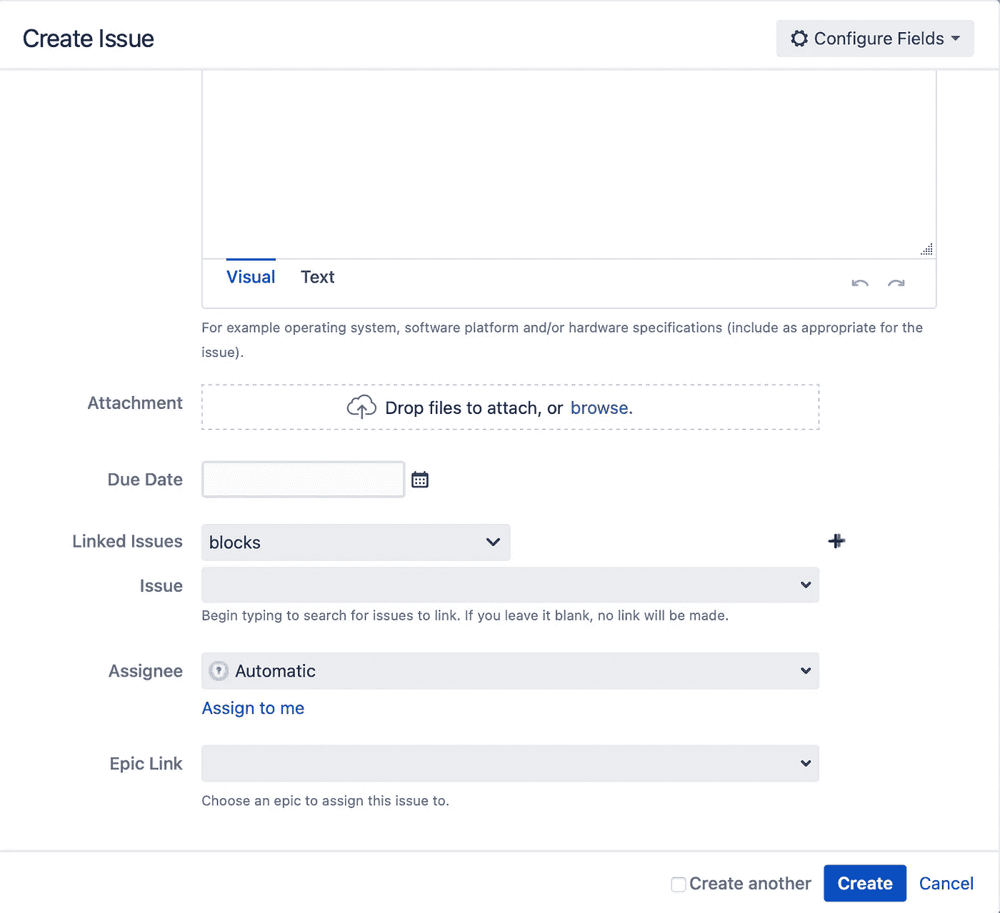

# JIRA 软件|如何提出 bug 票？

> 原文：<https://blog.devgenius.io/jira-software-how-to-raise-a-bug-ticket-95ef5c020a36?source=collection_archive---------1----------------------->

作为测试人员，我们的工作是在任何平台上测试或审计应用程序，然后在错误跟踪管理网站上提出。以前，在拥有任何类型的 bug 跟踪系统之前，测试人员会收集大量的标签，并通过开会逐个讨论 bug 来通知开发人员。请注意，这只是对过去发生的事情的推测，并不确定在有任何类型的错误跟踪系统之前它到底是如何进行的。

幸运的是，现在我们有多种来源的缺陷跟踪系统，但是现在排名第一的缺陷跟踪软件是 JIRA 的**。**使用吉拉时，我们不仅将其作为一个错误跟踪系统，现在它更像是一个 it 项目的项目管理软件。

作为测试人员，我们的程序非常简单，我们测试产品，我们写笔记，打开吉拉并创建一个 bug 标签，在那里可以写下发生的 bug 的信息或笔记，以便通知开发人员。

在您测试的产品上发现一些错误后，当您试图创建一个错误单时，您应该执行以下操作:

1.  打开吉拉网站
2.  点击创建按钮
3.  将为您打开“创建问题或故障单”屏幕

正如您在上面的图片中所看到的，当您直接点击 Create 按钮时，您的 bug 标签就准备好了，您可以填写了。

如图所示，您需要填写必填字段，如**项目、问题类型和摘要。**

但是如果只填写必填字段，对你的开发人员没有任何好处，因为如果没有额外的信息提供，他们很难理解错误是什么。

这就是为什么测试人员通常与 IT 项目经理一起工作来创建**组件、状态和标签**，以便更容易过滤并能够区分平台和产品。

然后你需要知道**摘要**字段是为特定的错误标签提供一个标题。然后对于**组件**字段是提供一些关于哪个环境、平台和特定区域发生了 bug 的过滤器。

还有一个重要的字段是**描述**，这里是最关键的信息，如图所示，这不是强制性的，但为了让测试人员和开发人员之间更容易更好地交流，最好是非常清楚地描述 bug。

对于我来说，我有一个在描述中写什么的系统，我将在下面提供我的方法:

**A .问题:(**对发现的 bug 进行清晰、简明、全面的解释或描述)

**B .重新创建的步骤:**(用于达到特定 bug 的步骤，最好是像您打开应用程序本身那样从头开始，并从那里开始)

**C .用户名:**(由您的团队提供)

**D .密码:**(由你的团队提供)

**E .环境:**(你在哪个环境下测试你的产品【SIT/UAT/生产】)

**F .移动设备:(**用于测试[Android/IOS]的移动设备类型)

**G .手机版:(**手机软件版)

**H .应用程序版本:(**您正在测试的应用程序或产品版本)

在**优先级**字段中，通常你需要选择你认为这个 bug 的优先级，最重要的是你需要知道它是否阻止你测试或者你因为这个 bug 而无法继续测试，优先级是**显示停止**这是最高优先级。

以及最低优先级，即**低或最低**该优先级仅针对您正在测试的产品中出现的简单图像问题或文本问题。即使是简单的词汇问题也是一个错误，或者拼写问题。

在**标签**字段中，您通常会从您的 IT 项目经理添加的标签中进行选择，这些标签通常是 sprint 编号、屏幕位置和测试的平台。

在**环境**字段中，您将写下 SIT 或 UAT，有时人们会将它留空，因为它已经写在**描述**中，也设置在**组件**字段中。

您还有**附件**字段，这也很重要，因为有些 bug 需要合格证明，并且也是为了向开发人员展示您面临的 bug 是什么样子，即使在清楚描述之后，提供 bug 的视觉证明也是有帮助的。

最后，最后一个重要的字段是 **Assignee** 字段，在这里，您将把这个特定的 bug 单分配给开发团队中的负责人，继续修复它并将其返回给您。

在所有这些之后，剩下唯一想做的就是点击**创建**按钮，它会直接显示在待办事项下的项目看板中。

记住，每个产品都不是完美的，总会有一个缺陷被发现，即使这个缺陷只是一个拼写错误，它仍然被认为是一个缺陷。

> 小的或次要的错误会导致真正的业务问题，所以没有什么叫做“它是如此的次要，客户可能不会注意到它”这些陈述可能来自除了测试人员之外的任何人，因为提供最高的质量是我们的工作。
> 
> 这就是为什么测试人员会为小事情伤脑筋。

我们的下一篇文章还将为您提供一些新的东西，让您了解新技术，无论是用于测试目的的在线还是离线技术工具，因为我们今天讨论的是关于测试用例的导入和执行。

对于刚刚推出新网站或新应用程序的公司，我们为您提供了优惠。如果您不确定您的网站/移动应用程序是否安全无故障，我们为您提供了**免费基础设施测试审计**。

所以你可以知道你的应用程序是否让你的潜在客户感到沮丧。要申请免费审计，请发送电子邮件至 stackedqa@gmail.com，并将您的主题填写为“**免费测试审计**”。

在社交媒体上关注我们:

[推特](https://twitter.com/stackedqa)， [Instagram](https://instagram.com/stackedqa) ，&Linkedin